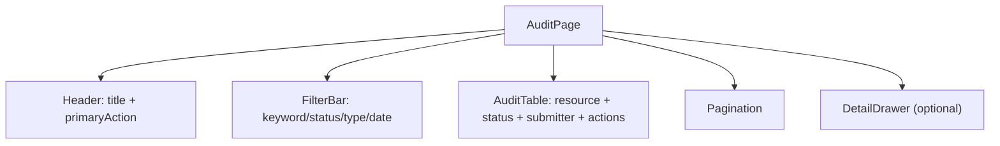
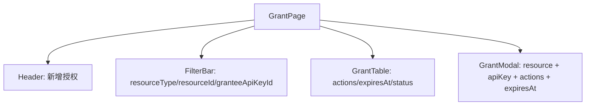
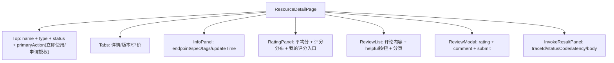
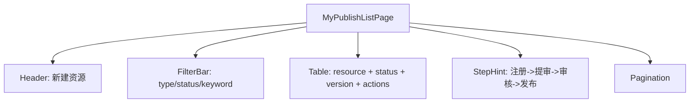
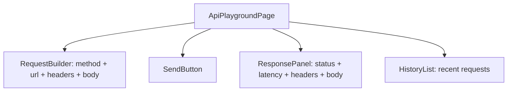

# 01 菜单与页面蓝图

## 1) 菜单主索引（三角色双端）

### platform_admin
- user：`hub`、`workspace`、`agent-market`、`skill-market`、`mcp-market`、`app-market`、`dataset-market`、`my-publish`、`my-space`、`user-settings`
- admin：`overview`、`agent-management`、`skill-management`、`mcp-management`、`app-management`、`dataset-management`、`audit-center`、`user-management`、`provider-management`、`monitoring`、`system-config`、`developer-portal`

### dept_admin
- user：同 `platform_admin`（按权限收敛）
- admin：`overview`、`agent-management`、`skill-management`、`mcp-management`、`app-management`、`dataset-management`、`audit-center`、`user-management(受限)`、`monitoring`

### developer
- user：`hub`、`workspace`、`agent-market`、`skill-market`、`mcp-market`、`app-market`、`dataset-market`、`my-publish`、`my-space`、`user-settings`
- admin：禁止进入（路由拦截）

## 2) 去重与归属规则

- `resource-grant-management` 仅在 `user-management` 作为权威入口。
- `provider-management` 仅做 provider 元数据与跳转，不承载授权主流程。
- 审核入口统一在 `audit-center`，资源管理目录不做 `approve/reject/publish`。
- 市场固定五类，不允许把 `mcp` 并回 `skill`。

## 3) 页面结构蓝图（通用骨架）

- `Header`：标题、说明、主按钮。
- `FilterBar`：关键词/状态/类型/时间/排序。
- `TableOrCardList`：关键字段列 + 行级动作。
- `Pagination`：`page/pageSize/total`。
- `StatePanel`：空态/错态/权限态。

## 3.1 统一组件与交互设计规范（UI 基线）

### 按钮层级
- 主按钮（Primary）：每个区域只允许 1 个，如“提交审核”“发布上架”“新增授权”。
- 次按钮（Secondary）：辅助动作，如“保存草稿”“撤回审核”。
- 危险按钮（Danger）：删除、下线、撤销授权，必须二次确认弹窗。

### 表格与列表
- 列表首列固定业务主键可读字段（`displayName` 或 `resourceCode`），末列固定操作列。
- 状态标签统一：`draft/pending_review/testing/published/rejected/deprecated` 使用固定文案与颜色语义。
- 列表页必须支持：加载态骨架、空态引导、错误态重试。

### 表单与弹窗
- 表单字段分组：基础信息区、能力配置区、安全配置区。
- 校验失败优先字段内提示，提交失败保留输入内容。
- 弹窗底部按钮顺序统一：`取消` 在左，`确认` 在右；危险操作按钮使用 Danger。

### 状态反馈
- 成功：右上角 toast + 局部刷新（不整页闪烁）。
- 失败：展示后端 message，保留用户当前上下文。
- 异步处理中：按钮 loading + 禁止重复点击。

## 4) admin 全页面蓝图（非仅关键页）

| 页面 | 分区 | 必显字段 | 状态要求 |
|---|---|---|---|
| `*-list` | Header + FilterBar + Table + Pagination | `resourceCode/displayName/status/version/updateTime` | 显示 `draft/pending_review/testing/published/deprecated` |
| `*-register` | Header + Form + StickyActionBar | 公共字段 + 类型字段 | 保存后 `draft`，提审后 `pending_review` |
| `audit-center/*-audit` | Header + FilterBar + AuditList + ActionModal | `displayName/resourceType/status/submitter/submitTime` | 通过->`testing`，发布->`published` |
| `resource-grant-management` | Header + FilterBar + GrantList + GrantModal | `granteeApiKeyId/actions/expiresAt/status` | 撤销后调用立即失效 |
| `monitoring/call-logs` | FilterBar + LogTable | `traceId/statusCode/latencyMs/time` | 支持 trace 定位 |
| `system-config/*` | ConfigTabs + Form + SaveBar | 配置项键值 + 更新时间 | 保存失败不丢已编辑内容 |

### 4.1 admin 路由级页面清单（全量）

| 目录 | 页面 slug | 页面骨架 | 主动作 | 后端能力 |
|---|---|---|---|---|
| `overview` | `dashboard` | KPI + Trend + Realtime | 切换时间范围 | `/dashboard/admin-overview`、`/dashboard/admin-realtime` |
| `overview` | `health-check` | Summary + Config入口 | 查看异常项 | `/dashboard/health-summary`、`/health/*` |
| `overview` | `usage-statistics` | 图表 + TopN + 导出区 | 切换维度 | `/dashboard/usage-stats` |
| `overview` | `data-reports` | 报表卡片 + 明细表 | 导出/筛选 | `/dashboard/data-reports` |
| `agent-management` | `agent-list` | Filter + Table | 新建/编辑/提审/下线 | `/resource-center/resources*` |
| `agent-management` | `agent-register` | 分步表单 + 粘底操作栏 | 保存草稿/提交审核 | `/resource-center/resources` |
| `agent-management` | `agent-detail` | 详情 + 版本 + 评价 | 切换版本/查看调用信息 | `/catalog/resources/{type}/{id}` |
| `agent-management` | `agent-monitoring` | 指标图 + 日志表 | 刷新/筛选 | `/monitoring/kpis`、`/monitoring/call-logs` |
| `agent-management` | `agent-trace` | Trace 查询 + Span 详情 | 按 traceId 检索 | `/monitoring/traces` |
| `skill-management` | `skill-list` | Filter + Table | 新建/编辑/提审/下线 | `/resource-center/resources*` |
| `skill-management` | `skill-register` | 分步表单 + 粘底操作栏 | 保存草稿/提交审核 | `/resource-center/resources` |
| `mcp-management` | `mcp-server-list` | Filter + Table | 新建/编辑/提审/下线 | `/resource-center/resources*` |
| `mcp-management` | `mcp-register` | 分步表单 + 粘底操作栏 | 保存草稿/提交审核 | `/resource-center/resources` |
| `app-management` | `app-list` | Filter + Table | 新建/编辑/提审/下线 | `/resource-center/resources*` |
| `app-management` | `app-register` | 分步表单 + 粘底操作栏 | 保存草稿/提交审核 | `/resource-center/resources` |
| `dataset-management` | `dataset-list` | Filter + Table | 新建/编辑/提审/下线 | `/resource-center/resources*` |
| `dataset-management` | `dataset-register` | 分步表单 + 粘底操作栏 | 保存草稿/提交审核 | `/resource-center/resources` |
| `audit-center` | `agent-audit` | 审核表 + 审核弹窗 | 通过/驳回/发布 | `/audit/agents*`、`/audit/resources*` |
| `audit-center` | `skill-audit` | 审核表 + 审核弹窗 | 通过/驳回/发布 | `/audit/skills*`、`/audit/resources*` |
| `audit-center` | `mcp-audit` | 审核表 + 审核弹窗 | 通过/驳回/发布 | `/audit/resources*` |
| `audit-center` | `app-audit` | 审核表 + 审核弹窗 | 通过/驳回/发布 | `/audit/resources*` |
| `audit-center` | `dataset-audit` | 审核表 + 审核弹窗 | 通过/驳回/发布 | `/audit/resources*` |
| `provider-management` | `provider-list` | 列表 + 详情抽屉 | 查看/维护元数据 | Provider 元数据（当前不承载 grant） |
| `provider-management` | `provider-create` | 表单 + 保存栏 | 新建 provider | Provider 元数据（当前不承载 grant） |
| `user-management` | `user-list` | 筛选 + 用户表 + 编辑弹窗 | 新增/编辑/禁用 | `/user-mgmt/users*` |
| `user-management` | `role-management` | 角色表 + 权限配置 | 新增/编辑/删除角色 | `/user-mgmt/roles*` |
| `user-management` | `organization` | 组织树 + 明细面板 | 新增/移动/删除组织 | `/user-mgmt/org-tree`、`/user-mgmt/orgs*` |
| `user-management` | `api-key-management` | 列表 + 创建弹窗 | 创建/撤销 API Key | `/user-mgmt/api-keys*` |
| `user-management` | `resource-grant-management` | 授权表 + 授权弹窗 | 新增授权/撤销授权 | `/resource-grants*` |
| `user-management` | `developer-applications` | 入驻申请表 + 审批弹窗 | 通过/驳回申请 | `/developer/applications*` |
| `monitoring` | `monitoring-overview` | KPI + 告警摘要 + 热点 | 切换时间窗 | `/monitoring/kpis`、`/monitoring/alerts` |
| `monitoring` | `call-logs` | 筛选 + 调用日志表 | 按条件检索 | `/monitoring/call-logs` |
| `monitoring` | `performance-analysis` | 趋势图 + 维度下钻 | 切换资源/时间 | `/monitoring/performance` |
| `monitoring` | `alert-management` | 告警表 + 处理状态 | 标记处理/筛选 | `/monitoring/alerts` |
| `monitoring` | `alert-rules` | 规则表 + 编辑弹窗 | 新增/编辑/删除/试跑 | `/monitoring/alert-rules*` |
| `monitoring` | `health-config` | 探针配置表单 | 新增/更新/删除探针 | `/health/configs*` |
| `monitoring` | `circuit-breaker` | 熔断列表 + 操作弹窗 | 打开/恢复熔断 | `/health/circuit-breakers*` |
| `system-config` | `tag-management` | 标签表 + 表单 | 新增/批量导入/删除 | `/tags*` |
| `system-config` | `model-config` | 模型配置表 + 表单 | 新增/更新/删除 | `/system-config/model-configs*` |
| `system-config` | `security-settings` | 安全配置表单 | 保存安全策略 | `/system-config/security` |
| `system-config` | `quota-management` | 配额表 + 编辑弹窗 | 新增/更新/删除 | `/quotas*` |
| `system-config` | `rate-limit-policy` | 限流策略表 + 表单 | 新增/更新/删除 | `/system-config/rate-limits*`、`/rate-limits*` |
| `system-config` | `access-control` | ACL 发布页 | 发布 ACL | `/system-config/acl/publish` |
| `system-config` | `audit-log` | 审计日志表 | 按条件检索 | `/system-config/audit-logs` |
| `system-config` | `sensitive-words` | 敏感词表 + 批量导入 | 新增/批量/检测/删除 | `/sensitive-words*` |
| `system-config` | `announcements` | 公告列表 + 编辑器 | 发布/更新/删除公告 | `/system-config/announcements*` |
| `developer-portal` | `api-docs` | 文档导航 + 示例 | 切换接口文档 | `/catalog/*`、`/sdk/v1/*` 文档镜像 |
| `developer-portal` | `sdk-download` | SDK 列表 + 版本说明 | 下载 SDK | SDK 制品分发 |
| `developer-portal` | `api-playground` | 请求构建器 + 响应区 | resolve/invoke 调试 | `/catalog/resolve`、`/invoke`、`/sdk/v1/invoke` |
| `developer-portal` | `developer-statistics` | 个人统计卡片 + 趋势 | 切换时间范围 | `/developer/my-statistics` |

## 4.2 admin 关键页面低保真线框（示例）

### `audit-center/*-audit`

### `resource-grant-management`

## 5) user 全页面蓝图（非仅关键页）

| 页面 | 分区 | 必显字段 | 状态要求 |
|---|---|---|---|
| 五市场 | FilterBar + CardList + DetailDrawer | `displayName/type/status/tags` | 默认仅 `published`，非发布不可“立即使用” |
| `my-publish` | ProgressCards + QuickActions + List | 五类资源状态计数与列表 | 从注册到提审路径可达 |
| `workspace` | SummaryCards + Shortcut + RecentPanel | 个人摘要与快捷入口 | 数据失败可重试 |
| `profile/preferences` | Form + SecurityPanel | 资料字段/偏好字段 | 401 跳登录，403 禁写 |

### 5.1 user 路由级页面清单（全量）

| 目录 | 页面 slug | 页面骨架 | 主动作 | 后端能力 |
|---|---|---|---|---|
| `hub` | `hub` | 推荐流 + 趋势榜 + 搜索建议 | 筛选/查看详情 | `/dashboard/explore-hub`、`/catalog/resources*` |
| `workspace` | `workspace` | 总览卡片 + 快捷区 + 最近使用 | 跳转常用页面 | `/dashboard/user-workspace` |
| `workspace` | `my-agents` | 我的资源列表 | 查看/编辑 | `/user/my-agents` |
| `workspace` | `authorized-skills` | 已授权技能列表 | 立即使用 | `/user/authorized-skills` |
| `workspace` | `my-favorites` | 收藏列表 | 取消收藏/跳详情 | `/user/favorites*` |
| `workspace` | `quick-access` | 快速入口卡片 | 直达常用功能 | 前端白名单路由 |
| `workspace` | `recent-use` | 最近使用时间线 | 复用调用参数 | `/user/recent-use` |
| `agent-market` | `agent-market` | 筛选 + 卡片 + 分页 | 查看详情/立即使用 | `/catalog/resources` |
| `skill-market` | `skill-market` | 筛选 + 卡片 + 分页 | 查看详情/立即使用 | `/catalog/resources` |
| `mcp-market` | `mcp-market` | 筛选 + 卡片 + 分页 | 查看详情/立即使用 | `/catalog/resources` |
| `app-market` | `app-market` | 筛选 + 卡片 + 分页 | 查看详情/立即使用 | `/catalog/resources` |
| `dataset-market` | `dataset-market` | 筛选 + 卡片 + 分页 | 查看详情/申请使用 | `/catalog/resources` |
| `my-publish` | `my-agents-pub` | 发布总览 + 五类入口卡 | 进入资源中心 | `/resource-center/resources/mine` |
| `my-publish` | `resource-center` | 统一资源中心列表 | 新建/提审/下线 | `/resource-center/resources*` |
| `my-publish` | `agent-list` | 资源列表 | 新建/编辑/提审 | `/resource-center/resources*` |
| `my-publish` | `agent-register` | 注册表单 | 保存草稿/提交审核 | `/resource-center/resources` |
| `my-publish` | `skill-list` | 资源列表 | 新建/编辑/提审 | `/resource-center/resources*` |
| `my-publish` | `skill-register` | 注册表单 | 保存草稿/提交审核 | `/resource-center/resources` |
| `my-publish` | `mcp-server-list` | 资源列表 | 新建/编辑/提审 | `/resource-center/resources*` |
| `my-publish` | `mcp-register` | 注册表单 | 保存草稿/提交审核 | `/resource-center/resources` |
| `my-publish` | `app-list` | 资源列表 | 新建/编辑/提审 | `/resource-center/resources*` |
| `my-publish` | `app-register` | 注册表单 | 保存草稿/提交审核 | `/resource-center/resources` |
| `my-publish` | `dataset-list` | 资源列表 | 新建/编辑/提审 | `/resource-center/resources*` |
| `my-publish` | `dataset-register` | 注册表单 | 保存草稿/提交审核 | `/resource-center/resources` |
| `my-publish` | `my-agents` | 我的 Agent 列表 | 查看/编辑 | `/user/my-agents` |
| `my-publish` | `my-skills` | 我的 Skill 列表 | 查看/编辑 | `/user/my-skills` |
| `my-space` | `usage-records` | 调用记录表 + 筛选 | 回放调用 | `/user/usage-records` |
| `my-space` | `usage-stats` | 统计图 + 明细 | 切换统计维度 | `/user/usage-stats` |
| `user-settings` | `profile` | 资料表单 + 会话管理 | 保存资料/踢出会话 | `/auth/profile`、`/auth/sessions*` |
| `user-settings` | `preferences` | 偏好设置 + API Key 区 | 保存偏好/创建 key | `/user-settings/*` |

## 5.2 user 关键页面低保真线框（示例）

### 市场详情页（Agent/Skill/MCP/App 通用）

### `my-publish` 列表页

### `api-playground`

## 完整性检查清单

- [x] 三角色双端菜单主索引完整
- [x] 五市场与五类管理目录完整
- [x] 审核中心独立目录明确
- [x] 授权入口唯一规则明确
- [x] admin/user 全页面结构蓝图完整
- [x] 统一组件与交互设计规范完整
- [x] 关键页面低保真线框完整
