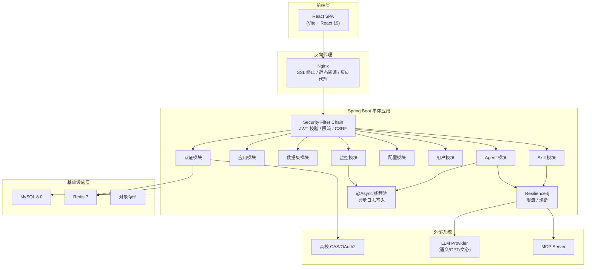
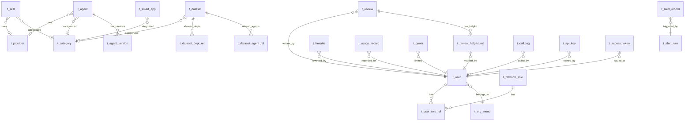
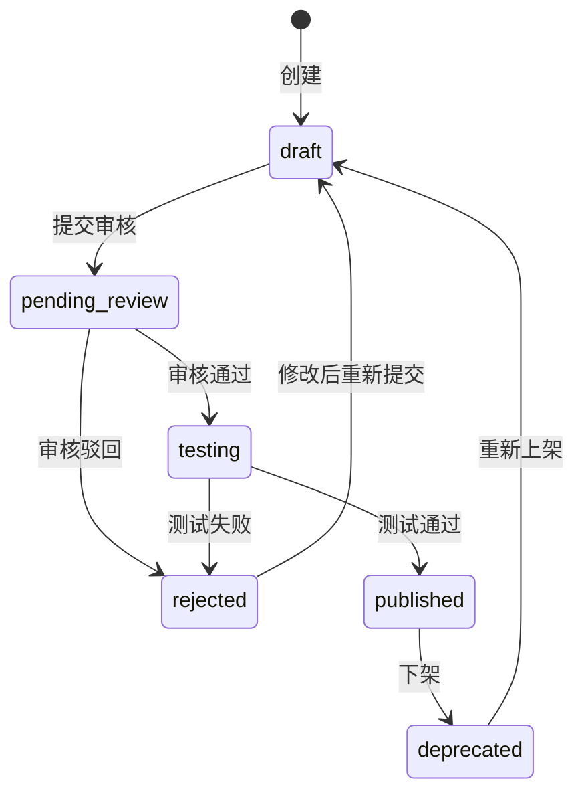
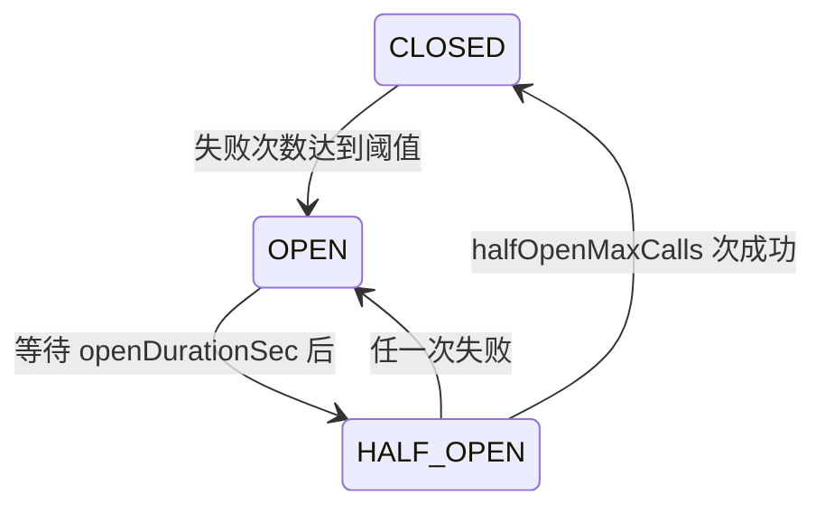

# 兰智通（LantuConnect）后端开发与数据库设计文档

> 本文档基于前端代码逆向分析自动生成，覆盖 19 个 API 服务模块、31 张数据库表、100+ 个 API 端点。
> 生成日期：2026-03-21

---

## 目录

- [第1章 架构推演与技术选型](#第1章-架构推演与技术选型)
- [第2章 数据库设计](#第2章-数据库设计)
- [第3章 API 接口文档](#第3章-api-接口文档)
- [第4章 核心隐藏逻辑](#第4章-核心隐藏逻辑)
- [第5章 前后端对齐注意事项](#第5章-前后端对齐注意事项)

---

## 第1章 架构推演与技术选型

### 1.1 业务场景分析

兰智通是面向高校的**智能体接入与管理平台**，核心业务包括：

1. **智能体生命周期管理**：Agent / Skill 的注册、审核、发布、版本管理、市场发现
2. **多源异构接入**：支持 MCP 协议、HTTP API、内置服务三种接入方式
3. **统一网关路由**：对 Agent / Skill 调用进行统一认证、限流、熔断、日志采集
4. **数据集管理**：文档、结构化数据、多媒体数据的注册与权限控制
5. **全链路可观测**：调用日志、性能指标、告警规则、分布式追踪、健康检查
6. **多租户权限体系**：对接高校统一身份认证，叠加平台 RBAC 四角色体系
7. **系统运营配置**：模型管理、限流策略、配额、安全策略、审计日志

### 1.2 推荐技术栈

| 层次 | 技术选型 | 理由 |
|------|----------|------|
| 语言 / 框架 | **Java 17 + Spring Boot 3.2** | 高校 IT 团队 Java 生态成熟，单体架构开发部署简单 |
| ORM | **MyBatis-Plus 3.5** | 灵活 SQL + 代码生成，适合复杂查询与高校已有数据库对接 |
| 数据库 | **MySQL 8.0** | 高校 IT 最广泛使用的关系型数据库，JSON 类型支持 specJson / parametersSchema，8.0 原生 CTE（WITH RECURSIVE）支持树形组织架构与分类查询 |
| 缓存 | **Redis 7** | Token 黑名单、限流计数器（滑动窗口）、热点数据缓存 |
| 限流 / 熔断 | **Resilience4j** | 直接集成到 Spring Boot，通过注解实现限流（@RateLimiter）和熔断（@CircuitBreaker），无需独立网关 |
| 异步任务 | **Spring 线程池 + @Async** | 调用日志异步写入、告警通知等，初期无需引入 MQ，后续可平滑迁移至 RabbitMQ |
| 认证 | **Spring Security + JWT** | 双 Token（Access + Refresh）机制，对接高校 CAS / OAuth2 |
| 文档 | **SpringDoc (OpenAPI 3)** | 自动生成 Swagger 文档，与前端开发者门户对接 |
| 监控 | **Spring Boot Actuator + Micrometer** | 内置健康检查、指标暴露，可选对接 Prometheus + Grafana |

### 1.3 系统架构图



### 1.4 部署架构建议

```
┌──────────────────────────────────────────────────┐
│  Nginx（SSL 终止、前端静态资源、反向代理 /api）     │
├──────────────────────────────────────────────────┤
│  Spring Boot 单体应用（可部署 1~2 实例做负载均衡）  │
│  ┌──────────────────────────────────────────┐    │
│  │  内置模块：Auth / Agent / Skill / App /  │    │
│  │  Dataset / Monitor / Config / User       │    │
│  │  内置组件：Resilience4j / @Async 线程池   │    │
│  └──────────────────────────────────────────┘    │
├──────────────────────────────────────────────────┤
│        MySQL 8.0        │       Redis 7          │
└──────────────────────────────────────────────────┘
```

> **演进路径**：当前单体足够支撑。后续若调用量激增，可将监控日志写入独立为消费者服务（引入 RabbitMQ），或将 Agent 调用网关拆出为独立服务，无需重写业务代码。

---

## 第2章 数据库设计

### 2.0 通用约定

- 所有表默认包含 `create_time`、`update_time`（自动填充，`update_time` 附加 `ON UPDATE CURRENT_TIMESTAMP`）
- 需要软删除的表包含 `deleted` 字段（0=正常，1=已删除）
- 主键统一使用 `BIGINT AUTO_INCREMENT`，前端 DTO 中 id 为 number 的对应 BIGINT，id 为 string 的对应 VARCHAR(36) UUID
- 时间字段统一使用 `DATETIME`
- JSON 类型字段使用 MySQL `JSON`
- 存储引擎 InnoDB，字符集 `utf8mb4`，排序规则 `utf8mb4_unicode_ci`
- 建表语句末尾添加 `ENGINE=InnoDB DEFAULT CHARSET=utf8mb4 COLLATE=utf8mb4_unicode_ci`

---

### 2.1 用户与权限域

#### 2.1.1 t_user — 用户表

> 对接高校统一身份认证系统（t_user），字段与高校数据库对齐。

| 字段 | 类型 | 约束 | 说明 |
|------|------|------|------|
| user_id | BIGINT AUTO_INCREMENT | PK | 用户ID |
| username | VARCHAR(64) | NOT NULL, UNIQUE | 学工号 |
| password_hash | VARCHAR(255) | NOT NULL | bcrypt 加密密码 |
| real_name | VARCHAR(64) | NOT NULL | 真实姓名 |
| sex | TINYINT | DEFAULT 0 | 1=男 2=女 0=未知 |
| school_id | BIGINT | NOT NULL | 学校ID |
| menu_id | BIGINT | FK -> t_org_menu | 主组织架构ID |
| major | VARCHAR(128) | NULL | 专业（学生） |
| class | VARCHAR(64) | NULL | 班级（学生） |
| role | TINYINT | NOT NULL | 学校身份（非平台角色） |
| mobile | VARCHAR(20) | NULL | 手机号 |
| mail | VARCHAR(128) | NULL | 邮箱 |
| head_image | VARCHAR(512) | NULL | 头像URL |
| zw | VARCHAR(64) | NULL | 职务 |
| zc | VARCHAR(64) | NULL | 职称 |
| birthday | DATE | NULL | 生日 |
| status | VARCHAR(16) | DEFAULT 'active' | active/disabled/locked |
| last_login_time | DATETIME | NULL | 最后登录时间 |
| deleted | TINYINT | DEFAULT 0 | 软删除 |
| create_time | DATETIME | DEFAULT CURRENT_TIMESTAMP | 创建时间 |
| update_time | DATETIME | DEFAULT CURRENT_TIMESTAMP | 更新时间 |

**索引**：`username` UNIQUE, `school_id`, `menu_id`, `mobile`

#### 2.1.2 t_platform_role — 平台角色表

| 字段 | 类型 | 约束 | 说明 |
|------|------|------|------|
| id | BIGINT AUTO_INCREMENT | PK | 角色ID |
| role_code | VARCHAR(32) | NOT NULL, UNIQUE | 角色编码：platform_admin / dept_admin / developer / user |
| role_name | VARCHAR(64) | NOT NULL | 角色名称 |
| description | VARCHAR(256) | NULL | 角色描述 |
| permissions | JSON | NOT NULL | 权限标识数组，如 ["agent:view","agent:create"] |
| is_system | BOOLEAN | DEFAULT false | 是否系统内置角色（不可删除） |
| user_count | INTEGER | DEFAULT 0 | 关联用户数（冗余，定时同步） |
| create_time | DATETIME | DEFAULT CURRENT_TIMESTAMP | |
| update_time | DATETIME | DEFAULT CURRENT_TIMESTAMP | |

**预设数据**：

| role_code | role_name | 权限范围 |
|-----------|-----------|----------|
| platform_admin | 平台管理员 | 全部权限 |
| dept_admin | 部门管理员 | 本部门 agent/skill/dataset 管理 + 用户查看 |
| developer | 开发者 | agent/skill 创建与发布 + API 密钥管理 |
| user | 普通用户 | 市场浏览 + 收藏 + 使用记录 |

#### 2.1.3 t_user_role_rel — 用户角色关联表

| 字段 | 类型 | 约束 | 说明 |
|------|------|------|------|
| id | BIGINT AUTO_INCREMENT | PK | |
| user_id | BIGINT | FK -> t_user, NOT NULL | |
| role_id | BIGINT | FK -> t_platform_role, NOT NULL | |
| create_time | DATETIME | DEFAULT CURRENT_TIMESTAMP | |

**约束**：`UNIQUE(user_id, role_id)`

#### 2.1.4 t_org_menu — 组织架构表

> 树形结构，对接高校 t_menu 表。

| 字段 | 类型 | 约束 | 说明 |
|------|------|------|------|
| menu_id | BIGINT AUTO_INCREMENT | PK | 组织节点ID |
| menu_name | VARCHAR(128) | NOT NULL | 组织名称 |
| menu_parent_id | BIGINT | DEFAULT 0 | 父节点ID，0=顶级 |
| menu_level | TINYINT | NOT NULL | 层级深度 |
| if_xy | TINYINT | DEFAULT 0 | 1=学院 0=非学院 |
| head_count | INTEGER | DEFAULT 0 | 人数统计 |
| sort_order | INTEGER | DEFAULT 0 | 排序权重 |
| create_time | DATETIME | DEFAULT CURRENT_TIMESTAMP | |
| update_time | DATETIME | DEFAULT CURRENT_TIMESTAMP | |

**索引**：`menu_parent_id`

#### 2.1.5 t_api_key — API 密钥表

> 管理员创建的全局 API Key 与用户个人 API Key 共用一张表，通过 owner_type 区分。

| 字段 | 类型 | 约束 | 说明 |
|------|------|------|------|
| id | VARCHAR(36) | PK | UUID |
| name | VARCHAR(128) | NOT NULL | 密钥名称 |
| key_hash | VARCHAR(255) | NOT NULL | 密钥哈希值（SHA-256） |
| prefix | VARCHAR(16) | NOT NULL | 密钥前缀（展示用，如 sk_a1b2） |
| masked_key | VARCHAR(64) | NOT NULL | 脱敏展示（sk_a1b2****c3d4） |
| owner_type | VARCHAR(16) | NOT NULL | admin / user |
| owner_id | VARCHAR(36) | NOT NULL | 所有者ID |
| scopes | JSON | DEFAULT '[]' | 权限范围 |
| status | VARCHAR(16) | DEFAULT 'active' | active / expired / revoked |
| expires_at | DATETIME | NULL | 过期时间 |
| last_used_at | DATETIME | NULL | 最后使用时间 |
| call_count | BIGINT | DEFAULT 0 | 调用次数 |
| created_by | VARCHAR(64) | NOT NULL | 创建人 |
| create_time | DATETIME | DEFAULT CURRENT_TIMESTAMP | |

**索引**：`owner_type + owner_id`, `status`, `prefix`

#### 2.1.6 t_access_token — 访问令牌表

| 字段 | 类型 | 约束 | 说明 |
|------|------|------|------|
| id | VARCHAR(36) | PK | UUID |
| name | VARCHAR(128) | NOT NULL | 令牌名称 |
| token_hash | VARCHAR(255) | NOT NULL | 令牌哈希值 |
| masked_token | VARCHAR(64) | NOT NULL | 脱敏展示 |
| type | VARCHAR(16) | NOT NULL | access / service / temporary |
| scopes | JSON | DEFAULT '[]' | 权限范围 |
| status | VARCHAR(16) | DEFAULT 'active' | active / expired / revoked |
| expires_at | DATETIME | NOT NULL | 过期时间 |
| last_used_at | DATETIME | NULL | 最后使用时间 |
| created_by | VARCHAR(64) | NOT NULL | 创建人 |
| create_time | DATETIME | DEFAULT CURRENT_TIMESTAMP | |

---

### 2.2 核心资产域

#### 2.2.1 t_agent — Agent 表

> 对应前端 Agent DTO。mode='SUBAGENT' 或 'ALL' 表示 Agent。

| 字段 | 类型 | 约束 | 说明 |
|------|------|------|------|
| id | BIGINT AUTO_INCREMENT | PK | |
| agent_name | VARCHAR(128) | NOT NULL, UNIQUE | 唯一标识（英文） |
| display_name | VARCHAR(128) | NOT NULL | 显示名称 |
| description | TEXT | NOT NULL | 描述 |
| agent_type | VARCHAR(16) | NOT NULL | mcp / http_api / builtin |
| mode | VARCHAR(16) | NOT NULL | SUBAGENT / ALL |
| source_type | VARCHAR(16) | NOT NULL | internal / partner / cloud |
| provider_id | BIGINT | FK -> t_provider, NULL | 关联提供商 |
| category_id | BIGINT | FK -> t_category, NULL | 分类ID |
| status | VARCHAR(20) | DEFAULT 'draft' | draft / pending_review / testing / published / rejected / deprecated |
| spec_json | JSON | NOT NULL | 连接配置 {url, api_key, headers, timeout} |
| is_public | BOOLEAN | DEFAULT false | 是否公开 |
| icon | VARCHAR(512) | NULL | 图标URL |
| sort_order | INTEGER | DEFAULT 0 | 排序权重 |
| hidden | BOOLEAN | DEFAULT false | 是否隐藏 |
| max_concurrency | INTEGER | DEFAULT 10 | 最大并发数 |
| max_steps | INTEGER | NULL | 最大步数 |
| temperature | DECIMAL(3,2) | NULL | 温度参数 |
| system_prompt | TEXT | NULL | 系统提示词 |
| quality_score | DECIMAL(5,2) | DEFAULT 0 | 质量评分 |
| avg_latency_ms | INTEGER | DEFAULT 0 | 平均延迟(ms) |
| success_rate | DECIMAL(5,2) | DEFAULT 100 | 成功率(%) |
| avg_token_cost | DECIMAL(10,4) | DEFAULT 0 | 平均Token消耗 |
| call_count | BIGINT | DEFAULT 0 | 调用次数 |
| created_by | BIGINT | NULL | 创建者用户ID |
| deleted | TINYINT | DEFAULT 0 | 软删除 |
| create_time | DATETIME | DEFAULT CURRENT_TIMESTAMP | |
| update_time | DATETIME | DEFAULT CURRENT_TIMESTAMP | |

**索引**：`agent_name` UNIQUE, `status`, `source_type`, `category_id`, `agent_type`, `is_public + status`（复合索引，市场查询用）

#### 2.2.2 t_skill — Skill 表

> 对应前端 Skill DTO。mode='TOOL'。与 Agent 分表存储以避免业务耦合。

| 字段 | 类型 | 约束 | 说明 |
|------|------|------|------|
| id | BIGINT AUTO_INCREMENT | PK | |
| agent_name | VARCHAR(128) | NOT NULL, UNIQUE | 唯一标识 |
| display_name | VARCHAR(128) | NOT NULL | 显示名称 |
| description | TEXT | NOT NULL | 描述 |
| agent_type | VARCHAR(16) | NOT NULL | mcp / http_api / builtin |
| mode | VARCHAR(8) | DEFAULT 'TOOL' | 固定为 TOOL |
| parent_id | BIGINT | NULL | 所属 MCP Server 的 ID（自引用或指向 t_mcp_server） |
| source_type | VARCHAR(16) | NOT NULL | internal / partner / cloud |
| provider_id | BIGINT | FK -> t_provider, NULL | 关联提供商 |
| category_id | BIGINT | FK -> t_category, NULL | 分类ID |
| status | VARCHAR(20) | DEFAULT 'draft' | 同 Agent 状态枚举 |
| display_template | VARCHAR(32) | NULL | file/image/audio/video/app/answer 等展示模板 |
| spec_json | JSON | NOT NULL | 连接配置 |
| parameters_schema | JSON | NULL | 工具参数 JSON Schema |
| is_public | BOOLEAN | DEFAULT false | |
| icon | VARCHAR(512) | NULL | |
| sort_order | INTEGER | DEFAULT 0 | |
| max_concurrency | INTEGER | DEFAULT 10 | |
| quality_score | DECIMAL(5,2) | DEFAULT 0 | |
| avg_latency_ms | INTEGER | DEFAULT 0 | |
| success_rate | DECIMAL(5,2) | DEFAULT 100 | |
| avg_token_cost | DECIMAL(10,4) | DEFAULT 0 | |
| call_count | BIGINT | DEFAULT 0 | |
| created_by | BIGINT | NULL | |
| deleted | TINYINT | DEFAULT 0 | |
| create_time | DATETIME | DEFAULT CURRENT_TIMESTAMP | |
| update_time | DATETIME | DEFAULT CURRENT_TIMESTAMP | |

**索引**：`agent_name` UNIQUE, `parent_id`, `status`, `category_id`

#### 2.2.3 t_smart_app — 智能应用表

| 字段 | 类型 | 约束 | 说明 |
|------|------|------|------|
| id | BIGINT AUTO_INCREMENT | PK | |
| app_name | VARCHAR(128) | NOT NULL, UNIQUE | 应用标识 |
| display_name | VARCHAR(128) | NOT NULL | 显示名称 |
| description | TEXT | NOT NULL | 描述 |
| app_url | VARCHAR(512) | NOT NULL | 应用URL |
| embed_type | VARCHAR(20) | NOT NULL | iframe / micro_frontend / redirect |
| icon | VARCHAR(512) | NULL | 图标URL |
| screenshots | JSON | DEFAULT '[]' | 截图URL数组 |
| category_id | BIGINT | FK -> t_category, NULL | 分类ID |
| source_type | VARCHAR(16) | NOT NULL | internal / partner |
| status | VARCHAR(16) | DEFAULT 'draft' | draft / published / testing / deprecated |
| is_public | BOOLEAN | DEFAULT false | |
| sort_order | INTEGER | DEFAULT 0 | |
| created_by | BIGINT | NULL | |
| deleted | TINYINT | DEFAULT 0 | |
| create_time | DATETIME | DEFAULT CURRENT_TIMESTAMP | |
| update_time | DATETIME | DEFAULT CURRENT_TIMESTAMP | |

#### 2.2.4 t_dataset — 数据集表

| 字段 | 类型 | 约束 | 说明 |
|------|------|------|------|
| id | BIGINT AUTO_INCREMENT | PK | |
| dataset_name | VARCHAR(128) | NOT NULL, UNIQUE | 数据集标识 |
| display_name | VARCHAR(128) | NOT NULL | 显示名称 |
| description | TEXT | NOT NULL | |
| source_type | VARCHAR(16) | NOT NULL | department / knowledge / third_party |
| data_type | VARCHAR(16) | NOT NULL | document / structured / image / audio / video / mixed |
| format | VARCHAR(32) | NOT NULL | csv/json/pdf/docx/parquet... |
| record_count | BIGINT | DEFAULT 0 | 记录数 |
| file_size | BIGINT | DEFAULT 0 | 文件大小(bytes) |
| category_id | BIGINT | FK -> t_category, NULL | |
| status | VARCHAR(16) | DEFAULT 'draft' | draft / published / testing / deprecated |
| tags | JSON | DEFAULT '[]' | 标签数组 |
| is_public | BOOLEAN | DEFAULT false | |
| created_by | BIGINT | NULL | |
| deleted | TINYINT | DEFAULT 0 | |
| create_time | DATETIME | DEFAULT CURRENT_TIMESTAMP | |
| update_time | DATETIME | DEFAULT CURRENT_TIMESTAMP | |

#### 2.2.5 t_dataset_dept_rel — 数据集部门权限关联

| 字段 | 类型 | 约束 | 说明 |
|------|------|------|------|
| id | BIGINT AUTO_INCREMENT | PK | |
| dataset_id | BIGINT | FK -> t_dataset, NOT NULL | |
| menu_id | BIGINT | FK -> t_org_menu, NOT NULL | 允许访问的组织ID |
| create_time | DATETIME | DEFAULT CURRENT_TIMESTAMP | |

**约束**：`UNIQUE(dataset_id, menu_id)`

#### 2.2.6 t_dataset_agent_rel — 数据集Agent关联

| 字段 | 类型 | 约束 | 说明 |
|------|------|------|------|
| id | BIGINT AUTO_INCREMENT | PK | |
| dataset_id | BIGINT | FK -> t_dataset, NOT NULL | |
| agent_id | BIGINT | FK -> t_agent, NOT NULL | |
| create_time | DATETIME | DEFAULT CURRENT_TIMESTAMP | |

**约束**：`UNIQUE(dataset_id, agent_id)`

#### 2.2.7 t_provider — 服务提供商表

| 字段 | 类型 | 约束 | 说明 |
|------|------|------|------|
| id | BIGINT AUTO_INCREMENT | PK | |
| provider_code | VARCHAR(64) | NOT NULL, UNIQUE | 提供商编码 |
| provider_name | VARCHAR(128) | NOT NULL | 提供商名称 |
| provider_type | VARCHAR(16) | NOT NULL | internal / partner / cloud |
| description | TEXT | NULL | |
| auth_type | VARCHAR(16) | NOT NULL | api_key / oauth2 / basic / none |
| auth_config | JSON | NULL | 认证配置（加密存储） |
| base_url | VARCHAR(512) | NULL | 基础URL |
| status | VARCHAR(16) | DEFAULT 'active' | active / inactive |
| agent_count | INTEGER | DEFAULT 0 | 关联 Agent 数（冗余） |
| skill_count | INTEGER | DEFAULT 0 | 关联 Skill 数（冗余） |
| deleted | TINYINT | DEFAULT 0 | |
| create_time | DATETIME | DEFAULT CURRENT_TIMESTAMP | |
| update_time | DATETIME | DEFAULT CURRENT_TIMESTAMP | |

#### 2.2.8 t_agent_version — Agent 版本表

| 字段 | 类型 | 约束 | 说明 |
|------|------|------|------|
| id | BIGINT AUTO_INCREMENT | PK | |
| agent_id | BIGINT | FK -> t_agent, NOT NULL | |
| version | VARCHAR(32) | NOT NULL | 版本号（如 v1.0.0） |
| changelog | TEXT | NOT NULL | 变更日志 |
| status | VARCHAR(16) | DEFAULT 'draft' | draft / testing / released / rollback |
| spec_json_snapshot | JSON | NULL | 版本快照 |
| created_by | VARCHAR(64) | NOT NULL | 创建人 |
| create_time | DATETIME | DEFAULT CURRENT_TIMESTAMP | |

**约束**：`UNIQUE(agent_id, version)`

---

### 2.3 分类与标签域

#### 2.3.1 t_category — 分类表（树形）

| 字段 | 类型 | 约束 | 说明 |
|------|------|------|------|
| id | BIGINT AUTO_INCREMENT | PK | |
| category_code | VARCHAR(64) | NOT NULL, UNIQUE | 分类编码 |
| category_name | VARCHAR(128) | NOT NULL | 分类名称 |
| parent_id | BIGINT | NULL | 父分类ID，NULL=顶级 |
| icon | VARCHAR(64) | NULL | 图标标识 |
| sort_order | INTEGER | DEFAULT 0 | |
| create_time | DATETIME | DEFAULT CURRENT_TIMESTAMP | |
| update_time | DATETIME | DEFAULT CURRENT_TIMESTAMP | |

**预设分类**：校园业务、教学科研、办公效率、数据分析、生活服务（各含子分类）

#### 2.3.2 t_tag — 标签表

| 字段 | 类型 | 约束 | 说明 |
|------|------|------|------|
| id | BIGINT AUTO_INCREMENT | PK | |
| name | VARCHAR(64) | NOT NULL | 标签名称 |
| category | VARCHAR(32) | NOT NULL | 标签分类（agent/skill/dataset/general） |
| usage_count | INTEGER | DEFAULT 0 | 使用次数 |
| create_time | DATETIME | DEFAULT CURRENT_TIMESTAMP | |

**约束**：`UNIQUE(name, category)`

#### 2.3.3 t_resource_tag_rel — 资源标签关联表

| 字段 | 类型 | 约束 | 说明 |
|------|------|------|------|
| id | BIGINT AUTO_INCREMENT | PK | |
| resource_type | VARCHAR(16) | NOT NULL | agent / skill / dataset / app |
| resource_id | BIGINT | NOT NULL | 资源ID |
| tag_id | BIGINT | FK -> t_tag, NOT NULL | |
| create_time | DATETIME | DEFAULT CURRENT_TIMESTAMP | |

**约束**：`UNIQUE(resource_type, resource_id, tag_id)`

---

### 2.4 审核与评论域

#### 2.4.1 t_audit_item — 审核队列表

| 字段 | 类型 | 约束 | 说明 |
|------|------|------|------|
| id | BIGINT AUTO_INCREMENT | PK | |
| target_type | VARCHAR(16) | NOT NULL | agent / skill |
| target_id | BIGINT | NOT NULL | 关联资源ID |
| display_name | VARCHAR(128) | NOT NULL | 资源显示名（冗余） |
| agent_name | VARCHAR(128) | NOT NULL | 资源标识（冗余） |
| description | TEXT | NULL | |
| agent_type | VARCHAR(16) | NULL | |
| source_type | VARCHAR(16) | NULL | |
| submitter | VARCHAR(64) | NOT NULL | 提交人 |
| submit_time | DATETIME | NOT NULL | 提交时间 |
| status | VARCHAR(20) | DEFAULT 'pending_review' | pending_review / testing / published / rejected |
| reviewer_id | BIGINT | NULL | 审核人ID |
| reject_reason | TEXT | NULL | 驳回原因 |
| review_time | DATETIME | NULL | 审核时间 |
| create_time | DATETIME | DEFAULT CURRENT_TIMESTAMP | |

#### 2.4.2 t_review — 评论评分表

| 字段 | 类型 | 约束 | 说明 |
|------|------|------|------|
| id | BIGINT AUTO_INCREMENT | PK | |
| target_type | VARCHAR(16) | NOT NULL | agent / skill / app |
| target_id | BIGINT | NOT NULL | 资源ID |
| user_id | BIGINT | FK -> t_user, NOT NULL | 评论用户 |
| user_name | VARCHAR(64) | NOT NULL | 用户名（冗余） |
| avatar | VARCHAR(512) | NULL | 头像（冗余） |
| rating | TINYINT | NOT NULL | 评分 1-5 |
| comment | TEXT | NOT NULL | 评论内容 |
| helpful_count | INTEGER | DEFAULT 0 | "有用"计数 |
| deleted | TINYINT | DEFAULT 0 | |
| create_time | DATETIME | DEFAULT CURRENT_TIMESTAMP | |

**索引**：`target_type + target_id`, `user_id`

#### 2.4.3 t_review_helpful_rel — 评论有用标记关联

| 字段 | 类型 | 约束 | 说明 |
|------|------|------|------|
| id | BIGINT AUTO_INCREMENT | PK | |
| review_id | BIGINT | FK -> t_review, NOT NULL | |
| user_id | BIGINT | FK -> t_user, NOT NULL | |
| create_time | DATETIME | DEFAULT CURRENT_TIMESTAMP | |

**约束**：`UNIQUE(review_id, user_id)`（每人每条评论只能点一次有用）

---

### 2.5 监控与运维域

#### 2.5.1 t_call_log — 调用日志表

> 高频写入表，建议按月分区。

| 字段 | 类型 | 约束 | 说明 |
|------|------|------|------|
| id | VARCHAR(36) | PK | UUID |
| trace_id | VARCHAR(64) | NOT NULL | 链路追踪ID |
| agent_id | VARCHAR(36) | NOT NULL | Agent/Skill ID |
| agent_name | VARCHAR(128) | NOT NULL | Agent/Skill 名称（冗余） |
| user_id | VARCHAR(36) | NOT NULL | 调用用户ID |
| model | VARCHAR(64) | NULL | 使用的模型名 |
| method | VARCHAR(128) | NOT NULL | 调用方法（如 POST /chat/completions） |
| status | VARCHAR(16) | NOT NULL | success / error / timeout |
| status_code | TINYINT | NOT NULL | HTTP 状态码 |
| latency_ms | INTEGER | NOT NULL | 响应延迟(ms) |
| input_tokens | INTEGER | DEFAULT 0 | 输入Token数 |
| output_tokens | INTEGER | DEFAULT 0 | 输出Token数 |
| cost | DECIMAL(10,6) | DEFAULT 0 | 本次费用 |
| error_message | TEXT | NULL | 错误信息 |
| ip | VARCHAR(45) | NOT NULL | 客户端IP |
| create_time | DATETIME | DEFAULT CURRENT_TIMESTAMP | |

**索引**：`trace_id`, `agent_id + create_time`, `user_id + create_time`, `status`, `create_time`（分区键）

#### 2.5.2 t_alert_rule — 告警规则表

| 字段 | 类型 | 约束 | 说明 |
|------|------|------|------|
| id | VARCHAR(36) | PK | UUID |
| name | VARCHAR(128) | NOT NULL | 规则名称 |
| description | TEXT | NULL | |
| metric | VARCHAR(128) | NOT NULL | 监控指标（如 api.latency.p95） |
| operator | VARCHAR(8) | NOT NULL | gt / lt / eq / gte / lte |
| threshold | DECIMAL(15,4) | NOT NULL | 阈值 |
| duration | VARCHAR(16) | DEFAULT '5m' | 持续时间 |
| severity | VARCHAR(16) | NOT NULL | critical / warning / info |
| enabled | BOOLEAN | DEFAULT true | |
| notify_channels | JSON | DEFAULT '[]' | 通知渠道 ["email","sms","webhook"] |
| create_time | DATETIME | DEFAULT CURRENT_TIMESTAMP | |
| update_time | DATETIME | DEFAULT CURRENT_TIMESTAMP | |

#### 2.5.3 t_alert_record — 告警记录表

| 字段 | 类型 | 约束 | 说明 |
|------|------|------|------|
| id | VARCHAR(36) | PK | UUID |
| rule_id | VARCHAR(36) | FK -> t_alert_rule, NOT NULL | |
| rule_name | VARCHAR(128) | NOT NULL | 规则名称（冗余） |
| severity | VARCHAR(16) | NOT NULL | critical / warning / info |
| status | VARCHAR(16) | NOT NULL | firing / resolved / silenced |
| message | TEXT | NOT NULL | 告警消息 |
| source | VARCHAR(64) | NOT NULL | 来源服务 |
| labels | JSON | DEFAULT '{}' | 标签 |
| fired_at | DATETIME | NOT NULL | 触发时间 |
| resolved_at | DATETIME | NULL | 恢复时间 |

#### 2.5.4 t_trace_span — 链路追踪表

| 字段 | 类型 | 约束 | 说明 |
|------|------|------|------|
| id | VARCHAR(36) | PK | Span ID |
| trace_id | VARCHAR(64) | NOT NULL | Trace ID |
| parent_id | VARCHAR(36) | NULL | 父 Span ID |
| operation_name | VARCHAR(128) | NOT NULL | 操作名（如 gateway.route） |
| service_name | VARCHAR(64) | NOT NULL | 服务名 |
| start_time | DATETIME | NOT NULL | 开始时间 |
| duration | INTEGER | NOT NULL | 持续时间(ms) |
| status | VARCHAR(8) | NOT NULL | ok / error |
| tags | JSON | DEFAULT '{}' | 标签 |
| logs | JSON | DEFAULT '[]' | 日志条目 |

**索引**：`trace_id`, `service_name + start_time`

#### 2.5.5 t_health_config — 健康检查配置表

| 字段 | 类型 | 约束 | 说明 |
|------|------|------|------|
| id | BIGINT AUTO_INCREMENT | PK | |
| agent_name | VARCHAR(128) | NOT NULL | 关联的 Agent/Skill 名 |
| display_name | VARCHAR(128) | NOT NULL | 显示名称 |
| agent_type | VARCHAR(16) | NOT NULL | |
| check_type | VARCHAR(8) | NOT NULL | http / tcp / ping |
| check_url | VARCHAR(512) | NOT NULL | 检查地址 |
| interval_sec | INTEGER | DEFAULT 30 | 检查间隔(秒) |
| healthy_threshold | INTEGER | DEFAULT 3 | 健康阈值次数 |
| timeout_sec | INTEGER | DEFAULT 10 | 超时时间(秒) |
| health_status | VARCHAR(16) | DEFAULT 'healthy' | healthy / degraded / down |
| last_check_time | DATETIME | NULL | 最后检查时间 |
| create_time | DATETIME | DEFAULT CURRENT_TIMESTAMP | |
| update_time | DATETIME | DEFAULT CURRENT_TIMESTAMP | |

#### 2.5.6 t_circuit_breaker — 熔断器配置表

| 字段 | 类型 | 约束 | 说明 |
|------|------|------|------|
| id | BIGINT AUTO_INCREMENT | PK | |
| agent_name | VARCHAR(128) | NOT NULL | 关联 Agent/Skill |
| display_name | VARCHAR(128) | NOT NULL | |
| current_state | VARCHAR(16) | DEFAULT 'CLOSED' | CLOSED / OPEN / HALF_OPEN |
| failure_threshold | INTEGER | DEFAULT 5 | 失败阈值 |
| open_duration_sec | INTEGER | DEFAULT 60 | 熔断持续时间(秒) |
| half_open_max_calls | INTEGER | DEFAULT 3 | 半开最大尝试数 |
| fallback_agent_name | VARCHAR(128) | NULL | 降级 Agent |
| fallback_message | TEXT | NULL | 降级消息 |
| last_opened_at | DATETIME | NULL | 最后熔断时间 |
| success_count | BIGINT | DEFAULT 0 | 成功计数 |
| failure_count | BIGINT | DEFAULT 0 | 失败计数 |
| create_time | DATETIME | DEFAULT CURRENT_TIMESTAMP | |
| update_time | DATETIME | DEFAULT CURRENT_TIMESTAMP | |

---

### 2.6 系统配置域

#### 2.6.1 t_model_config — 模型配置表

| 字段 | 类型 | 约束 | 说明 |
|------|------|------|------|
| id | VARCHAR(36) | PK | UUID |
| name | VARCHAR(128) | NOT NULL | 模型名称（如 通义千问-Turbo） |
| provider | VARCHAR(64) | NOT NULL | 供应商名（如 阿里云） |
| model_id | VARCHAR(64) | NOT NULL | 模型标识（如 qwen-turbo） |
| endpoint | VARCHAR(512) | NOT NULL | API 端点 |
| api_key | VARCHAR(512) | NULL | API 密钥（加密存储） |
| max_tokens | INTEGER | NOT NULL | 最大 Token 数 |
| temperature | DECIMAL(3,2) | DEFAULT 0.7 | |
| top_p | DECIMAL(3,2) | DEFAULT 0.9 | |
| enabled | BOOLEAN | DEFAULT true | |
| rate_limit | INTEGER | DEFAULT 50 | 每分钟限流 |
| cost_per_token | DECIMAL(10,8) | DEFAULT 0 | 每 Token 成本 |
| description | TEXT | NULL | |
| create_time | DATETIME | DEFAULT CURRENT_TIMESTAMP | |
| update_time | DATETIME | DEFAULT CURRENT_TIMESTAMP | |

#### 2.6.2 t_rate_limit_rule — 限流规则表

| 字段 | 类型 | 约束 | 说明 |
|------|------|------|------|
| id | VARCHAR(36) | PK | UUID |
| name | VARCHAR(128) | NOT NULL | 规则名称 |
| target | VARCHAR(16) | NOT NULL | user / role / ip / api_key / global |
| target_value | VARCHAR(128) | NULL | 目标值（如角色名、IP 段） |
| window_ms | BIGINT | NOT NULL | 时间窗口(ms) |
| max_requests | INTEGER | NOT NULL | 最大请求数 |
| max_tokens | INTEGER | NULL | 最大Token数 |
| burst_limit | INTEGER | NULL | 突发限制 |
| action | VARCHAR(16) | NOT NULL | reject / queue / throttle |
| enabled | BOOLEAN | DEFAULT true | |
| priority | INTEGER | DEFAULT 0 | 优先级（高优先） |
| create_time | DATETIME | DEFAULT CURRENT_TIMESTAMP | |
| update_time | DATETIME | DEFAULT CURRENT_TIMESTAMP | |

#### 2.6.3 t_system_param — 系统参数表

| 字段 | 类型 | 约束 | 说明 |
|------|------|------|------|
| key | VARCHAR(128) | PK | 参数键 |
| value | TEXT | NOT NULL | 参数值 |
| type | VARCHAR(16) | NOT NULL | string / number / boolean / json |
| description | VARCHAR(256) | NOT NULL | 参数说明 |
| category | VARCHAR(32) | NOT NULL | 分组（存储/模型/安全/用户/系统/集成） |
| editable | BOOLEAN | DEFAULT true | 是否可编辑 |
| update_time | DATETIME | DEFAULT CURRENT_TIMESTAMP | |

#### 2.6.4 t_security_setting — 安全设置表

| 字段 | 类型 | 约束 | 说明 |
|------|------|------|------|
| key | VARCHAR(128) | PK | 设置键 |
| value | TEXT | NOT NULL | 设置值 |
| label | VARCHAR(128) | NOT NULL | 显示名称 |
| description | VARCHAR(256) | NOT NULL | |
| type | VARCHAR(16) | NOT NULL | toggle / input / select |
| options | JSON | NULL | 可选值（select 类型用） |
| category | VARCHAR(32) | NOT NULL | 认证 / 访问控制 / 数据安全 |

---

### 2.7 用户行为域

#### 2.7.1 t_usage_record — 使用记录表

| 字段 | 类型 | 约束 | 说明 |
|------|------|------|------|
| id | BIGINT AUTO_INCREMENT | PK | |
| user_id | BIGINT | FK -> t_user, NOT NULL | |
| agent_name | VARCHAR(128) | NOT NULL | |
| display_name | VARCHAR(128) | NOT NULL | |
| type | VARCHAR(16) | NOT NULL | agent / skill / app |
| action | VARCHAR(64) | NOT NULL | 操作描述 |
| input_preview | TEXT | NULL | 输入摘要 |
| output_preview | TEXT | NULL | 输出摘要 |
| token_cost | INTEGER | DEFAULT 0 | Token 消耗 |
| latency_ms | INTEGER | DEFAULT 0 | |
| status | VARCHAR(16) | NOT NULL | success / failed |
| create_time | DATETIME | DEFAULT CURRENT_TIMESTAMP | |

**索引**：`user_id + create_time`, `type`

#### 2.7.2 t_favorite — 收藏表

| 字段 | 类型 | 约束 | 说明 |
|------|------|------|------|
| id | BIGINT AUTO_INCREMENT | PK | |
| user_id | BIGINT | FK -> t_user, NOT NULL | |
| target_type | VARCHAR(16) | NOT NULL | agent / skill / app |
| target_id | BIGINT | NOT NULL | 资源ID |
| create_time | DATETIME | DEFAULT CURRENT_TIMESTAMP | |

**约束**：`UNIQUE(user_id, target_type, target_id)`

#### 2.7.3 t_quota — 配额表

| 字段 | 类型 | 约束 | 说明 |
|------|------|------|------|
| id | BIGINT AUTO_INCREMENT | PK | |
| target_type | VARCHAR(16) | NOT NULL | user / department / global |
| target_id | BIGINT | NULL | 目标ID（global 时为 NULL） |
| target_name | VARCHAR(128) | NOT NULL | 目标名称 |
| daily_limit | INTEGER | NOT NULL | 日调用上限 |
| monthly_limit | INTEGER | NOT NULL | 月调用上限 |
| daily_used | INTEGER | DEFAULT 0 | 当日已用 |
| monthly_used | INTEGER | DEFAULT 0 | 当月已用 |
| enabled | BOOLEAN | DEFAULT true | |
| create_time | DATETIME | DEFAULT CURRENT_TIMESTAMP | |
| update_time | DATETIME | DEFAULT CURRENT_TIMESTAMP | |

#### 2.7.4 t_quota_rate_limit — 资源级限流表

| 字段 | 类型 | 约束 | 说明 |
|------|------|------|------|
| id | BIGINT AUTO_INCREMENT | PK | |
| name | VARCHAR(128) | NOT NULL | |
| target_type | VARCHAR(16) | NOT NULL | agent / skill / global |
| target_id | BIGINT | NULL | |
| target_name | VARCHAR(128) | NOT NULL | |
| max_requests_per_min | INTEGER | NOT NULL | 每分钟最大请求数 |
| max_requests_per_hour | INTEGER | NOT NULL | 每小时最大请求数 |
| max_concurrent | INTEGER | NOT NULL | 最大并发数 |
| enabled | BOOLEAN | DEFAULT true | |
| create_time | DATETIME | DEFAULT CURRENT_TIMESTAMP | |
| update_time | DATETIME | DEFAULT CURRENT_TIMESTAMP | |

#### 2.7.5 t_audit_log — 审计日志表

> 记录所有管理操作，不可删除、不可修改。

| 字段 | 类型 | 约束 | 说明 |
|------|------|------|------|
| id | VARCHAR(36) | PK | UUID |
| user_id | VARCHAR(36) | NOT NULL | 操作用户ID |
| username | VARCHAR(64) | NOT NULL | 操作用户名 |
| action | VARCHAR(64) | NOT NULL | 操作类型（login/create_agent/delete_user/...） |
| resource | VARCHAR(64) | NOT NULL | 资源类型（auth/agent/user-mgmt/...） |
| resource_id | VARCHAR(64) | NULL | 资源ID |
| details | TEXT | NULL | 操作详情 |
| ip | VARCHAR(45) | NOT NULL | 客户端IP |
| user_agent | VARCHAR(512) | NULL | User-Agent |
| result | VARCHAR(16) | NOT NULL | success / failure |
| create_time | DATETIME | DEFAULT CURRENT_TIMESTAMP | |

**索引**：`user_id + create_time`, `action`, `resource + resource_id`, `create_time`

---

### 2.8 ER 关系图



---

## 第3章 API 接口文档

### 3.0 通用约定

#### 基础路径

```
所有接口统一前缀：/api
示例：POST /api/auth/login
```

#### 统一响应格式

```json
{
  "code": 0,
  "data": "<T>",
  "message": "ok",
  "timestamp": 1711000000000
}
```

- `code = 0`：成功
- `code != 0`：失败，具体错误码见附录

#### 分页响应格式

```json
{
  "code": 0,
  "data": {
    "list": [],
    "total": 100,
    "page": 1,
    "pageSize": 20
  },
  "message": "ok",
  "timestamp": 1711000000000
}
```

#### 通用请求头

| Header | 必填 | 说明 |
|--------|------|------|
| Authorization | 是（除登录/注册外） | Bearer {token} |
| X-Request-Id | 否 | 请求追踪ID（前端自动生成） |
| X-Request-Time | 否 | 请求时间戳 |
| X-CSRF-Token | 否（非 GET 请求） | CSRF 防护令牌 |
| Content-Type | 是（POST/PUT） | application/json |

#### 通用分页参数

| 参数 | 类型 | 默认 | 说明 |
|------|------|------|------|
| page | number | 1 | 页码 |
| pageSize | number | 20 | 每页条数 |
| sortBy | string | - | 排序字段 |
| sortOrder | string | asc | asc / desc |

---

### 3.1 认证服务（auth）

#### POST /auth/login — 用户登录

**请求 Body**：

```json
{
  "username": "admin",
  "password": "123456",
  "captcha": "a1b2",
  "remember": true
}
```

**响应 data**：

```json
{
  "token": "eyJhbGciOiJIUzI1NiJ9...",
  "refreshToken": "eyJhbGciOiJIUzI1NiJ9...",
  "user": {
    "id": "u_001",
    "username": "张管理",
    "email": "admin@school.edu.cn",
    "phone": "13800138000",
    "avatar": "",
    "nickname": "张老师",
    "role": "admin",
    "status": "active",
    "department": "信息技术中心",
    "lastLoginAt": "2026-03-20T08:30:00Z",
    "createdAt": "2025-09-01T00:00:00Z",
    "updatedAt": "2026-03-20T08:30:00Z"
  },
  "expiresIn": 7200
}
```

#### POST /auth/register — 用户注册

**请求 Body**：

```json
{
  "username": "新用户",
  "email": "new@school.edu.cn",
  "password": "Password1",
  "confirmPassword": "Password1",
  "phone": "13900139000",
  "captcha": "a1b2"
}
```

**响应 data**：同登录响应

#### POST /auth/logout — 退出登录

**请求**：无 Body（仅需 Authorization Header）

**响应 data**：null

#### GET /auth/me — 获取当前用户信息

**响应 data**：UserInfo 对象（同登录响应中的 user）

#### POST /auth/refresh — 刷新 Token

**请求 Body**：

```json
{
  "refreshToken": "eyJhbGciOiJIUzI1NiJ9..."
}
```

**响应 data**：

```json
{
  "token": "new_access_token",
  "refreshToken": "new_refresh_token"
}
```

#### POST /auth/change-password — 修改密码

**请求 Body**：

```json
{
  "oldPassword": "123456",
  "newPassword": "NewPass1"
}
```

**响应 data**：null

#### POST /auth/send-sms — 发送短信验证码

**请求 Body**：

```json
{ "phone": "13800138000" }
```

**响应 data**：null

#### POST /auth/bind-phone — 绑定手机号

**请求 Body**：

```json
{ "phone": "13800138000", "code": "123456" }
```

**响应 data**：null

#### PUT /auth/profile — 更新个人资料

**请求 Body**：

```json
{
  "avatar": "https://...",
  "language": "zh-CN",
  "twoStep": false
}
```

**响应 data**：null

---

### 3.2 Agent 服务（agents）

#### GET /agents — 分页查询 Agent 列表

**Query 参数**：

| 参数 | 类型 | 说明 |
|------|------|------|
| page | number | 页码 |
| pageSize | number | 每页条数 |
| keyword | string | 关键词搜索（名称/描述） |
| status | string | 状态过滤 |
| sourceType | string | 来源过滤 |
| agentType | string | 类型过滤 |
| categoryId | number | 分类过滤 |
| sortBy | string | 排序字段 |
| sortOrder | string | asc / desc |

**响应 data**：`PaginatedData<Agent>`

#### GET /agents/:id — 获取 Agent 详情

**响应 data**：Agent 对象

#### POST /agents — 创建 Agent

**请求 Body**：

```json
{
  "agentName": "smart-tutor",
  "displayName": "智能备课助手",
  "description": "...",
  "agentType": "http_api",
  "sourceType": "internal",
  "providerId": 1,
  "categoryId": 11,
  "specJson": { "url": "https://...", "api_key": "...", "timeout": 30 },
  "isPublic": false,
  "icon": "https://...",
  "maxConcurrency": 10,
  "maxSteps": 20,
  "temperature": 0.7,
  "systemPrompt": "你是一个智能备课助手..."
}
```

**响应 data**：创建后的 Agent 对象

#### PUT /agents/:id — 更新 Agent

**请求 Body**：AgentCreatePayload 的部分字段 + status / hidden / sortOrder

**响应 data**：更新后的 Agent 对象

#### DELETE /agents/:id — 删除 Agent

**响应 data**：null

---

### 3.3 Agent 版本服务（versions）

#### GET /agents/:agentId/versions — 获取版本列表

**响应 data**：`AgentVersion[]`

```json
[
  {
    "id": 1,
    "agentId": 1,
    "version": "v1.0.0",
    "changelog": "初始发布",
    "status": "released",
    "specJsonSnapshot": {},
    "createdBy": "admin",
    "createTime": "2026-01-15T10:00:00Z"
  }
]
```

#### POST /agents/:agentId/versions — 创建版本

**请求 Body**：

```json
{
  "version": "v1.1.0",
  "changelog": "新增xx功能"
}
```

**响应 data**：AgentVersion 对象

#### POST /versions/:versionId/publish — 发布版本

**响应 data**：null

#### POST /versions/:versionId/rollback — 回滚版本

**响应 data**：null

---

### 3.4 Skill 服务（skills）

#### GET /api/v1/skills — 分页查询 Skill 列表

**Query 参数**：

| 参数 | 类型 | 说明 |
|------|------|------|
| page | number | |
| pageSize | number | |
| keyword | string | 关键词 |
| status | string | |
| sourceType | string | |
| parentId | number | MCP Server ID |
| categoryId | number | |

**响应 data**：`PaginatedData<Skill>`

#### GET /api/v1/skills/:id — 获取 Skill 详情

**响应 data**：Skill 对象

#### POST /api/v1/skills — 创建 Skill

**请求 Body**：

```json
{
  "agentName": "local-kb-search",
  "displayName": "本地知识库搜索",
  "description": "...",
  "agentType": "mcp",
  "parentId": 1,
  "sourceType": "internal",
  "categoryId": 21,
  "displayTemplate": "search_file",
  "specJson": { "url": "https://...", "timeout": 30 },
  "parametersSchema": { "type": "object", "properties": {...} },
  "isPublic": true,
  "maxConcurrency": 20
}
```

**响应 data**：Skill 对象

#### PUT /api/v1/skills/:id — 更新 Skill

**请求 Body**：SkillCreatePayload 部分字段 + status / sortOrder

**响应 data**：更新后的 Skill 对象

#### DELETE /api/v1/skills/:id — 删除 Skill

**响应 data**：null

#### GET /api/v1/mcp-servers — 获取 MCP Server 列表

**响应 data**：

```json
[
  {
    "id": 1,
    "agentName": "lantu-mcp-server",
    "displayName": "兰智通 MCP Server",
    "description": "...",
    "specJson": { "url": "https://..." },
    "sourceType": "internal",
    "status": "published",
    "skillCount": 8,
    "createTime": "2026-01-10T00:00:00Z"
  }
]
```

#### POST /api/v1/skills/:id/invoke — 调用 Skill

**请求 Body**：

```json
{
  "query": "搜索关键词",
  "limit": 10
}
```

**响应 data**：

```json
{
  "result": { ... },
  "latencyMs": 350
}
```

---

### 3.5 智能应用服务（apps）

#### GET /v1/apps — 分页查询应用列表

**Query 参数**：page, pageSize, keyword, status, embedType, sourceType, categoryId

**响应 data**：`PaginatedData<SmartApp>`

#### GET /v1/apps/:id — 获取应用详情

**响应 data**：SmartApp 对象

#### POST /v1/apps — 创建应用

**请求 Body**：

```json
{
  "appName": "campus-card",
  "displayName": "校园一卡通查询",
  "description": "...",
  "appUrl": "https://card.school.edu.cn",
  "embedType": "iframe",
  "sourceType": "internal",
  "categoryId": 51
}
```

**响应 data**：SmartApp 对象

#### PUT /v1/apps/:id — 更新应用

**响应 data**：SmartApp 对象

#### DELETE /v1/apps/:id — 删除应用

**响应 data**：null

---

### 3.6 数据集服务（datasets）

#### GET /v1/datasets — 分页查询数据集

**Query 参数**：page, pageSize, keyword, status, sourceType, dataType, categoryId

**响应 data**：`PaginatedData<Dataset>`

#### GET /v1/datasets/:id — 获取数据集详情

**响应 data**：Dataset 对象

#### POST /v1/datasets — 创建数据集

**请求 Body**：

```json
{
  "datasetName": "cs-papers-2026",
  "displayName": "计算机论文库2026",
  "description": "...",
  "sourceType": "knowledge",
  "dataType": "document",
  "format": "pdf",
  "categoryId": 22,
  "isPublic": false,
  "tags": ["论文", "计算机"],
  "allowedDepartments": [11, 12],
  "relatedAgentIds": [1, 3]
}
```

**响应 data**：Dataset 对象

#### PUT /v1/datasets/:id — 更新数据集

**响应 data**：Dataset 对象

#### DELETE /v1/datasets/:id — 删除数据集

**响应 data**：null

#### POST /v1/datasets/:id/apply — 申请数据集访问权限

**响应 data**：null

---

### 3.7 服务提供商（providers）

#### GET /v1/providers — 分页查询提供商

**Query 参数**：page, pageSize, keyword, providerType, status

**响应 data**：`PaginatedData<Provider>`

#### GET /v1/providers/:id — 获取提供商详情

**响应 data**：Provider 对象

#### POST /v1/providers — 创建提供商

**请求 Body**：

```json
{
  "providerCode": "aliyun-dashscope",
  "providerName": "阿里云灵积",
  "providerType": "cloud",
  "description": "...",
  "authType": "api_key",
  "authConfig": { "api_key": "sk-xxx" },
  "baseUrl": "https://dashscope.aliyuncs.com"
}
```

**响应 data**：Provider 对象

#### PUT /v1/providers/:id — 更新提供商

**响应 data**：Provider 对象

#### DELETE /v1/providers/:id — 删除提供商

**响应 data**：null

---

### 3.8 分类服务（categories）

#### GET /api/v1/categories — 获取分类树

**响应 data**：`Category[]`（树形嵌套结构）

```json
[
  {
    "id": 1,
    "categoryCode": "campus-business",
    "categoryName": "校园业务",
    "parentId": null,
    "icon": "School",
    "sortOrder": 1,
    "children": [
      {
        "id": 11,
        "categoryCode": "academic-affairs",
        "categoryName": "教务管理",
        "parentId": 1,
        "children": []
      }
    ]
  }
]
```

#### POST /api/v1/categories — 创建分类

**请求 Body**：

```json
{
  "categoryCode": "new-cat",
  "categoryName": "新分类",
  "parentId": 1,
  "icon": "Star",
  "sortOrder": 10
}
```

**响应 data**：Category 对象

#### PUT /api/v1/categories/:id — 更新分类

**响应 data**：Category 对象

#### DELETE /api/v1/categories/:id — 删除分类

**响应 data**：null

---

### 3.9 标签服务（tags）

#### GET /tags — 获取全部标签

**响应 data**：`TagItem[]`

```json
[
  { "id": 1, "name": "教务", "category": "agent", "usageCount": 15, "createTime": "..." }
]
```

#### POST /tags — 创建标签

**请求 Body**：

```json
{ "name": "新标签", "category": "skill" }
```

**响应 data**：TagItem 对象

#### DELETE /tags/:id — 删除标签

**响应 data**：null

#### POST /tags/batch — 批量创建标签

**请求 Body**：

```json
[
  { "name": "标签A", "category": "agent" },
  { "name": "标签B", "category": "agent" }
]
```

**响应 data**：`TagItem[]`

---

### 3.10 用户管理服务（user-mgmt）

#### GET /user-mgmt/users — 分页查询用户列表

**Query 参数**：page, pageSize, sortBy, sortOrder

**响应 data**：`PaginatedData<UserRecord>`

#### POST /user-mgmt/users — 创建用户

**请求 Body**：

```json
{
  "username": "zhangsan",
  "email": "zhangsan@school.edu.cn",
  "password": "Password1",
  "phone": "13800138001",
  "role": "developer",
  "department": "计算机学院"
}
```

**响应 data**：UserRecord 对象

#### PUT /user-mgmt/users/:id — 更新用户

**请求 Body**：CreateUserPayload 的部分字段

**响应 data**：UserRecord 对象

#### DELETE /user-mgmt/users/:id — 删除用户

**响应 data**：null

#### GET /user-mgmt/roles — 获取角色列表

**响应 data**：`RoleRecord[]`

#### POST /user-mgmt/roles — 创建角色

**请求 Body**：

```json
{
  "name": "内容审核员",
  "code": "content_auditor",
  "description": "...",
  "permissions": ["agent:view", "agent:audit"]
}
```

**响应 data**：RoleRecord 对象

#### PUT /user-mgmt/roles/:id — 更新角色

**响应 data**：RoleRecord 对象

#### DELETE /user-mgmt/roles/:id — 删除角色

**响应 data**：null

#### GET /user-mgmt/api-keys — 分页查询 API Key 列表

**Query 参数**：page, pageSize

**响应 data**：`PaginatedData<ApiKeyRecord>`

#### POST /user-mgmt/api-keys — 创建 API Key

**请求 Body**：

```json
{
  "name": "生产环境密钥",
  "scopes": ["agent:invoke", "skill:invoke"],
  "expiresAt": "2027-01-01T00:00:00Z"
}
```

**响应 data**：`ApiKeyRecord & { plainKey: "sk_a1b2c3d4..." }`

> 注意：plainKey 仅在创建时返回一次，之后不可再查看。

#### PATCH /user-mgmt/api-keys/:id/revoke — 吊销 API Key

**响应 data**：null

#### GET /user-mgmt/tokens — 分页查询 Token 列表

**Query 参数**：page, pageSize

**响应 data**：`PaginatedData<TokenRecord>`

#### POST /user-mgmt/tokens — 创建 Token

**请求 Body**：

```json
{
  "name": "CI/CD Token",
  "type": "service",
  "scopes": ["agent:invoke"],
  "expiresAt": "2026-12-31T23:59:59Z"
}
```

**响应 data**：`TokenRecord & { plainToken: "lt_xxx..." }`

#### PATCH /user-mgmt/tokens/:id/revoke — 吊销 Token

**响应 data**：null

#### GET /user-mgmt/org-tree — 获取组织架构树

**响应 data**：`OrgNode[]`（树形嵌套）

```json
[
  {
    "menuId": 1,
    "menuName": "XX大学",
    "menuParentId": 0,
    "menuLevel": 1,
    "ifXy": 0,
    "children": [
      {
        "menuId": 2,
        "menuName": "计算机学院",
        "menuParentId": 1,
        "menuLevel": 2,
        "ifXy": 1,
        "children": []
      }
    ]
  }
]
```

---

### 3.11 监控服务（monitoring）

#### GET /monitoring/kpis — 获取监控 KPI 指标

**响应 data**：`KpiMetric[]`

```json
[
  {
    "id": "kpi1",
    "label": "API 总调用量",
    "value": 128340,
    "unit": "次/日",
    "change": 12.5,
    "changeType": "up",
    "up": true,
    "delta": "+12.5%",
    "sparkline": [125000, 126000, ...]
  }
]
```

#### GET /monitoring/call-logs — 分页查询调用日志

**Query 参数**：page, pageSize

**响应 data**：`PaginatedData<CallLogEntry>`

#### GET /monitoring/alerts — 分页查询告警记录

**Query 参数**：page, pageSize

**响应 data**：`PaginatedData<AlertRecord>`

#### GET /monitoring/alert-rules — 获取告警规则列表

**响应 data**：`AlertRule[]`

#### POST /monitoring/alert-rules — 创建告警规则

**请求 Body**：

```json
{
  "name": "API延迟过高",
  "description": "P95延迟超过阈值时告警",
  "metric": "api.latency.p95",
  "operator": "gt",
  "threshold": 800,
  "duration": "5m",
  "severity": "warning",
  "notifyChannels": ["email", "webhook"]
}
```

**响应 data**：AlertRule 对象

#### PUT /monitoring/alert-rules/:id — 更新告警规则

**响应 data**：AlertRule 对象

#### DELETE /monitoring/alert-rules/:id — 删除告警规则

**响应 data**：null

#### GET /monitoring/traces — 分页查询链路追踪

**Query 参数**：page, pageSize

**响应 data**：`PaginatedData<TraceSpan>`

#### GET /monitoring/performance — 获取性能指标

**响应 data**：`PerformanceMetric[]`（24 小时时序数据）

```json
[
  {
    "timestamp": "2026-03-21T00:00:00Z",
    "cpu": 45.2,
    "memory": 62.8,
    "disk": 65.3,
    "network": 28.5,
    "requestRate": 850,
    "errorRate": 0.5,
    "p50Latency": 150,
    "p95Latency": 420,
    "p99Latency": 850,
    "latencyP50": 150,
    "latencyP99": 850,
    "throughput": 850
  }
]
```

---

### 3.12 系统配置服务（system-config）

#### GET /system-config/model-configs — 分页查询模型配置

**Query 参数**：page, pageSize

**响应 data**：`PaginatedData<ModelConfig>`

#### POST /system-config/model-configs — 创建模型配置

**请求 Body**：

```json
{
  "name": "通义千问-Turbo",
  "provider": "阿里云",
  "modelId": "qwen-turbo",
  "endpoint": "https://dashscope.aliyuncs.com/v1",
  "apiKey": "sk-xxx",
  "maxTokens": 8192,
  "temperature": 0.7,
  "topP": 0.9,
  "rateLimit": 100,
  "costPerToken": 0.00002,
  "description": "校内默认模型"
}
```

**响应 data**：ModelConfig 对象

#### PUT /system-config/model-configs/:id — 更新模型配置

**响应 data**：ModelConfig 对象

#### DELETE /system-config/model-configs/:id — 删除模型配置

**响应 data**：null

#### GET /system-config/rate-limits — 获取限流规则列表

**响应 data**：`RateLimitRule[]`

#### POST /system-config/rate-limits — 创建限流规则

**请求 Body**：

```json
{
  "name": "全局默认限流",
  "target": "global",
  "windowMs": 60000,
  "maxRequests": 100,
  "maxTokens": 50000,
  "burstLimit": 20,
  "action": "throttle",
  "priority": 0
}
```

**响应 data**：RateLimitRule 对象

#### PUT /system-config/rate-limits/:id — 更新限流规则

**响应 data**：RateLimitRule 对象

#### DELETE /system-config/rate-limits/:id — 删除限流规则

**响应 data**：null

#### GET /system-config/audit-logs — 分页查询审计日志

**Query 参数**：page, pageSize, action (可选过滤)

**响应 data**：`PaginatedData<AuditLogEntry>`

#### GET /system-config/params — 获取系统参数

**响应 data**：`SystemParam[]`

```json
[
  {
    "key": "max_upload_size_mb",
    "value": "50",
    "type": "number",
    "description": "单文件上传大小上限（MB）",
    "category": "存储",
    "editable": true,
    "updatedAt": "2026-03-10T00:00:00Z"
  }
]
```

#### PUT /system-config/params — 更新系统参数

**请求 Body**：

```json
{ "key": "max_upload_size_mb", "value": "100" }
```

**响应 data**：`SystemParam[]`

#### GET /system-config/security — 获取安全设置

**响应 data**：`SecuritySetting[]`

#### PUT /system-config/security — 更新安全设置

**请求 Body**：

```json
{ "key": "two_factor_auth", "value": true }
```

**响应 data**：`SecuritySetting[]`

#### POST /system-config/network/apply — 应用网络白名单

**请求 Body**：

```json
{ "rules": [...] }
```

**响应 data**：null

#### POST /system-config/acl/publish — 发布访问控制策略

**请求 Body**：

```json
{ "rules": [...] }
```

**响应 data**：null

---

### 3.13 仪表盘服务（dashboard）

#### GET /dashboard/admin-overview — 管理端概览

**响应 data**：

```json
{
  "kpis": [
    { "label": "注册Agent数", "value": 48, "trend": 12.5 },
    { "label": "注册Skill数", "value": 126, "trend": 8.3 },
    { "label": "今日调用量", "value": 15680, "trend": 5.2 },
    { "label": "活跃用户数", "value": 1243, "trend": -2.1 },
    { "label": "平均响应时间", "value": 2350, "trend": -8.6 },
    { "label": "成功率", "value": 96.8, "trend": 1.2 }
  ],
  "healthSummary": { "healthy": 38, "warning": 6, "down": 4 },
  "recentRegistrations": [
    { "name": "智能备课助手", "type": "Agent", "status": "审核中", "time": "2026-03-18 09:00" }
  ]
}
```

#### GET /dashboard/user-workspace — 用户工作台

**响应 data**：

```json
{
  "recentAgents": [
    { "id": 1, "displayName": "图像生成", "icon": "🎨", "lastUsedTime": "2026-03-21T07:30:00Z" }
  ],
  "recentSkills": [
    { "id": 3, "displayName": "Word文档生成", "icon": "📄", "lastUsedTime": "2026-03-21T06:50:00Z" }
  ],
  "favoriteCount": 12,
  "totalUsageToday": 37,
  "quickActions": [
    { "label": "发起对话", "route": "/chat", "icon": "💬" }
  ]
}
```

#### GET /dashboard/health-summary — 健康概览

**响应 data**：

```json
{
  "totalAgents": 48,
  "healthy": 38,
  "degraded": 6,
  "down": 4,
  "avgLatencyMs": 2350,
  "avgSuccessRate": 96.8,
  "recentIncidents": [
    { "agentName": "ppt_generate", "displayName": "PPT生成", "issue": "服务不可用", "time": "2026-03-21 07:50" }
  ]
}
```

#### GET /dashboard/usage-stats — 用量统计

**Query 参数**：

| 参数 | 类型 | 说明 |
|------|------|------|
| range | string | 7d / 30d / 90d |

**响应 data**：

```json
{
  "range": "7d",
  "points": [
    { "date": "2026-03-15", "calls": 12500, "tokens": 650000, "users": 980 }
  ],
  "totalCalls": 105000,
  "totalTokens": 5200000,
  "activeUsers": 1200
}
```

#### GET /dashboard/data-reports — 数据报表

**Query 参数**：range (7d / 30d / 90d)

**响应 data**：

```json
{
  "range": "30d",
  "topAgents": [
    { "name": "联网搜索", "calls": 45280, "successRate": 99.1 }
  ],
  "topSkills": [
    { "name": "本地知识库搜索", "calls": 58900, "avgLatency": 650 }
  ],
  "departmentUsage": [
    { "department": "计算机学院", "calls": 28500, "users": 320 }
  ]
}
```

---

### 3.14 审核服务（audit）

#### GET /audit/agents — 获取待审核 Agent 列表

**Query 参数**：page, pageSize

**响应 data**：`PaginatedData<AuditItem>`

```json
{
  "list": [
    {
      "id": 1,
      "displayName": "智能备课助手",
      "agentName": "smart-tutor",
      "description": "...",
      "agentType": "http_api",
      "sourceType": "internal",
      "submitter": "张三",
      "submitTime": "2026-03-18T09:00:00Z",
      "status": "pending_review"
    }
  ],
  "total": 4,
  "page": 1,
  "pageSize": 20
}
```

#### GET /audit/skills — 获取待审核 Skill 列表

**响应 data**：`PaginatedData<AuditItem>`（同上结构）

#### POST /audit/agents/:id/approve — 通过 Agent 审核

**响应 data**：null

#### POST /audit/skills/:id/approve — 通过 Skill 审核

**响应 data**：null

#### POST /audit/agents/:id/reject — 驳回 Agent

**请求 Body**：

```json
{ "reason": "接口规范不符合要求，请补充文档" }
```

**响应 data**：null

#### POST /audit/skills/:id/reject — 驳回 Skill

**请求 Body**：同上

**响应 data**：null

---

### 3.15 评论服务（reviews）

#### GET /reviews — 获取评论列表

**Query 参数**：

| 参数 | 类型 | 说明 |
|------|------|------|
| targetType | string | agent / skill / app |
| targetId | number | 资源ID |

**响应 data**：`Review[]`

#### GET /reviews/summary — 获取评分摘要

**Query 参数**：targetType, targetId

**响应 data**：

```json
{
  "avgRating": 4.2,
  "totalCount": 28,
  "distribution": { "5": 12, "4": 8, "3": 5, "2": 2, "1": 1 }
}
```

#### POST /reviews — 创建评论

**请求 Body**：

```json
{
  "targetType": "agent",
  "targetId": 1,
  "rating": 5,
  "comment": "非常好用的Agent！"
}
```

**响应 data**：Review 对象

#### POST /reviews/:id/helpful — 标记评论有用

**响应 data**：null（Toggle 逻辑：已标记则取消）

---

### 3.16 健康检查服务（health）

#### GET /health/configs — 获取健康检查配置列表

**响应 data**：`HealthConfigItem[]`

```json
[
  {
    "id": 1,
    "agentName": "web_search",
    "displayName": "联网搜索",
    "agentType": "http_api",
    "checkType": "http",
    "checkUrl": "https://api.search.com/health",
    "intervalSec": 30,
    "healthyThreshold": 3,
    "timeoutSec": 10,
    "healthStatus": "healthy",
    "lastCheckTime": "2026-03-21T08:00:00Z"
  }
]
```

#### PUT /health/configs/:id — 更新健康检查配置

**请求 Body**：HealthConfigItem 的部分字段

**响应 data**：null

#### GET /health/circuit-breakers — 获取熔断器列表

**响应 data**：`CircuitBreakerItem[]`

```json
[
  {
    "id": 1,
    "agentName": "ppt_generate",
    "displayName": "PPT生成",
    "currentState": "OPEN",
    "failureThreshold": 5,
    "openDurationSec": 60,
    "halfOpenMaxCalls": 3,
    "fallbackAgentName": null,
    "fallbackMessage": "服务暂时不可用，请稍后重试",
    "lastOpenedAt": "2026-03-21T07:50:00Z",
    "successCount": 1250,
    "failureCount": 23
  }
]
```

#### PUT /health/circuit-breakers/:id — 更新熔断器配置

**响应 data**：null

#### POST /health/circuit-breakers/:id/break — 手动熔断

**响应 data**：null

#### POST /health/circuit-breakers/:id/recover — 手动恢复

**响应 data**：null

---

### 3.17 配额服务（quotas / rate-limits）

#### GET /quotas — 获取配额列表

**响应 data**：`QuotaItem[]`

```json
[
  {
    "id": 1,
    "targetType": "department",
    "targetId": 11,
    "targetName": "计算机学院",
    "dailyLimit": 5000,
    "monthlyLimit": 100000,
    "dailyUsed": 1250,
    "monthlyUsed": 28500,
    "enabled": true,
    "createTime": "...",
    "updateTime": "..."
  }
]
```

#### POST /quotas — 创建配额

**请求 Body**：

```json
{
  "targetType": "department",
  "targetId": 11,
  "targetName": "计算机学院",
  "dailyLimit": 5000,
  "monthlyLimit": 100000
}
```

**响应 data**：QuotaItem 对象

#### GET /rate-limits — 获取资源级限流列表

**响应 data**：`RateLimitItem[]`

#### POST /rate-limits — 创建资源级限流

**请求 Body**：

```json
{
  "name": "联网搜索限流",
  "targetType": "agent",
  "targetId": 1,
  "targetName": "联网搜索",
  "maxRequestsPerMin": 200,
  "maxRequestsPerHour": 5000,
  "maxConcurrent": 50
}
```

**响应 data**：RateLimitItem 对象

#### PATCH /rate-limits/:id — 切换限流开关

**请求 Body**：

```json
{ "enabled": false }
```

**响应 data**：null

---

### 3.18 用户活动服务（user）

#### GET /user/usage-records — 获取使用记录

**Query 参数**：page, pageSize, range, type

**响应 data**：`PaginatedData<UsageRecord>`

#### GET /user/favorites — 获取收藏列表

**响应 data**：`FavoriteItem[]`

```json
[
  {
    "id": 1,
    "targetType": "agent",
    "targetId": 1,
    "displayName": "联网搜索",
    "description": "...",
    "icon": null,
    "createTime": "2026-03-15T10:00:00Z"
  }
]
```

#### POST /user/favorites — 添加收藏

**请求 Body**：

```json
{ "targetType": "agent", "targetId": 1 }
```

**响应 data**：null

#### DELETE /user/favorites/:id — 取消收藏

**响应 data**：null

#### GET /user/usage-stats — 获取个人用量统计

**响应 data**：

```json
{
  "todayCalls": 37,
  "weekCalls": 185,
  "monthCalls": 720,
  "totalCalls": 3500,
  "tokensUsed": 1250000,
  "favoriteCount": 12,
  "recentDays": [
    { "date": "2026-03-21", "calls": 37 },
    { "date": "2026-03-20", "calls": 42 }
  ]
}
```

#### GET /user/my-agents — 获取我发布的 Agent

**响应 data**：`MyPublishItem[]`

```json
[
  {
    "id": 1,
    "displayName": "我的Agent",
    "description": "...",
    "icon": null,
    "status": "published",
    "callCount": 1250,
    "qualityScore": 4.5,
    "createTime": "...",
    "updateTime": "..."
  }
]
```

#### GET /user/my-skills — 获取我发布的 Skill

**响应 data**：`MyPublishItem[]`（同上结构）

---

### 3.19 用户设置服务（user-settings）

#### GET /user-settings/workspace — 获取工作区设置

**响应 data**：

```json
{
  "id": "ws_001",
  "name": "默认工作区",
  "description": "个人工作区",
  "defaultModel": "qwen-turbo",
  "maxConcurrentRuns": 5,
  "language": "zh-CN",
  "timezone": "Asia/Shanghai",
  "notifications": {
    "email": true,
    "browser": true,
    "agentErrors": true,
    "billingAlerts": true,
    "systemUpdates": false,
    "weeklyReport": true
  },
  "createdAt": "...",
  "updatedAt": "..."
}
```

#### PUT /user-settings/workspace — 更新工作区设置

**请求 Body**：UserWorkspace 的部分字段

**响应 data**：UserWorkspace 对象

#### GET /user-settings/api-keys — 获取个人 API Key 列表

**响应 data**：`UserApiKey[]`

#### POST /user-settings/api-keys — 创建个人 API Key

**请求 Body**：

```json
{
  "name": "开发测试Key",
  "scopes": ["agent:invoke"],
  "expiresAt": "2027-01-01T00:00:00Z"
}
```

**响应 data**：`UserApiKey & { plainKey: "sk_xxx..." }`

#### DELETE /user-settings/api-keys/:id — 删除个人 API Key

**响应 data**：null

#### GET /user-settings/stats — 获取个人统计

**响应 data**：

```json
{
  "totalAgents": 3,
  "totalWorkflows": 5,
  "totalApiCalls": 12500,
  "tokenUsage": 3500000,
  "storageUsedMb": 256,
  "activeSessions": 2,
  "period": "all_time"
}
```

---

## 第4章 核心隐藏逻辑

以下是前端代码中未体现，但在后端实现时**必须考虑**的关键业务逻辑。

### 4.1 认证与安全

#### 4.1.1 JWT 双 Token 机制

前端 `lib/http.ts` 中实现了 Token 自动刷新逻辑：

```
1. Access Token 过期（401） → 自动用 Refresh Token 调用 /auth/refresh
2. 刷新成功 → 更新 Token 并重试原请求
3. 刷新失败 → 强制登出
```

**后端实现要点**：

- Access Token 有效期建议 2 小时（expiresIn: 7200）
- Refresh Token 有效期建议 7 天
- Refresh Token 使用后应立即失效（旋转刷新）
- Redis 维护 Token 黑名单（登出时将未过期 Token 加入黑名单）
- 并发刷新防护：同一 Refresh Token 只能成功刷新一次

#### 4.1.2 密码安全

前端 Zod Schema 定义了密码规则：

- 登录：最少 6 位
- 注册/修改：最少 8 位 + 至少1个大写字母 + 至少1个数字

**后端实现要点**：

- 存储使用 bcrypt（cost factor >= 12）
- 密码修改需验证旧密码
- 连续登录失败 N 次锁定（N 从 t_security_setting 的 auto_lock_attempts 读取）
- 密码历史：最近 N 次密码不能重复

#### 4.1.3 CSRF 防护

前端在非 GET 请求中自动添加 `X-CSRF-Token` Header。

**后端实现要点**：

- 登录时下发 CSRF Token（绑定到 Session）
- 非 GET 请求校验 `X-CSRF-Token` Header
- Token 应不可预测（UUID 或 crypto.randomUUID）

#### 4.1.4 Session 绑定

`t_security_setting` 中有 `session_binding` 配置项（none / ip / device）。

**后端实现要点**：

- `ip` 模式：JWT 中嵌入客户端 IP，请求时校验
- `device` 模式：JWT 中嵌入 User-Agent 指纹
- 绑定不匹配时拒绝请求并通知用户

### 4.2 权限控制（RBAC）

#### 4.2.1 四角色体系

| 角色 | 管理端 | 用户端 | 核心权限 |
|------|--------|--------|----------|
| platform_admin | 全部菜单 | 全部 | 所有操作 |
| dept_admin | 部分菜单 | 全部 | 本部门资源管理 + 审核 |
| developer | 无 | 全部 + 开发者门户 | Agent/Skill 创建发布 + API Key |
| user | 无 | 市场 + 个人 | 浏览 + 使用 + 收藏 |

**后端实现要点**：

- 每个 Controller 方法使用 `@PreAuthorize` 或自定义注解声明所需权限
- 权限标识格式：`{resource}:{action}`
  - agent:view / agent:create / agent:edit / agent:delete / agent:publish / agent:audit
  - skill:view / skill:create / skill:edit / skill:delete / skill:publish / skill:audit
  - app:view / app:create / app:edit / app:delete
  - dataset:view / dataset:create / dataset:edit / dataset:delete
  - provider:manage
  - user:manage
  - system:config
  - monitor:view

#### 4.2.2 数据行级隔离

- **dept_admin** 只能管理自己部门（menu_id）下的用户和资源
- **developer** 只能编辑/删除自己创建的 Agent / Skill（created_by = current_user_id）
- **数据集** 的 `allowedDepartments` 控制哪些部门可访问
- Agent / Skill 的 `isPublic` 控制市场可见性

### 4.3 审核工作流

#### 4.3.1 状态机



**后端实现要点**：

- 状态流转使用**状态机模式**实现，禁止非法跳转（如 draft 直接到 published）
- 审核操作记录到 `t_audit_log`
- 驳回时 `reject_reason` 必填
- 状态变更通过 `@Async` 异步发送通知（邮件/站内信通知提交人）

#### 4.3.2 自动审核（可选增强）

- 低风险场景（internal 来源 + platform_admin 提交）可配置自动通过
- 检测 specJson.url 是否可达
- 检查 systemPrompt 是否包含敏感词

### 4.4 并发与限流

#### 4.4.1 滑动窗口限流

`t_rate_limit_rule` 定义了多层限流策略：

```
优先级排序：IP黑名单(100) > 管理员豁免(20) > 单用户(10) > API Key(5) > 全局(0)
```

**后端实现要点**：

- 使用 Redis `ZSET` 实现滑动窗口（score = timestamp, value = requestId）
- 通过 Spring `HandlerInterceptor` 或 Servlet `Filter` 拦截请求，按优先级匹配第一个命中的规则
- 也可直接使用 Resilience4j `@RateLimiter` 注解对 Controller 方法限流
- `action` 处理：
  - `reject`：直接返回 429
  - `throttle`：延迟响应
  - `queue`：放入等待队列

#### 4.4.2 Token 配额计量

- `t_quota` 记录日/月配额与已用量
- 每次调用后通过 `@Async` 异步更新 `daily_used` 和 `monthly_used`
- Redis 缓存当前计数，定时同步到数据库
- 每日 00:00 重置 `daily_used`，每月1日重置 `monthly_used`（`@Scheduled` 定时任务）

#### 4.4.3 熔断器状态机



**后端实现要点**：

- 使用 Resilience4j CircuitBreaker
- 配置从 `t_circuit_breaker` 表动态加载
- 熔断时返回 `fallbackMessage` 或转发到 `fallbackAgentName`
- 手动 break / recover 操作修改 `current_state` 并重置计数器

### 4.5 数据一致性与事务

#### 4.5.1 Agent 删除级联

删除 Agent 时需要处理：

1. `t_agent_version` — 关联版本标记废弃或删除
2. `t_dataset_agent_rel` — 解除数据集关联
3. `t_review` — 关联评论软删除
4. `t_favorite` — 删除相关收藏
5. `t_health_config` — 删除健康检查配置
6. `t_circuit_breaker` — 删除熔断配置
7. `t_audit_item` — 关联审核记录状态更新

**建议使用事务 + 软删除**：先将 Agent 标记为 deleted=1，关联数据通过定时任务清理。

#### 4.5.2 版本发布事务

发布新版本时：

1. 将当前 released 版本状态改为 rollback
2. 将新版本状态改为 released
3. 用 spec_json_snapshot 覆盖 Agent 的 spec_json
4. 记录 audit_log

以上操作必须在同一事务中完成。

#### 4.5.3 评论有用切换

`POST /reviews/:id/helpful` 是 Toggle 操作：

- 如果 `t_review_helpful_rel` 中存在记录 → 删除记录，`helpful_count - 1`
- 如果不存在 → 插入记录，`helpful_count + 1`
- 需要事务保证一致性，或使用 `INSERT ON CONFLICT` + 计数器原子更新

### 4.6 监控指标采集

#### 4.6.1 调用日志异步写入

每次 Agent / Skill 调用时：

1. AOP 切面（`@Around`）拦截 Agent / Skill 调用方法，记录请求开始时间
2. 调用完成后构建 `CallLogEntry`
3. **通过 `@Async` 异步写入** `t_call_log`（避免影响主链路延迟）
4. 同时异步更新 Agent / Skill 的 `call_count`、`avg_latency_ms`、`success_rate`

#### 4.6.2 KPI 指标聚合

`GET /monitoring/kpis` 返回的指标需要：

- `API 总调用量`：`SELECT COUNT(*) FROM t_call_log WHERE create_time >= today`
- `平均响应时间`：`SELECT AVG(latency_ms) FROM t_call_log WHERE create_time >= today`
- `成功率`：`成功数 / 总数 * 100`
- `change` / `changeType`：对比昨日同期数据计算

**建议**：使用 Redis 缓存 + 定时刷新（每 5 分钟），避免每次实时查询。

#### 4.6.3 性能指标

`GET /monitoring/performance` 返回的 CPU / 内存 / 磁盘等数据：

- 来源于 Prometheus / Micrometer 的 JVM 和系统指标
- 后端需要暴露 `/actuator/prometheus` 端点
- 查询时从 Prometheus 拉取最近 24 小时数据并格式化

### 4.7 高校系统对接

#### 4.7.1 统一身份认证

前端登录页有 CAS 登录按钮（当前禁用状态），后端需预留：

```
1. 用户点击 CAS 登录 → 重定向到高校 CAS Server
2. CAS 回调 → 后端验证 ticket → 获取用户信息
3. 在 t_user 中查找/创建用户 → 生成 JWT → 重定向前端
```

#### 4.7.2 组织架构同步

`t_org_menu` 数据来自高校 `t_menu` 表：

- 定时任务（每日凌晨）全量同步
- 或通过 Webhook 接收增量变更
- 同步时维护 `menu_parent_id` 关系，重建 `children` 树

### 4.8 审计日志

所有管理操作必须记录审计日志：

| 操作 | 资源 | 记录内容 |
|------|------|----------|
| login / logout | auth | 登录IP、时间 |
| create_agent / update_agent / delete_agent | agent | 操作详情 |
| approve / reject | audit | 审核结果 |
| create_user / delete_user | user-mgmt | 用户信息 |
| update_model_config | system-config | 配置变更 |
| export_data | data-eval | 导出内容 |

**实现**：使用 AOP（`@AuditLog` 注解）自动拦截并记录。

---

## 第5章 前后端对齐注意事项

### 5.1 分页响应字段不一致

| 位置 | 字段名 | 说明 |
|------|--------|------|
| `src/types/api.ts` PaginatedData | `list` | 前端实际使用 |
| `.cursor/rules/data-models.mdc` PageResponse | `records` | 规范定义 |

**建议**：后端统一使用 `list`，与前端 `PaginatedData<T>` 对齐。如需兼容 `records`，可在序列化时同时输出两个字段。

### 5.2 system-config 接口路径不一致

| 位置 | 路径 |
|------|------|
| `system-config.service.ts` | `/system-config/model-configs` |
| `system-config.mock.ts` | `/system-config/models` |

**建议**：后端使用 Service 定义的 `/system-config/model-configs`，同时修复 Mock 路径。

### 5.3 user-mgmt API Key 吊销方法不一致

| 位置 | HTTP 方法 |
|------|-----------|
| `user-mgmt.service.ts` | `PATCH /user-mgmt/api-keys/:id/revoke` |
| `user-mgmt.mock.ts` | `PUT /user-mgmt/api-keys/:id/revoke` |

**建议**：后端使用 `PATCH`（语义更准确：部分更新状态），修复 Mock。

### 5.4 user-mgmt Token 相关不一致

- Service 定义了 `POST /user-mgmt/tokens` 创建 Token，但 Mock 未实现
- Service `listTokens` 期望 `PaginatedData`，Mock 返回的是普通数组
- Service 使用 `PATCH` 吊销 Token，Mock 使用 `PUT`

**建议**：后端按 Service 定义实现，前端修复 Mock。

### 5.5 组织架构接口不一致

| 位置 | 路径 | 返回类型 |
|------|------|----------|
| `user-mgmt.service.ts` | `GET /user-mgmt/org-tree` | `OrgNode[]`（dto/user.ts 版本） |
| `user-mgmt.mock.ts` | `GET /user-mgmt/org` | 单个对象（dto/user-mgmt.ts 版本） |

两个 `OrgNode` 类型定义冲突：

- `dto/user.ts`：使用 `menuId / menuName / menuParentId / menuLevel / ifXy`
- `dto/user-mgmt.ts`：使用 `id / name / parentId / type / headCount / leader`

**建议**：后端统一使用 `dto/user.ts` 的 OrgNode（与高校 t_menu 表对齐），路径使用 `/user-mgmt/org-tree`。前端需修复 Mock 和 `dto/user-mgmt.ts` 中的 OrgNode。

### 5.6 UserWorkspace 类型重名

- `dto/user-settings.ts`：工作区设置（通知偏好、语言、时区等）
- `dto/dashboard.ts`：工作台数据（最近使用、收藏、快捷入口）

**建议**：后端使用不同的 VO 类名以避免混淆，如 `WorkspaceSettings` 和 `WorkspaceDashboard`。

### 5.7 Auth UserInfo 与 User DTO 的差异

- `dto/auth.ts` 的 `UserInfo`：id 为 string，role 为 'admin'|'user'
- `dto/user.ts` 的 `User`：userId 为 number，role 为 number，有 platformRoles

**建议**：登录接口返回简化的 `UserInfo`（用于前端鉴权和展示），详细的 `User` 信息通过用户管理接口获取。后端用不同 VO 处理。

---

## 附录 A：错误码定义

| code | 含义 | HTTP Status |
|------|------|-------------|
| 0 | 成功 | 200 |
| 1001 | 参数校验失败 | 400 |
| 1002 | 未认证 | 401 |
| 1003 | 权限不足 | 403 |
| 1004 | 资源不存在 | 404 |
| 1005 | 资源冲突（如名称重复） | 409 |
| 2001 | Token 过期 | 401 |
| 2002 | Refresh Token 无效 | 401 |
| 2003 | 账户锁定 | 403 |
| 2004 | 密码错误 | 401 |
| 3001 | 限流拒绝 | 429 |
| 3002 | 配额耗尽 | 429 |
| 3003 | 服务熔断 | 503 |
| 5001 | 内部错误 | 500 |
| 5002 | 外部服务调用失败 | 502 |
| 5003 | 服务超时 | 504 |

## 附录 B：权限标识完整清单

```
# Agent
agent:view, agent:create, agent:edit, agent:delete, agent:publish, agent:audit

# Skill
skill:view, skill:create, skill:edit, skill:delete, skill:publish, skill:audit

# App
app:view, app:create, app:edit, app:delete

# Dataset
dataset:view, dataset:create, dataset:edit, dataset:delete

# Provider
provider:manage

# User Management
user:manage

# System Config
system:config

# Monitoring
monitor:view

# Audit
audit:manage
```

## 附录 C：环境变量参考

后端 `application.yml` 建议配置项：

```yaml
server:
  port: 8080
  servlet:
    context-path: /api

spring:
  datasource:
    url: jdbc:mysql://localhost:3306/lantu_connect?useUnicode=true&characterEncoding=utf8mb4&useSSL=false&serverTimezone=Asia/Shanghai&allowPublicKeyRetrieval=true
    username: lantu
    password: ${DB_PASSWORD}
    driver-class-name: com.mysql.cj.jdbc.Driver
  redis:
    host: localhost
    port: 6379
  task:
    execution:
      pool:
        core-size: 8
        max-size: 32
        queue-capacity: 200

resilience4j:
  circuitbreaker:
    configs:
      default:
        failure-rate-threshold: 50
        wait-duration-in-open-state: 60s
        sliding-window-size: 10
  ratelimiter:
    configs:
      default:
        limit-for-period: 100
        limit-refresh-period: 1m
        timeout-duration: 0s

jwt:
  secret: ${JWT_SECRET}
  access-token-expiry: 7200       # 2小时
  refresh-token-expiry: 604800    # 7天

cas:
  server-url: https://cas.school.edu.cn
  service-url: https://lantu.school.edu.cn/api/auth/cas/callback
```
