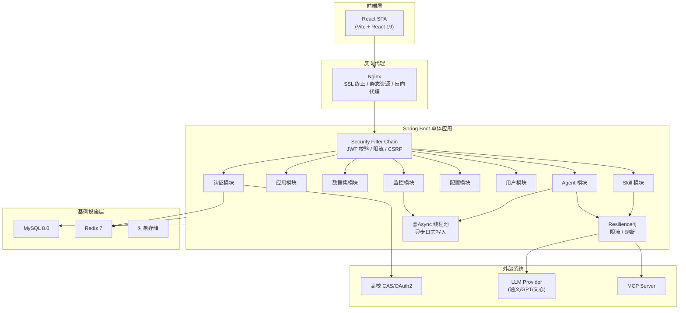
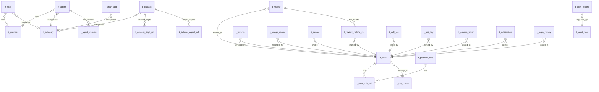
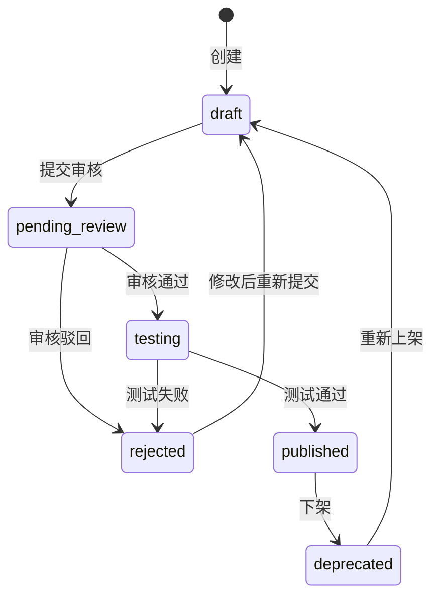
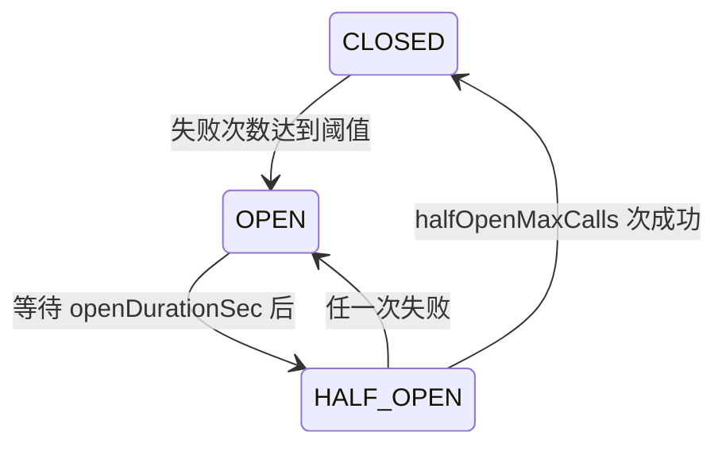
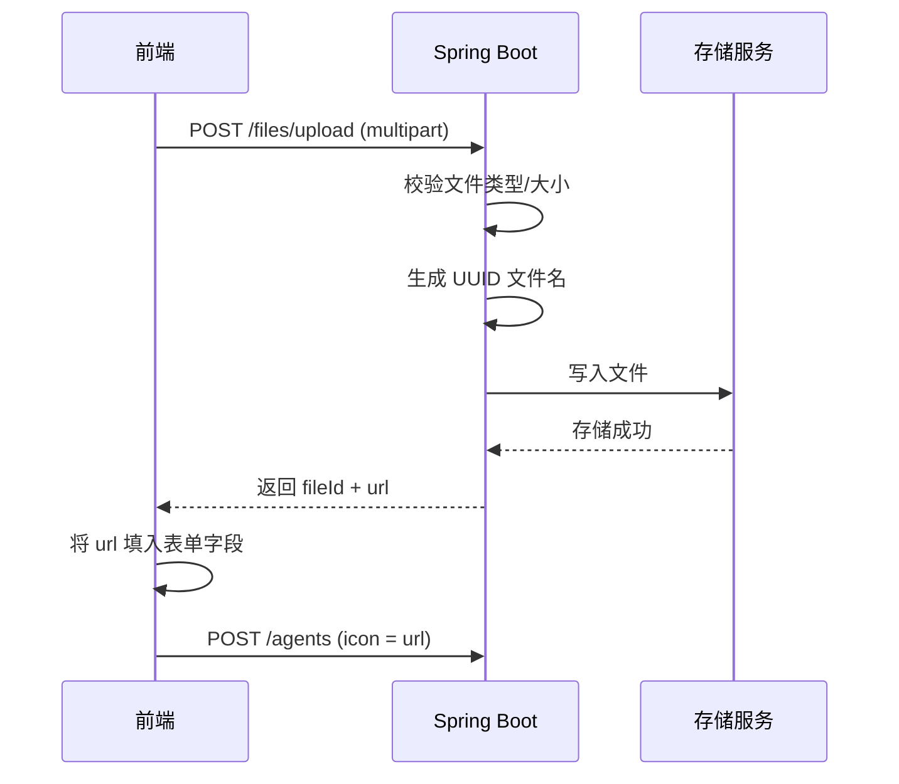
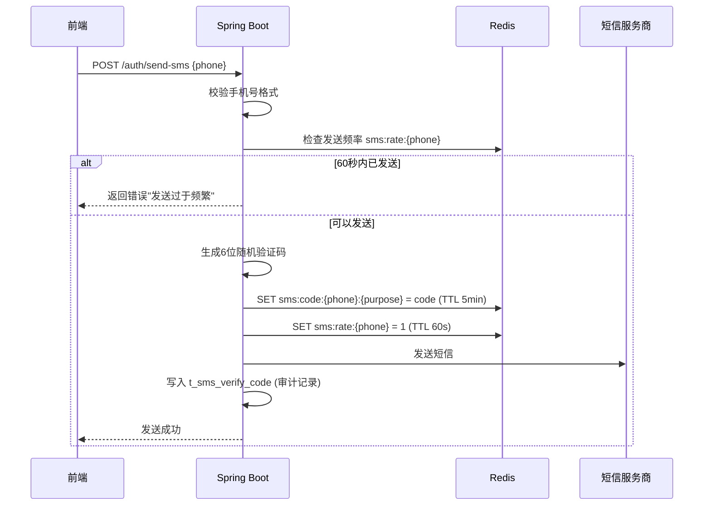

# 兰智通（LantuConnect）后端开发与数据库设计文档

> 本文档基于前端代码逆向分析自动生成，覆盖 19 个 API 服务模块、31 张数据库表、100+ 个 API 端点。
> 生成日期：2026-03-21

**与实现、联调的关系**：后端按本文进行设计与实现；**当前可联调的 URL/请求头/分页/响应等契约**以 **[frontend-alignment-handbook.md](frontend-alignment-handbook.md)**（及 Swagger）为准，避免仅依赖本文与真实接口不一致。实现过程中的问题见 **[bug-fixes.md](bug-fixes.md)**。三份文档在仓库 [README.md](../README.md) 中有统一说明。

---

## 后端实现状态说明（相对本文目标的差距）

> **快照日期**：2026-03-22（**2026-03-22 三次修订**：JWT 过滤器、角色切面、技能真实调用、短信 mock、定时任务实现、统计聚合、Resilience4j 注解、登录历史等已补全，详见 [remaining-work.md](remaining-work.md) 与 [bug-fixes.md](bug-fixes.md) IMPL-002/IMPL-003）。本节描述 **Java 代码实际能力** 与本文「目标架构」差异；**接口契约**以 **[frontend-alignment-handbook.md](frontend-alignment-handbook.md)** 为准。

### 已大体实现（可与前端联调）

- **单体 Spring Boot**：Auth（含登录历史）、Agent（含版本发布/回滚）、Skill（含 MCP 根列表、**invoke 真实 HTTP 调用**）、App、Dataset、Provider、Category、Tag、用户管理、监控（KPI/调用日志/告警记录/追踪/告警规则 CRUD）、健康与熔断配置、系统参数与安全项、审计日志查询、配额与两套限流接口、审核流、评论、收藏与使用记录分页、通知分页、文件本地上传等 **REST 接口均已暴露**。
- **数据层**：以 `sql/schema.sql` 为主；种子数据见 `sql/seed-data.sql`。
- **Redis**：Token 黑名单（写入 **并在请求链由 `JwtAuthenticationFilter` 校验**）、Refresh 防重放、用户偏好（`language`/`twoStep`）、短信频控等。
- **JWT 过滤器**：`JwtAuthenticationFilter` 解析 `Authorization: Bearer`，校验黑名单，注入 `X-User-Id`；可通过 `lantu.security.allow-header-user-id-fallback` 渐进关闭裸 `X-User-Id` 回退。
- **RBAC**：`@RequireRole` 注解 + `RequireRoleAspect` 切面，已挂 `UserMgmtController`、`SystemParamController`、`HealthController`（写操作）、`MonitoringController`（告警规则写）、`ReviewController`（审核写）。
- **Resilience4j**：`@RateLimiter("authLogin")` 挂登录接口；`@CircuitBreaker("skillInvoke")` 挂技能出站调用；`GlobalExceptionHandler` 捕获 `RequestNotPermitted` 返回 429。

### 未完全实现、占位或返回空数据（前端勿当完整业务）

| 领域 | 现状（代码依据） |
|------|------------------|
| **认证扩展** | `POST /auth/send-sms`、`/auth/bind-phone` 已实现 **mock 阶段**（验证码写入 `t_sms_verify_code` + Redis 60s 频控，验证码打日志，**未对接真实短信商**）。 |
| **JWT 全局鉴权** | **已实现** `JwtAuthenticationFilter`（Bearer 解析 + 黑名单 + `X-User-Id` 回退）。Spring Security 仍为 `permitAll`（JWT 校验由独立 Servlet 过滤器完成）。生产建议设 `allow-header-user-id-fallback: false`。 |
| **Resilience4j** | **部分已挂注解**：登录接口 `@RateLimiter`、技能出站 `@CircuitBreaker`；其余外部 HTTP/文件/邮件等尚未统一限流/熔断。 |
| **Skill 调用** | **已实现**：`POST /v1/skills/{id}/invoke` 读取 `spec_json.url` 发起真实 HTTP POST，写入 `t_call_log`（含 token 估算），异常/超时/熔断均记录。 |
| **监控性能接口** | **已实现**：`GET /monitoring/performance` 基于 `t_call_log` **近 24 小时按小时**聚合 `avgLatencyMs` / `requestCount`（MySQL `DATE_FORMAT`）。无数据时为空数组。 |
| **系统配置** | `POST /system-config/network/apply`、`/acl/publish` 返回带 `mock` 标识的 JSON（受 `lantu.system.integration-mock` 开关控制），无真实网络/ACL 下发。 |
| **仪表盘** | **已实现（聚合版）**：`admin-overview` 汇总用户数/Agent/Skill/App/Dataset/当日调用/待审数 + 近 7 日调用趋势；`user-workspace` 拉用户基本信息、最近使用记录、收藏数与未读通知数；`health-summary` 健康配置数量与 OPEN 熔断器数；`usage-stats` / `data-reports` 基于 `t_call_log` 按日/路径聚合。**仍非**架构文中全部图表与运营大屏能力。 |
| **用户活动** | **已实现**：`my-agents` / `my-skills` 按 `created_by = userId`；`usage-stats` 按使用记录聚合（含按 `target_type`、近 7 日按天）。 |
| **用户设置** | **已实现**：`PUT/GET /user-settings/workspace` 使用 **Redis** 键 `lantu:usersettings:workspace:{userId}`（JSON，TTL 365 天），无独立 workspace 表；`GET .../stats` 中 `totalAgents`/`totalWorkflows`/`totalApiCalls` 为真实统计，`tokenUsage` 由 `t_call_log` 近 30 天 token 汇总（依赖调用方写入 token 数），`storageUsedMb` 由用户数据集 `file_size` 汇总，`activeSessions` 为近 24h 调用条数（代理指标）。 |
| **定时任务** | **`QuotaDailyResetTask`、`QuotaMonthlyResetTask`、`CircuitBreakerStateTask`** 等已接库表逻辑；**`UserRoleCountSyncTask`**（同步 `t_platform_role.user_count`）、**`ProviderCountSyncTask`**（同步 `agent_count`/`skill_count`）、**`HealthCheckTask`**（HTTP 探测 `t_health_config.check_url`）、**`ExpiredTokenCleanupTask`**（清理孤立黑名单键）**均已实现真实逻辑**。 |
| **Profile 持久化** | `PUT /auth/profile`：`avatar` 写入 `t_user`；`language`/`twoStep` 持久化到 Redis `lantu:user:pref:{userId}`；`/auth/me` 返回合并后的字段。 |

### 与本文第 1 章图述的差异（摘要）

- 架构图中的 **「JWT 校验 / 限流」在 Filter 层完整生效** → **JWT 过滤器已实现**（`JwtAuthenticationFilter`），限流部分已挂 `@RateLimiter`；完整 `permissions` 细粒度鉴权仍以后续增强为主。
- **CAS/OAuth2**：接口形态未在本文档单独章节与当前代码一一对应，仍以平台账号密码登录为主。

---

## 目录

- [后端实现状态说明（相对本文目标的差距）](#后端实现状态说明相对本文目标的差距)
- [第1章 架构推演与技术选型](#第1章-架构推演与技术选型)
- [第2章 数据库设计](#第2章-数据库设计)
- [第3章 API 接口文档](#第3章-api-接口文档)
- [第4章 核心隐藏逻辑](#第4章-核心隐藏逻辑)
- [第5章 前后端对齐注意事项](#第5章-前后端对齐注意事项)

---

## 第1章 架构推演与技术选型

### 1.1 业务场景分析

兰智通是面向高校的**智能体接入与管理平台**，核心业务包括：

1. **智能体生命周期管理**：Agent / Skill 的注册、审核、发布、版本管理、市场发现
2. **多源异构接入**：支持 MCP 协议、HTTP API、内置服务三种接入方式
3. **统一网关路由**：对 Agent / Skill 调用进行统一认证、限流、熔断、日志采集
4. **数据集管理**：文档、结构化数据、多媒体数据的注册与权限控制
5. **全链路可观测**：调用日志、性能指标、告警规则、分布式追踪、健康检查
6. **多租户权限体系**：对接高校统一身份认证，叠加平台 RBAC 四角色体系
7. **系统运营配置**：模型管理、限流策略、配额、安全策略、审计日志

### 1.2 推荐技术栈

| 层次 | 技术选型 | 理由 |
|------|----------|------|
| 语言 / 框架 | **Java 17 + Spring Boot 3.2** | 高校 IT 团队 Java 生态成熟，单体架构开发部署简单 |
| ORM | **MyBatis-Plus 3.5** | 灵活 SQL + 代码生成，适合复杂查询与高校已有数据库对接 |
| 数据库 | **MySQL 8.0** | 高校 IT 最广泛使用的关系型数据库，JSON 类型支持 specJson / parametersSchema，8.0 原生 CTE（WITH RECURSIVE）支持树形组织架构与分类查询 |
| 缓存 | **Redis 7** | Token 黑名单、限流计数器（滑动窗口）、热点数据缓存 |
| 限流 / 熔断 | **Resilience4j** | 直接集成到 Spring Boot，通过注解实现限流（@RateLimiter）和熔断（@CircuitBreaker），无需独立网关 |
| 异步任务 | **Spring 线程池 + @Async** | 调用日志异步写入、告警通知等，初期无需引入 MQ，后续可平滑迁移至 RabbitMQ |
| 认证 | **Spring Security + JWT** | 双 Token（Access + Refresh）机制，对接高校 CAS / OAuth2 |
| 文档 | **SpringDoc (OpenAPI 3)** | 自动生成 Swagger 文档，与前端开发者门户对接 |
| 监控 | **Micrometer + Prometheus + Grafana** | Actuator 暴露 /actuator/prometheus 端点，Prometheus 定时拉取，Grafana 可视化看板 |

### 1.3 系统架构图



### 1.4 部署架构建议

```
┌──────────────────────────────────────────────────┐
│  Nginx（SSL 终止、前端静态资源、反向代理 /api）     │
├──────────────────────────────────────────────────┤
│  Spring Boot 单体应用（可部署 1~2 实例做负载均衡）  │
│  ┌──────────────────────────────────────────┐    │
│  │  内置模块：Auth / Agent / Skill / App /  │    │
│  │  Dataset / Monitor / Config / User       │    │
│  │  内置组件：Resilience4j / @Async 线程池   │    │
│  └──────────────────────────────────────────┘    │
├──────────────────────────────────────────────────┤
│        MySQL 8.0        │       Redis 7          │
└──────────────────────────────────────────────────┘
```

> **演进路径**：当前单体足够支撑。后续若调用量激增，可将监控日志写入独立为消费者服务（引入 RabbitMQ），或将 Agent 调用网关拆出为独立服务，无需重写业务代码。

---

## 第2章 数据库设计

### 2.0 通用约定

- 所有表默认包含 `create_time`、`update_time`（自动填充，`update_time` 附加 `ON UPDATE CURRENT_TIMESTAMP`）
- 需要软删除的表包含 `deleted` 字段（0=正常，1=已删除）
- 主键统一使用 `BIGINT AUTO_INCREMENT`，前端 DTO 中 id 为 number 的对应 BIGINT，id 为 string 的对应 VARCHAR(36) UUID
- 时间字段统一使用 `DATETIME`
- JSON 类型字段使用 MySQL `JSON`
- 存储引擎 InnoDB，字符集 `utf8mb4`，排序规则 `utf8mb4_unicode_ci`
- 建表语句末尾添加 `ENGINE=InnoDB DEFAULT CHARSET=utf8mb4 COLLATE=utf8mb4_unicode_ci`

---

### 2.1 用户与权限域

#### 2.1.1 t_user — 用户表

> 对接高校统一身份认证系统（t_user），字段与高校数据库对齐。

| 字段 | 类型 | 约束 | 说明 |
|------|------|------|------|
| user_id | BIGINT AUTO_INCREMENT | PK | 用户ID |
| username | VARCHAR(64) | NOT NULL, UNIQUE | 学工号 |
| password_hash | VARCHAR(255) | NOT NULL | bcrypt 加密密码 |
| real_name | VARCHAR(64) | NOT NULL | 真实姓名 |
| sex | TINYINT | DEFAULT 0 | 1=男 2=女 0=未知 |
| school_id | BIGINT | NOT NULL | 学校ID |
| menu_id | BIGINT | FK -> t_org_menu | 主组织架构ID |
| major | VARCHAR(128) | NULL | 专业（学生） |
| class | VARCHAR(64) | NULL | 班级（学生） |
| role | TINYINT | NOT NULL | 学校身份（非平台角色） |
| mobile | VARCHAR(20) | NULL | 手机号 |
| mail | VARCHAR(128) | NULL | 邮箱 |
| head_image | VARCHAR(512) | NULL | 头像URL |
| zw | VARCHAR(64) | NULL | 职务 |
| zc | VARCHAR(64) | NULL | 职称 |
| birthday | DATE | NULL | 生日 |
| status | VARCHAR(16) | DEFAULT 'active' | active/disabled/locked |
| last_login_time | DATETIME | NULL | 最后登录时间 |
| deleted | TINYINT | DEFAULT 0 | 软删除 |
| create_time | DATETIME | DEFAULT CURRENT_TIMESTAMP | 创建时间 |
| update_time | DATETIME | DEFAULT CURRENT_TIMESTAMP | 更新时间 |

**索引**：`username` UNIQUE, `school_id`, `menu_id`, `mobile`

#### 2.1.2 t_platform_role — 平台角色表

| 字段 | 类型 | 约束 | 说明 |
|------|------|------|------|
| id | BIGINT AUTO_INCREMENT | PK | 角色ID |
| role_code | VARCHAR(32) | NOT NULL, UNIQUE | 角色编码：platform_admin / dept_admin / developer / user |
| role_name | VARCHAR(64) | NOT NULL | 角色名称 |
| description | VARCHAR(256) | NULL | 角色描述 |
| permissions | JSON | NOT NULL | 权限标识数组，如 ["agent:view","agent:create"] |
| is_system | BOOLEAN | DEFAULT false | 是否系统内置角色（不可删除） |
| user_count | INTEGER | DEFAULT 0 | 关联用户数（冗余，定时同步） |
| create_time | DATETIME | DEFAULT CURRENT_TIMESTAMP | |
| update_time | DATETIME | DEFAULT CURRENT_TIMESTAMP | |

**预设数据**：

| role_code | role_name | 权限范围 |
|-----------|-----------|----------|
| platform_admin | 平台管理员 | 全部权限 |
| dept_admin | 部门管理员 | 本部门 agent/skill/dataset 管理 + 用户查看 |
| developer | 开发者 | agent/skill 创建与发布 + API 密钥管理 |
| user | 普通用户 | 市场浏览 + 收藏 + 使用记录 |

#### 2.1.3 t_user_role_rel — 用户角色关联表

| 字段 | 类型 | 约束 | 说明 |
|------|------|------|------|
| id | BIGINT AUTO_INCREMENT | PK | |
| user_id | BIGINT | FK -> t_user, NOT NULL | |
| role_id | BIGINT | FK -> t_platform_role, NOT NULL | |
| create_time | DATETIME | DEFAULT CURRENT_TIMESTAMP | |

**约束**：`UNIQUE(user_id, role_id)`

#### 2.1.4 t_org_menu — 组织架构表

> 树形结构，对接高校 t_menu 表。

| 字段 | 类型 | 约束 | 说明 |
|------|------|------|------|
| menu_id | BIGINT AUTO_INCREMENT | PK | 组织节点ID |
| menu_name | VARCHAR(128) | NOT NULL | 组织名称 |
| menu_parent_id | BIGINT | DEFAULT 0 | 父节点ID，0=顶级 |
| menu_level | TINYINT | NOT NULL | 层级深度 |
| if_xy | TINYINT | DEFAULT 0 | 1=学院 0=非学院 |
| head_count | INTEGER | DEFAULT 0 | 人数统计 |
| sort_order | INTEGER | DEFAULT 0 | 排序权重 |
| create_time | DATETIME | DEFAULT CURRENT_TIMESTAMP | |
| update_time | DATETIME | DEFAULT CURRENT_TIMESTAMP | |

**索引**：`menu_parent_id`

#### 2.1.5 t_api_key — API 密钥表

> 管理员创建的全局 API Key 与用户个人 API Key 共用一张表，通过 owner_type 区分。

| 字段 | 类型 | 约束 | 说明 |
|------|------|------|------|
| id | VARCHAR(36) | PK | UUID |
| name | VARCHAR(128) | NOT NULL | 密钥名称 |
| key_hash | VARCHAR(255) | NOT NULL | 密钥哈希值（SHA-256） |
| prefix | VARCHAR(16) | NOT NULL | 密钥前缀（展示用，如 sk_a1b2） |
| masked_key | VARCHAR(64) | NOT NULL | 脱敏展示（sk_a1b2****c3d4） |
| owner_type | VARCHAR(16) | NOT NULL | admin / user |
| owner_id | VARCHAR(36) | NOT NULL | 所有者ID |
| scopes | JSON | DEFAULT '[]' | 权限范围 |
| status | VARCHAR(16) | DEFAULT 'active' | active / expired / revoked |
| expires_at | DATETIME | NULL | 过期时间 |
| last_used_at | DATETIME | NULL | 最后使用时间 |
| call_count | BIGINT | DEFAULT 0 | 调用次数 |
| created_by | VARCHAR(64) | NOT NULL | 创建人 |
| create_time | DATETIME | DEFAULT CURRENT_TIMESTAMP | |

**索引**：`owner_type + owner_id`, `status`, `prefix`

#### 2.1.6 t_access_token — 访问令牌表

| 字段 | 类型 | 约束 | 说明 |
|------|------|------|------|
| id | VARCHAR(36) | PK | UUID |
| name | VARCHAR(128) | NOT NULL | 令牌名称 |
| token_hash | VARCHAR(255) | NOT NULL | 令牌哈希值 |
| masked_token | VARCHAR(64) | NOT NULL | 脱敏展示 |
| type | VARCHAR(16) | NOT NULL | access / service / temporary |
| scopes | JSON | DEFAULT '[]' | 权限范围 |
| status | VARCHAR(16) | DEFAULT 'active' | active / expired / revoked |
| expires_at | DATETIME | NOT NULL | 过期时间 |
| last_used_at | DATETIME | NULL | 最后使用时间 |
| created_by | VARCHAR(64) | NOT NULL | 创建人 |
| create_time | DATETIME | DEFAULT CURRENT_TIMESTAMP | |

---

### 2.2 核心资产域

#### 2.2.1 t_agent — Agent 表

> 对应前端 Agent DTO。mode='SUBAGENT' 或 'ALL' 表示 Agent。

| 字段 | 类型 | 约束 | 说明 |
|------|------|------|------|
| id | BIGINT AUTO_INCREMENT | PK | |
| agent_name | VARCHAR(128) | NOT NULL, UNIQUE | 唯一标识（英文） |
| display_name | VARCHAR(128) | NOT NULL | 显示名称 |
| description | TEXT | NOT NULL | 描述 |
| agent_type | VARCHAR(16) | NOT NULL | mcp / http_api / builtin |
| mode | VARCHAR(16) | NOT NULL | SUBAGENT / ALL |
| source_type | VARCHAR(16) | NOT NULL | internal / partner / cloud |
| provider_id | BIGINT | FK -> t_provider, NULL | 关联提供商 |
| category_id | BIGINT | FK -> t_category, NULL | 分类ID |
| status | VARCHAR(20) | DEFAULT 'draft' | draft / pending_review / testing / published / rejected / deprecated |
| spec_json | JSON | NOT NULL | 连接配置 {url, api_key, headers, timeout} |
| is_public | BOOLEAN | DEFAULT false | 是否公开 |
| icon | VARCHAR(512) | NULL | 图标URL |
| sort_order | INTEGER | DEFAULT 0 | 排序权重 |
| hidden | BOOLEAN | DEFAULT false | 是否隐藏 |
| max_concurrency | INTEGER | DEFAULT 10 | 最大并发数 |
| max_steps | INTEGER | NULL | 最大步数 |
| temperature | DECIMAL(3,2) | NULL | 温度参数 |
| system_prompt | TEXT | NULL | 系统提示词 |
| quality_score | DECIMAL(5,2) | DEFAULT 0 | 质量评分 |
| avg_latency_ms | INTEGER | DEFAULT 0 | 平均延迟(ms) |
| success_rate | DECIMAL(5,2) | DEFAULT 100 | 成功率(%) |
| avg_token_cost | DECIMAL(10,4) | DEFAULT 0 | 平均Token消耗 |
| call_count | BIGINT | DEFAULT 0 | 调用次数 |
| featured | TINYINT | DEFAULT 0 | 是否推荐（市场首页精选） |
| rating_avg | DECIMAL(3,2) | DEFAULT 0 | 平均评分（从 t_review 聚合，冗余） |
| rating_count | INTEGER | DEFAULT 0 | 评分数量（冗余） |
| created_by | BIGINT | NULL | 创建者用户ID（关联 t_user，市场页展示作者） |
| deleted | TINYINT | DEFAULT 0 | 软删除 |
| create_time | DATETIME | DEFAULT CURRENT_TIMESTAMP | |
| update_time | DATETIME | DEFAULT CURRENT_TIMESTAMP | |

**索引**：`agent_name` UNIQUE, `status`, `source_type`, `category_id`, `agent_type`, `is_public + status`（复合索引，市场查询用）, `featured + sort_order`

#### 2.2.2 t_skill — Skill 表

> 对应前端 Skill DTO。mode='TOOL'。与 Agent 分表存储以避免业务耦合。

| 字段 | 类型 | 约束 | 说明 |
|------|------|------|------|
| id | BIGINT AUTO_INCREMENT | PK | |
| agent_name | VARCHAR(128) | NOT NULL, UNIQUE | 唯一标识 |
| display_name | VARCHAR(128) | NOT NULL | 显示名称 |
| description | TEXT | NOT NULL | 描述 |
| agent_type | VARCHAR(16) | NOT NULL | mcp / http_api / builtin |
| mode | VARCHAR(8) | DEFAULT 'TOOL' | 固定为 TOOL |
| parent_id | BIGINT | NULL | 所属 MCP Server 的 ID（自引用或指向 t_mcp_server） |
| source_type | VARCHAR(16) | NOT NULL | internal / partner / cloud |
| provider_id | BIGINT | FK -> t_provider, NULL | 关联提供商 |
| category_id | BIGINT | FK -> t_category, NULL | 分类ID |
| status | VARCHAR(20) | DEFAULT 'draft' | 同 Agent 状态枚举 |
| display_template | VARCHAR(32) | NULL | file/image/audio/video/app/answer 等展示模板 |
| spec_json | JSON | NOT NULL | 连接配置 |
| parameters_schema | JSON | NULL | 工具参数 JSON Schema |
| is_public | BOOLEAN | DEFAULT false | |
| icon | VARCHAR(512) | NULL | |
| sort_order | INTEGER | DEFAULT 0 | |
| max_concurrency | INTEGER | DEFAULT 10 | |
| quality_score | DECIMAL(5,2) | DEFAULT 0 | |
| avg_latency_ms | INTEGER | DEFAULT 0 | |
| success_rate | DECIMAL(5,2) | DEFAULT 100 | |
| avg_token_cost | DECIMAL(10,4) | DEFAULT 0 | |
| call_count | BIGINT | DEFAULT 0 | |
| created_by | BIGINT | NULL | |
| deleted | TINYINT | DEFAULT 0 | |
| create_time | DATETIME | DEFAULT CURRENT_TIMESTAMP | |
| update_time | DATETIME | DEFAULT CURRENT_TIMESTAMP | |

**索引**：`agent_name` UNIQUE, `parent_id`, `status`, `category_id`

#### 2.2.3 t_smart_app — 智能应用表

| 字段 | 类型 | 约束 | 说明 |
|------|------|------|------|
| id | BIGINT AUTO_INCREMENT | PK | |
| app_name | VARCHAR(128) | NOT NULL, UNIQUE | 应用标识 |
| display_name | VARCHAR(128) | NOT NULL | 显示名称 |
| description | TEXT | NOT NULL | 描述 |
| app_url | VARCHAR(512) | NOT NULL | 应用URL |
| embed_type | VARCHAR(20) | NOT NULL | iframe / micro_frontend / redirect |
| icon | VARCHAR(512) | NULL | 图标URL |
| screenshots | JSON | DEFAULT '[]' | 截图URL数组 |
| category_id | BIGINT | FK -> t_category, NULL | 分类ID |
| source_type | VARCHAR(16) | NOT NULL | internal / partner |
| status | VARCHAR(16) | DEFAULT 'draft' | draft / published / testing / deprecated |
| is_public | BOOLEAN | DEFAULT false | |
| sort_order | INTEGER | DEFAULT 0 | |
| created_by | BIGINT | NULL | |
| deleted | TINYINT | DEFAULT 0 | |
| create_time | DATETIME | DEFAULT CURRENT_TIMESTAMP | |
| update_time | DATETIME | DEFAULT CURRENT_TIMESTAMP | |

**索引**：`app_name` UNIQUE, `status`, `embed_type`, `category_id`, `source_type`

#### 2.2.4 t_dataset — 数据集表

| 字段 | 类型 | 约束 | 说明 |
|------|------|------|------|
| id | BIGINT AUTO_INCREMENT | PK | |
| dataset_name | VARCHAR(128) | NOT NULL, UNIQUE | 数据集标识 |
| display_name | VARCHAR(128) | NOT NULL | 显示名称 |
| description | TEXT | NOT NULL | |
| source_type | VARCHAR(16) | NOT NULL | department / knowledge / third_party |
| data_type | VARCHAR(16) | NOT NULL | document / structured / image / audio / video / mixed |
| format | VARCHAR(32) | NOT NULL | csv/json/pdf/docx/parquet... |
| record_count | BIGINT | DEFAULT 0 | 记录数 |
| file_size | BIGINT | DEFAULT 0 | 文件大小(bytes) |
| category_id | BIGINT | FK -> t_category, NULL | |
| status | VARCHAR(16) | DEFAULT 'draft' | draft / published / testing / deprecated |
| tags | JSON | DEFAULT '[]' | 标签数组 |
| is_public | BOOLEAN | DEFAULT false | |
| created_by | BIGINT | NULL | |
| deleted | TINYINT | DEFAULT 0 | |
| create_time | DATETIME | DEFAULT CURRENT_TIMESTAMP | |
| update_time | DATETIME | DEFAULT CURRENT_TIMESTAMP | |

**索引**：`dataset_name` UNIQUE, `status`, `source_type`, `data_type`, `category_id`, `is_public + status`

#### 2.2.5 t_dataset_dept_rel — 数据集部门权限关联

| 字段 | 类型 | 约束 | 说明 |
|------|------|------|------|
| id | BIGINT AUTO_INCREMENT | PK | |
| dataset_id | BIGINT | FK -> t_dataset, NOT NULL | |
| menu_id | BIGINT | FK -> t_org_menu, NOT NULL | 允许访问的组织ID |
| create_time | DATETIME | DEFAULT CURRENT_TIMESTAMP | |

**约束**：`UNIQUE(dataset_id, menu_id)`

#### 2.2.6 t_dataset_agent_rel — 数据集Agent关联

| 字段 | 类型 | 约束 | 说明 |
|------|------|------|------|
| id | BIGINT AUTO_INCREMENT | PK | |
| dataset_id | BIGINT | FK -> t_dataset, NOT NULL | |
| agent_id | BIGINT | FK -> t_agent, NOT NULL | |
| create_time | DATETIME | DEFAULT CURRENT_TIMESTAMP | |

**约束**：`UNIQUE(dataset_id, agent_id)`

#### 2.2.7 t_provider — 服务提供商表

| 字段 | 类型 | 约束 | 说明 |
|------|------|------|------|
| id | BIGINT AUTO_INCREMENT | PK | |
| provider_code | VARCHAR(64) | NOT NULL, UNIQUE | 提供商编码 |
| provider_name | VARCHAR(128) | NOT NULL | 提供商名称 |
| provider_type | VARCHAR(16) | NOT NULL | internal / partner / cloud |
| description | TEXT | NULL | |
| auth_type | VARCHAR(16) | NOT NULL | api_key / oauth2 / basic / none |
| auth_config | JSON | NULL | 认证配置（加密存储） |
| base_url | VARCHAR(512) | NULL | 基础URL |
| status | VARCHAR(16) | DEFAULT 'active' | active / inactive |
| agent_count | INTEGER | DEFAULT 0 | 关联 Agent 数（冗余） |
| skill_count | INTEGER | DEFAULT 0 | 关联 Skill 数（冗余） |
| deleted | TINYINT | DEFAULT 0 | |
| create_time | DATETIME | DEFAULT CURRENT_TIMESTAMP | |
| update_time | DATETIME | DEFAULT CURRENT_TIMESTAMP | |

**索引**：`provider_code` UNIQUE, `provider_type`, `status`

#### 2.2.8 t_agent_version — Agent 版本表

| 字段 | 类型 | 约束 | 说明 |
|------|------|------|------|
| id | BIGINT AUTO_INCREMENT | PK | |
| agent_id | BIGINT | FK -> t_agent, NOT NULL | |
| version | VARCHAR(32) | NOT NULL | 版本号（如 v1.0.0） |
| changelog | TEXT | NOT NULL | 变更日志 |
| status | VARCHAR(16) | DEFAULT 'draft' | draft / testing / released / rollback |
| spec_json_snapshot | JSON | NULL | 版本快照 |
| created_by | VARCHAR(64) | NOT NULL | 创建人 |
| create_time | DATETIME | DEFAULT CURRENT_TIMESTAMP | |

**约束**：`UNIQUE(agent_id, version)`

---

### 2.3 分类与标签域

#### 2.3.1 t_category — 分类表（树形）

| 字段 | 类型 | 约束 | 说明 |
|------|------|------|------|
| id | BIGINT AUTO_INCREMENT | PK | |
| category_code | VARCHAR(64) | NOT NULL, UNIQUE | 分类编码 |
| category_name | VARCHAR(128) | NOT NULL | 分类名称 |
| parent_id | BIGINT | NULL | 父分类ID，NULL=顶级 |
| icon | VARCHAR(64) | NULL | 图标标识 |
| sort_order | INTEGER | DEFAULT 0 | |
| create_time | DATETIME | DEFAULT CURRENT_TIMESTAMP | |
| update_time | DATETIME | DEFAULT CURRENT_TIMESTAMP | |

**预设分类**：校园业务、教学科研、办公效率、数据分析、生活服务（各含子分类）

#### 2.3.2 t_tag — 标签表

| 字段 | 类型 | 约束 | 说明 |
|------|------|------|------|
| id | BIGINT AUTO_INCREMENT | PK | |
| name | VARCHAR(64) | NOT NULL | 标签名称 |
| category | VARCHAR(32) | NOT NULL | 标签分类（agent/skill/dataset/general） |
| usage_count | INTEGER | DEFAULT 0 | 使用次数 |
| create_time | DATETIME | DEFAULT CURRENT_TIMESTAMP | |

**约束**：`UNIQUE(name, category)`

#### 2.3.3 t_resource_tag_rel — 资源标签关联表

| 字段 | 类型 | 约束 | 说明 |
|------|------|------|------|
| id | BIGINT AUTO_INCREMENT | PK | |
| resource_type | VARCHAR(16) | NOT NULL | agent / skill / dataset / app |
| resource_id | BIGINT | NOT NULL | 资源ID |
| tag_id | BIGINT | FK -> t_tag, NOT NULL | |
| create_time | DATETIME | DEFAULT CURRENT_TIMESTAMP | |

**约束**：`UNIQUE(resource_type, resource_id, tag_id)`

---

### 2.4 审核与评论域

#### 2.4.1 t_audit_item — 审核队列表

| 字段 | 类型 | 约束 | 说明 |
|------|------|------|------|
| id | BIGINT AUTO_INCREMENT | PK | |
| target_type | VARCHAR(16) | NOT NULL | agent / skill |
| target_id | BIGINT | NOT NULL | 关联资源ID |
| display_name | VARCHAR(128) | NOT NULL | 资源显示名（冗余） |
| agent_name | VARCHAR(128) | NOT NULL | 资源标识（冗余） |
| description | TEXT | NULL | |
| agent_type | VARCHAR(16) | NULL | |
| source_type | VARCHAR(16) | NULL | |
| submitter | VARCHAR(64) | NOT NULL | 提交人 |
| submit_time | DATETIME | NOT NULL | 提交时间 |
| status | VARCHAR(20) | DEFAULT 'pending_review' | pending_review / testing / published / rejected |
| reviewer_id | BIGINT | NULL | 审核人ID |
| reject_reason | TEXT | NULL | 驳回原因 |
| review_time | DATETIME | NULL | 审核时间 |
| create_time | DATETIME | DEFAULT CURRENT_TIMESTAMP | |

**索引**：`target_type + target_id`, `status`, `submitter`, `submit_time`

#### 2.4.2 t_review — 评论评分表

| 字段 | 类型 | 约束 | 说明 |
|------|------|------|------|
| id | BIGINT AUTO_INCREMENT | PK | |
| target_type | VARCHAR(16) | NOT NULL | agent / skill / app |
| target_id | BIGINT | NOT NULL | 资源ID |
| user_id | BIGINT | FK -> t_user, NOT NULL | 评论用户 |
| user_name | VARCHAR(64) | NOT NULL | 用户名（冗余） |
| avatar | VARCHAR(512) | NULL | 头像（冗余） |
| rating | TINYINT | NOT NULL | 评分 1-5 |
| comment | TEXT | NOT NULL | 评论内容 |
| helpful_count | INTEGER | DEFAULT 0 | "有用"计数 |
| deleted | TINYINT | DEFAULT 0 | |
| create_time | DATETIME | DEFAULT CURRENT_TIMESTAMP | |

**索引**：`target_type + target_id`, `user_id`

#### 2.4.3 t_review_helpful_rel — 评论有用标记关联

| 字段 | 类型 | 约束 | 说明 |
|------|------|------|------|
| id | BIGINT AUTO_INCREMENT | PK | |
| review_id | BIGINT | FK -> t_review, NOT NULL | |
| user_id | BIGINT | FK -> t_user, NOT NULL | |
| create_time | DATETIME | DEFAULT CURRENT_TIMESTAMP | |

**约束**：`UNIQUE(review_id, user_id)`（每人每条评论只能点一次有用）

---

### 2.5 监控与运维域

#### 2.5.1 t_call_log — 调用日志表

> 高频写入表，建议按月分区。

| 字段 | 类型 | 约束 | 说明 |
|------|------|------|------|
| id | VARCHAR(36) | PK | UUID |
| trace_id | VARCHAR(64) | NOT NULL | 链路追踪ID |
| agent_id | VARCHAR(36) | NOT NULL | Agent/Skill ID |
| agent_name | VARCHAR(128) | NOT NULL | Agent/Skill 名称（冗余） |
| user_id | VARCHAR(36) | NOT NULL | 调用用户ID |
| model | VARCHAR(64) | NULL | 使用的模型名 |
| method | VARCHAR(128) | NOT NULL | 调用方法（如 POST /chat/completions） |
| status | VARCHAR(16) | NOT NULL | success / error / timeout |
| status_code | TINYINT | NOT NULL | HTTP 状态码 |
| latency_ms | INTEGER | NOT NULL | 响应延迟(ms) |
| input_tokens | INTEGER | DEFAULT 0 | 输入Token数 |
| output_tokens | INTEGER | DEFAULT 0 | 输出Token数 |
| cost | DECIMAL(10,6) | DEFAULT 0 | 本次费用 |
| error_message | TEXT | NULL | 错误信息 |
| ip | VARCHAR(45) | NOT NULL | 客户端IP |
| create_time | DATETIME | DEFAULT CURRENT_TIMESTAMP | |

**索引**：`trace_id`, `agent_id + create_time`, `user_id + create_time`, `status`, `create_time`（分区键）

#### 2.5.2 t_alert_rule — 告警规则表

| 字段 | 类型 | 约束 | 说明 |
|------|------|------|------|
| id | VARCHAR(36) | PK | UUID |
| name | VARCHAR(128) | NOT NULL | 规则名称 |
| description | TEXT | NULL | |
| metric | VARCHAR(128) | NOT NULL | 监控指标（如 api.latency.p95） |
| operator | VARCHAR(8) | NOT NULL | gt / lt / eq / gte / lte |
| threshold | DECIMAL(15,4) | NOT NULL | 阈值 |
| duration | VARCHAR(16) | DEFAULT '5m' | 持续时间 |
| severity | VARCHAR(16) | NOT NULL | critical / warning / info |
| enabled | BOOLEAN | DEFAULT true | |
| notify_channels | JSON | DEFAULT '[]' | 通知渠道 ["email","sms","webhook"] |
| create_time | DATETIME | DEFAULT CURRENT_TIMESTAMP | |
| update_time | DATETIME | DEFAULT CURRENT_TIMESTAMP | |

#### 2.5.3 t_alert_record — 告警记录表

| 字段 | 类型 | 约束 | 说明 |
|------|------|------|------|
| id | VARCHAR(36) | PK | UUID |
| rule_id | VARCHAR(36) | FK -> t_alert_rule, NOT NULL | |
| rule_name | VARCHAR(128) | NOT NULL | 规则名称（冗余） |
| severity | VARCHAR(16) | NOT NULL | critical / warning / info |
| status | VARCHAR(16) | NOT NULL | firing / resolved / silenced |
| message | TEXT | NOT NULL | 告警消息 |
| source | VARCHAR(64) | NOT NULL | 来源服务 |
| labels | JSON | DEFAULT '{}' | 标签 |
| fired_at | DATETIME | NOT NULL | 触发时间 |
| resolved_at | DATETIME | NULL | 恢复时间 |

#### 2.5.4 t_trace_span — 链路追踪表

| 字段 | 类型 | 约束 | 说明 |
|------|------|------|------|
| id | VARCHAR(36) | PK | Span ID |
| trace_id | VARCHAR(64) | NOT NULL | Trace ID |
| parent_id | VARCHAR(36) | NULL | 父 Span ID |
| operation_name | VARCHAR(128) | NOT NULL | 操作名（如 gateway.route） |
| service_name | VARCHAR(64) | NOT NULL | 服务名 |
| start_time | DATETIME | NOT NULL | 开始时间 |
| duration | INTEGER | NOT NULL | 持续时间(ms) |
| status | VARCHAR(8) | NOT NULL | ok / error |
| tags | JSON | DEFAULT '{}' | 标签 |
| logs | JSON | DEFAULT '[]' | 日志条目 |

**索引**：`trace_id`, `service_name + start_time`

#### 2.5.5 t_health_config — 健康检查配置表

| 字段 | 类型 | 约束 | 说明 |
|------|------|------|------|
| id | BIGINT AUTO_INCREMENT | PK | |
| agent_name | VARCHAR(128) | NOT NULL | 关联的 Agent/Skill 名 |
| display_name | VARCHAR(128) | NOT NULL | 显示名称 |
| agent_type | VARCHAR(16) | NOT NULL | |
| check_type | VARCHAR(8) | NOT NULL | http / tcp / ping |
| check_url | VARCHAR(512) | NOT NULL | 检查地址 |
| interval_sec | INTEGER | DEFAULT 30 | 检查间隔(秒) |
| healthy_threshold | INTEGER | DEFAULT 3 | 健康阈值次数 |
| timeout_sec | INTEGER | DEFAULT 10 | 超时时间(秒) |
| health_status | VARCHAR(16) | DEFAULT 'healthy' | healthy / degraded / down |
| last_check_time | DATETIME | NULL | 最后检查时间 |
| create_time | DATETIME | DEFAULT CURRENT_TIMESTAMP | |
| update_time | DATETIME | DEFAULT CURRENT_TIMESTAMP | |

#### 2.5.6 t_circuit_breaker — 熔断器配置表

| 字段 | 类型 | 约束 | 说明 |
|------|------|------|------|
| id | BIGINT AUTO_INCREMENT | PK | |
| agent_name | VARCHAR(128) | NOT NULL | 关联 Agent/Skill |
| display_name | VARCHAR(128) | NOT NULL | |
| current_state | VARCHAR(16) | DEFAULT 'CLOSED' | CLOSED / OPEN / HALF_OPEN |
| failure_threshold | INTEGER | DEFAULT 5 | 失败阈值 |
| open_duration_sec | INTEGER | DEFAULT 60 | 熔断持续时间(秒) |
| half_open_max_calls | INTEGER | DEFAULT 3 | 半开最大尝试数 |
| fallback_agent_name | VARCHAR(128) | NULL | 降级 Agent |
| fallback_message | TEXT | NULL | 降级消息 |
| last_opened_at | DATETIME | NULL | 最后熔断时间 |
| success_count | BIGINT | DEFAULT 0 | 成功计数 |
| failure_count | BIGINT | DEFAULT 0 | 失败计数 |
| create_time | DATETIME | DEFAULT CURRENT_TIMESTAMP | |
| update_time | DATETIME | DEFAULT CURRENT_TIMESTAMP | |

---

### 2.6 系统配置域

#### 2.6.1 t_model_config — 模型配置表

| 字段 | 类型 | 约束 | 说明 |
|------|------|------|------|
| id | VARCHAR(36) | PK | UUID |
| name | VARCHAR(128) | NOT NULL | 模型名称（如 通义千问-Turbo） |
| provider | VARCHAR(64) | NOT NULL | 供应商名（如 阿里云） |
| model_id | VARCHAR(64) | NOT NULL | 模型标识（如 qwen-turbo） |
| endpoint | VARCHAR(512) | NOT NULL | API 端点 |
| api_key | VARCHAR(512) | NULL | API 密钥（加密存储） |
| max_tokens | INTEGER | NOT NULL | 最大 Token 数 |
| temperature | DECIMAL(3,2) | DEFAULT 0.7 | |
| top_p | DECIMAL(3,2) | DEFAULT 0.9 | |
| enabled | BOOLEAN | DEFAULT true | |
| rate_limit | INTEGER | DEFAULT 50 | 每分钟限流 |
| cost_per_token | DECIMAL(10,8) | DEFAULT 0 | 每 Token 成本 |
| description | TEXT | NULL | |
| create_time | DATETIME | DEFAULT CURRENT_TIMESTAMP | |
| update_time | DATETIME | DEFAULT CURRENT_TIMESTAMP | |

#### 2.6.2 t_rate_limit_rule — 限流规则表

| 字段 | 类型 | 约束 | 说明 |
|------|------|------|------|
| id | VARCHAR(36) | PK | UUID |
| name | VARCHAR(128) | NOT NULL | 规则名称 |
| target | VARCHAR(16) | NOT NULL | user / role / ip / api_key / global |
| target_value | VARCHAR(128) | NULL | 目标值（如角色名、IP 段） |
| window_ms | BIGINT | NOT NULL | 时间窗口(ms) |
| max_requests | INTEGER | NOT NULL | 最大请求数 |
| max_tokens | INTEGER | NULL | 最大Token数 |
| burst_limit | INTEGER | NULL | 突发限制 |
| action | VARCHAR(16) | NOT NULL | reject / queue / throttle |
| enabled | BOOLEAN | DEFAULT true | |
| priority | INTEGER | DEFAULT 0 | 优先级（高优先） |
| create_time | DATETIME | DEFAULT CURRENT_TIMESTAMP | |
| update_time | DATETIME | DEFAULT CURRENT_TIMESTAMP | |

#### 2.6.3 t_system_param — 系统参数表

| 字段 | 类型 | 约束 | 说明 |
|------|------|------|------|
| key | VARCHAR(128) | PK | 参数键 |
| value | TEXT | NOT NULL | 参数值 |
| type | VARCHAR(16) | NOT NULL | string / number / boolean / json |
| description | VARCHAR(256) | NOT NULL | 参数说明 |
| category | VARCHAR(32) | NOT NULL | 分组（存储/模型/安全/用户/系统/集成） |
| editable | BOOLEAN | DEFAULT true | 是否可编辑 |
| update_time | DATETIME | DEFAULT CURRENT_TIMESTAMP | |

#### 2.6.4 t_security_setting — 安全设置表

| 字段 | 类型 | 约束 | 说明 |
|------|------|------|------|
| key | VARCHAR(128) | PK | 设置键 |
| value | TEXT | NOT NULL | 设置值 |
| label | VARCHAR(128) | NOT NULL | 显示名称 |
| description | VARCHAR(256) | NOT NULL | |
| type | VARCHAR(16) | NOT NULL | toggle / input / select |
| options | JSON | NULL | 可选值（select 类型用） |
| category | VARCHAR(32) | NOT NULL | 认证 / 访问控制 / 数据安全 |

---

### 2.7 用户行为域

#### 2.7.1 t_usage_record — 使用记录表

| 字段 | 类型 | 约束 | 说明 |
|------|------|------|------|
| id | BIGINT AUTO_INCREMENT | PK | |
| user_id | BIGINT | FK -> t_user, NOT NULL | |
| agent_name | VARCHAR(128) | NOT NULL | |
| display_name | VARCHAR(128) | NOT NULL | |
| type | VARCHAR(16) | NOT NULL | agent / skill / app |
| action | VARCHAR(64) | NOT NULL | 操作描述 |
| input_preview | TEXT | NULL | 输入摘要 |
| output_preview | TEXT | NULL | 输出摘要 |
| token_cost | INTEGER | DEFAULT 0 | Token 消耗 |
| latency_ms | INTEGER | DEFAULT 0 | |
| status | VARCHAR(16) | NOT NULL | success / failed |
| create_time | DATETIME | DEFAULT CURRENT_TIMESTAMP | |

**索引**：`user_id + create_time`, `type`

#### 2.7.2 t_favorite — 收藏表

| 字段 | 类型 | 约束 | 说明 |
|------|------|------|------|
| id | BIGINT AUTO_INCREMENT | PK | |
| user_id | BIGINT | FK -> t_user, NOT NULL | |
| target_type | VARCHAR(16) | NOT NULL | agent / skill / app |
| target_id | BIGINT | NOT NULL | 资源ID |
| create_time | DATETIME | DEFAULT CURRENT_TIMESTAMP | |

**约束**：`UNIQUE(user_id, target_type, target_id)`

#### 2.7.3 t_quota — 配额表

| 字段 | 类型 | 约束 | 说明 |
|------|------|------|------|
| id | BIGINT AUTO_INCREMENT | PK | |
| target_type | VARCHAR(16) | NOT NULL | user / department / global |
| target_id | BIGINT | NULL | 目标ID（global 时为 NULL） |
| target_name | VARCHAR(128) | NOT NULL | 目标名称 |
| daily_limit | INTEGER | NOT NULL | 日调用上限 |
| monthly_limit | INTEGER | NOT NULL | 月调用上限 |
| daily_used | INTEGER | DEFAULT 0 | 当日已用 |
| monthly_used | INTEGER | DEFAULT 0 | 当月已用 |
| enabled | BOOLEAN | DEFAULT true | |
| create_time | DATETIME | DEFAULT CURRENT_TIMESTAMP | |
| update_time | DATETIME | DEFAULT CURRENT_TIMESTAMP | |

#### 2.7.4 t_quota_rate_limit — 资源级限流表

| 字段 | 类型 | 约束 | 说明 |
|------|------|------|------|
| id | BIGINT AUTO_INCREMENT | PK | |
| name | VARCHAR(128) | NOT NULL | |
| target_type | VARCHAR(16) | NOT NULL | agent / skill / global |
| target_id | BIGINT | NULL | |
| target_name | VARCHAR(128) | NOT NULL | |
| max_requests_per_min | INTEGER | NOT NULL | 每分钟最大请求数 |
| max_requests_per_hour | INTEGER | NOT NULL | 每小时最大请求数 |
| max_concurrent | INTEGER | NOT NULL | 最大并发数 |
| enabled | BOOLEAN | DEFAULT true | |
| create_time | DATETIME | DEFAULT CURRENT_TIMESTAMP | |
| update_time | DATETIME | DEFAULT CURRENT_TIMESTAMP | |

#### 2.7.5 t_audit_log — 审计日志表

> 记录所有管理操作，不可删除、不可修改。

| 字段 | 类型 | 约束 | 说明 |
|------|------|------|------|
| id | VARCHAR(36) | PK | UUID |
| user_id | VARCHAR(36) | NOT NULL | 操作用户ID |
| username | VARCHAR(64) | NOT NULL | 操作用户名 |
| action | VARCHAR(64) | NOT NULL | 操作类型（login/create_agent/delete_user/...） |
| resource | VARCHAR(64) | NOT NULL | 资源类型（auth/agent/user-mgmt/...） |
| resource_id | VARCHAR(64) | NULL | 资源ID |
| details | TEXT | NULL | 操作详情 |
| ip | VARCHAR(45) | NOT NULL | 客户端IP |
| user_agent | VARCHAR(512) | NULL | User-Agent |
| result | VARCHAR(16) | NOT NULL | success / failure |
| create_time | DATETIME | DEFAULT CURRENT_TIMESTAMP | |

**索引**：`user_id + create_time`, `action`, `resource + resource_id`, `create_time`

---

### 2.8 通知与会话域

#### 2.8.1 t_notification — 消息通知表

> 对应前端 MessagePanel，支持 system（系统公告）、notice（业务通知）、alert（告警）三类消息。

| 字段 | 类型 | 约束 | 说明 |
|------|------|------|------|
| id | BIGINT AUTO_INCREMENT | PK | |
| user_id | BIGINT | FK -> t_user, NOT NULL | 接收用户（0=全体广播） |
| type | VARCHAR(16) | NOT NULL | system / notice / alert |
| title | VARCHAR(256) | NOT NULL | 通知标题 |
| body | TEXT | NOT NULL | 通知内容 |
| is_read | TINYINT | DEFAULT 0 | 0=未读 1=已读 |
| source_type | VARCHAR(32) | NULL | 来源类型（audit_result / alert_fire / system_announce） |
| source_id | VARCHAR(64) | NULL | 来源资源ID |
| create_time | DATETIME | DEFAULT CURRENT_TIMESTAMP | |

**索引**：`user_id + is_read + create_time`（未读消息查询）, `type`, `create_time`

#### 2.8.2 t_login_history — 登录历史表

> 对应前端 UserProfile 中展示的"最近登录记录"。

| 字段 | 类型 | 约束 | 说明 |
|------|------|------|------|
| id | BIGINT AUTO_INCREMENT | PK | |
| user_id | BIGINT | FK -> t_user, NOT NULL | |
| ip | VARCHAR(45) | NOT NULL | 登录IP |
| location | VARCHAR(128) | NULL | IP 归属地（通过 IP 库解析） |
| device | VARCHAR(256) | NULL | 设备信息（从 User-Agent 解析） |
| os | VARCHAR(64) | NULL | 操作系统 |
| browser | VARCHAR(64) | NULL | 浏览器 |
| login_method | VARCHAR(16) | NOT NULL | password / cas / sms |
| result | VARCHAR(16) | NOT NULL | success / failed / locked |
| fail_reason | VARCHAR(128) | NULL | 失败原因 |
| create_time | DATETIME | DEFAULT CURRENT_TIMESTAMP | |

**索引**：`user_id + create_time`, `ip`, `result`

#### 2.8.3 t_sms_verify_code — 短信验证码表

> 对应 `POST /auth/send-sms` 和 `POST /auth/bind-phone`，Redis 为主存储，MySQL 做审计备份。

| 字段 | 类型 | 约束 | 说明 |
|------|------|------|------|
| id | BIGINT AUTO_INCREMENT | PK | |
| phone | VARCHAR(20) | NOT NULL | 手机号 |
| code | VARCHAR(8) | NOT NULL | 验证码（6 位数字） |
| purpose | VARCHAR(16) | NOT NULL | login / bind_phone / reset_password |
| used | TINYINT | DEFAULT 0 | 是否已使用 |
| ip | VARCHAR(45) | NOT NULL | 请求IP |
| expire_time | DATETIME | NOT NULL | 过期时间 |
| create_time | DATETIME | DEFAULT CURRENT_TIMESTAMP | |

**索引**：`phone + purpose + used`, `expire_time`

---

### 2.9 ER 关系图



---

## 第3章 API 接口文档

### 3.0 通用约定

#### 基础路径

```
所有接口统一前缀：/api
示例：POST /api/auth/login
```

> **路径统一说明**：前端 Service 中部分接口使用了 `/api/v1/` 前缀（如 skills、categories），部分使用 `/` 前缀（如 agents、auth）。后端通过 `server.servlet.context-path=/api` 统一加前缀，Controller 中的路径不再重复 `/api`。对于 `/v1/` 前缀，建议当前版本统一去掉，待后续有破坏性变更时再引入版本号。前端 Service 中的路径需同步调整。

#### 统一响应格式

```json
{
  "code": 0,
  "data": "<T>",
  "message": "ok",
  "timestamp": 1711000000000
}
```

- `code = 0`：成功
- `code != 0`：失败，具体错误码见附录

#### 分页响应格式

```json
{
  "code": 0,
  "data": {
    "list": [],
    "total": 100,
    "page": 1,
    "pageSize": 20
  },
  "message": "ok",
  "timestamp": 1711000000000
}
```

#### 通用请求头

| Header | 必填 | 说明 |
|--------|------|------|
| Authorization | 是（除登录/注册外） | Bearer {token} |
| X-Request-Id | 否 | 请求追踪ID（前端自动生成） |
| X-Request-Time | 否 | 请求时间戳 |
| X-CSRF-Token | 否（非 GET 请求） | CSRF 防护令牌 |
| Content-Type | 是（POST/PUT） | application/json |

#### 通用分页参数

| 参数 | 类型 | 默认 | 说明 |
|------|------|------|------|
| page | number | 1 | 页码 |
| pageSize | number | 20 | 每页条数 |
| sortBy | string | - | 排序字段 |
| sortOrder | string | asc | asc / desc |

---

### 3.1 认证服务（auth）

#### POST /auth/login — 用户登录

**请求 Body**：

```json
{
  "username": "admin",
  "password": "123456",
  "captcha": "a1b2",
  "remember": true
}
```

**响应 data**：

```json
{
  "token": "eyJhbGciOiJIUzI1NiJ9...",
  "refreshToken": "eyJhbGciOiJIUzI1NiJ9...",
  "user": {
    "id": "u_001",
    "username": "张管理",
    "email": "admin@school.edu.cn",
    "phone": "13800138000",
    "avatar": "",
    "nickname": "张老师",
    "role": "admin",
    "status": "active",
    "department": "信息技术中心",
    "lastLoginAt": "2026-03-20T08:30:00Z",
    "createdAt": "2025-09-01T00:00:00Z",
    "updatedAt": "2026-03-20T08:30:00Z"
  },
  "expiresIn": 7200
}
```

#### POST /auth/register — 用户注册

**请求 Body**：

```json
{
  "username": "新用户",
  "email": "new@school.edu.cn",
  "password": "Password1",
  "confirmPassword": "Password1",
  "phone": "13900139000",
  "captcha": "a1b2"
}
```

**响应 data**：同登录响应

#### POST /auth/logout — 退出登录

**请求**：无 Body（仅需 Authorization Header）

**响应 data**：null

#### GET /auth/me — 获取当前用户信息

**响应 data**：UserInfo 对象（同登录响应中的 user）

#### POST /auth/refresh — 刷新 Token

**请求 Body**：

```json
{
  "refreshToken": "eyJhbGciOiJIUzI1NiJ9..."
}
```

**响应 data**：

```json
{
  "token": "new_access_token",
  "refreshToken": "new_refresh_token"
}
```

#### POST /auth/change-password — 修改密码

**请求 Body**：

```json
{
  "oldPassword": "123456",
  "newPassword": "NewPass1"
}
```

**响应 data**：null

#### POST /auth/send-sms — 发送短信验证码

**请求 Body**：

```json
{ "phone": "13800138000" }
```

**响应 data**：null

#### POST /auth/bind-phone — 绑定手机号

**请求 Body**：

```json
{ "phone": "13800138000", "code": "123456" }
```

**响应 data**：null

#### PUT /auth/profile — 更新个人资料

**请求 Body**：

```json
{
  "avatar": "https://...",
  "language": "zh-CN",
  "twoStep": false
}
```

**响应 data**：null

---

### 3.2 Agent 服务（agents）

#### GET /agents — 分页查询 Agent 列表

**Query 参数**：

| 参数 | 类型 | 说明 |
|------|------|------|
| page | number | 页码 |
| pageSize | number | 每页条数 |
| keyword | string | 关键词搜索（名称/描述） |
| status | string | 状态过滤 |
| sourceType | string | 来源过滤 |
| agentType | string | 类型过滤 |
| categoryId | number | 分类过滤 |
| sortBy | string | 排序字段 |
| sortOrder | string | asc / desc |

**响应 data**：`PaginatedData<Agent>`

#### GET /agents/:id — 获取 Agent 详情

**响应 data**：Agent 对象

#### POST /agents — 创建 Agent

**请求 Body**：

```json
{
  "agentName": "smart-tutor",
  "displayName": "智能备课助手",
  "description": "...",
  "agentType": "http_api",
  "sourceType": "internal",
  "providerId": 1,
  "categoryId": 11,
  "specJson": { "url": "https://...", "api_key": "...", "timeout": 30 },
  "isPublic": false,
  "icon": "https://...",
  "maxConcurrency": 10,
  "maxSteps": 20,
  "temperature": 0.7,
  "systemPrompt": "你是一个智能备课助手..."
}
```

**响应 data**：创建后的 Agent 对象

#### PUT /agents/:id — 更新 Agent

**请求 Body**：AgentCreatePayload 的部分字段 + status / hidden / sortOrder

**响应 data**：更新后的 Agent 对象

#### DELETE /agents/:id — 删除 Agent

**响应 data**：null

---

### 3.3 Agent 版本服务（versions）

#### GET /agents/:agentId/versions — 获取版本列表

**响应 data**：`AgentVersion[]`

```json
[
  {
    "id": 1,
    "agentId": 1,
    "version": "v1.0.0",
    "changelog": "初始发布",
    "status": "released",
    "specJsonSnapshot": {},
    "createdBy": "admin",
    "createTime": "2026-01-15T10:00:00Z"
  }
]
```

#### POST /agents/:agentId/versions — 创建版本

**请求 Body**：

```json
{
  "version": "v1.1.0",
  "changelog": "新增xx功能"
}
```

**响应 data**：AgentVersion 对象

#### POST /versions/:versionId/publish — 发布版本

**响应 data**：null

#### POST /versions/:versionId/rollback — 回滚版本

**响应 data**：null

---

### 3.4 Skill 服务（skills）

#### GET /api/v1/skills — 分页查询 Skill 列表

**Query 参数**：

| 参数 | 类型 | 说明 |
|------|------|------|
| page | number | |
| pageSize | number | |
| keyword | string | 关键词 |
| status | string | |
| sourceType | string | |
| parentId | number | MCP Server ID |
| categoryId | number | |

**响应 data**：`PaginatedData<Skill>`

#### GET /api/v1/skills/:id — 获取 Skill 详情

**响应 data**：Skill 对象

#### POST /api/v1/skills — 创建 Skill

**请求 Body**：

```json
{
  "agentName": "local-kb-search",
  "displayName": "本地知识库搜索",
  "description": "...",
  "agentType": "mcp",
  "parentId": 1,
  "sourceType": "internal",
  "categoryId": 21,
  "displayTemplate": "search_file",
  "specJson": { "url": "https://...", "timeout": 30 },
  "parametersSchema": { "type": "object", "properties": {...} },
  "isPublic": true,
  "maxConcurrency": 20
}
```

**响应 data**：Skill 对象

#### PUT /api/v1/skills/:id — 更新 Skill

**请求 Body**：SkillCreatePayload 部分字段 + status / sortOrder

**响应 data**：更新后的 Skill 对象

#### DELETE /api/v1/skills/:id — 删除 Skill

**响应 data**：null

#### GET /api/v1/mcp-servers — 获取 MCP Server 列表

**响应 data**：

```json
[
  {
    "id": 1,
    "agentName": "lantu-mcp-server",
    "displayName": "兰智通 MCP Server",
    "description": "...",
    "specJson": { "url": "https://..." },
    "sourceType": "internal",
    "status": "published",
    "skillCount": 8,
    "createTime": "2026-01-10T00:00:00Z"
  }
]
```

#### POST /api/v1/skills/:id/invoke — 调用 Skill

**请求 Body**：

```json
{
  "query": "搜索关键词",
  "limit": 10
}
```

**响应 data**：

```json
{
  "result": { ... },
  "latencyMs": 350
}
```

---

### 3.5 智能应用服务（apps）

#### GET /v1/apps — 分页查询应用列表

**Query 参数**：page, pageSize, keyword, status, embedType, sourceType, categoryId

**响应 data**：`PaginatedData<SmartApp>`

#### GET /v1/apps/:id — 获取应用详情

**响应 data**：SmartApp 对象

#### POST /v1/apps — 创建应用

**请求 Body**：

```json
{
  "appName": "campus-card",
  "displayName": "校园一卡通查询",
  "description": "...",
  "appUrl": "https://card.school.edu.cn",
  "embedType": "iframe",
  "sourceType": "internal",
  "categoryId": 51
}
```

**响应 data**：SmartApp 对象

#### PUT /v1/apps/:id — 更新应用

**响应 data**：SmartApp 对象

#### DELETE /v1/apps/:id — 删除应用

**响应 data**：null

---

### 3.6 数据集服务（datasets）

#### GET /v1/datasets — 分页查询数据集

**Query 参数**：page, pageSize, keyword, status, sourceType, dataType, categoryId

**响应 data**：`PaginatedData<Dataset>`

#### GET /v1/datasets/:id — 获取数据集详情

**响应 data**：Dataset 对象

#### POST /v1/datasets — 创建数据集

**请求 Body**：

```json
{
  "datasetName": "cs-papers-2026",
  "displayName": "计算机论文库2026",
  "description": "...",
  "sourceType": "knowledge",
  "dataType": "document",
  "format": "pdf",
  "categoryId": 22,
  "isPublic": false,
  "tags": ["论文", "计算机"],
  "allowedDepartments": [11, 12],
  "relatedAgentIds": [1, 3]
}
```

**响应 data**：Dataset 对象

#### PUT /v1/datasets/:id — 更新数据集

**响应 data**：Dataset 对象

#### DELETE /v1/datasets/:id — 删除数据集

**响应 data**：null

#### POST /v1/datasets/:id/apply — 申请数据集访问权限

**响应 data**：null

---

### 3.7 服务提供商（providers）

#### GET /v1/providers — 分页查询提供商

**Query 参数**：page, pageSize, keyword, providerType, status

**响应 data**：`PaginatedData<Provider>`

#### GET /v1/providers/:id — 获取提供商详情

**响应 data**：Provider 对象

#### POST /v1/providers — 创建提供商

**请求 Body**：

```json
{
  "providerCode": "aliyun-dashscope",
  "providerName": "阿里云灵积",
  "providerType": "cloud",
  "description": "...",
  "authType": "api_key",
  "authConfig": { "api_key": "sk-xxx" },
  "baseUrl": "https://dashscope.aliyuncs.com"
}
```

**响应 data**：Provider 对象

#### PUT /v1/providers/:id — 更新提供商

**响应 data**：Provider 对象

#### DELETE /v1/providers/:id — 删除提供商

**响应 data**：null

---

### 3.8 分类服务（categories）

#### GET /api/v1/categories — 获取分类树

**响应 data**：`Category[]`（树形嵌套结构）

```json
[
  {
    "id": 1,
    "categoryCode": "campus-business",
    "categoryName": "校园业务",
    "parentId": null,
    "icon": "School",
    "sortOrder": 1,
    "children": [
      {
        "id": 11,
        "categoryCode": "academic-affairs",
        "categoryName": "教务管理",
        "parentId": 1,
        "children": []
      }
    ]
  }
]
```

#### POST /api/v1/categories — 创建分类

**请求 Body**：

```json
{
  "categoryCode": "new-cat",
  "categoryName": "新分类",
  "parentId": 1,
  "icon": "Star",
  "sortOrder": 10
}
```

**响应 data**：Category 对象

#### PUT /api/v1/categories/:id — 更新分类

**响应 data**：Category 对象

#### DELETE /api/v1/categories/:id — 删除分类

**响应 data**：null

---

### 3.9 标签服务（tags）

#### GET /tags — 获取全部标签

**响应 data**：`TagItem[]`

```json
[
  { "id": 1, "name": "教务", "category": "agent", "usageCount": 15, "createTime": "..." }
]
```

#### POST /tags — 创建标签

**请求 Body**：

```json
{ "name": "新标签", "category": "skill" }
```

**响应 data**：TagItem 对象

#### DELETE /tags/:id — 删除标签

**响应 data**：null

#### POST /tags/batch — 批量创建标签

**请求 Body**：

```json
[
  { "name": "标签A", "category": "agent" },
  { "name": "标签B", "category": "agent" }
]
```

**响应 data**：`TagItem[]`

---

### 3.10 用户管理服务（user-mgmt）

#### GET /user-mgmt/users — 分页查询用户列表

**Query 参数**：page, pageSize, sortBy, sortOrder

**响应 data**：`PaginatedData<UserRecord>`

#### POST /user-mgmt/users — 创建用户

**请求 Body**：

```json
{
  "username": "zhangsan",
  "email": "zhangsan@school.edu.cn",
  "password": "Password1",
  "phone": "13800138001",
  "role": "developer",
  "department": "计算机学院"
}
```

**响应 data**：UserRecord 对象

#### PUT /user-mgmt/users/:id — 更新用户

**请求 Body**：CreateUserPayload 的部分字段

**响应 data**：UserRecord 对象

#### DELETE /user-mgmt/users/:id — 删除用户

**响应 data**：null

#### GET /user-mgmt/roles — 获取角色列表

**响应 data**：`RoleRecord[]`

#### POST /user-mgmt/roles — 创建角色

**请求 Body**：

```json
{
  "name": "内容审核员",
  "code": "content_auditor",
  "description": "...",
  "permissions": ["agent:view", "agent:audit"]
}
```

**响应 data**：RoleRecord 对象

#### PUT /user-mgmt/roles/:id — 更新角色

**响应 data**：RoleRecord 对象

#### DELETE /user-mgmt/roles/:id — 删除角色

**响应 data**：null

#### GET /user-mgmt/api-keys — 分页查询 API Key 列表

**Query 参数**：page, pageSize

**响应 data**：`PaginatedData<ApiKeyRecord>`

#### POST /user-mgmt/api-keys — 创建 API Key

**请求 Body**：

```json
{
  "name": "生产环境密钥",
  "scopes": ["agent:invoke", "skill:invoke"],
  "expiresAt": "2027-01-01T00:00:00Z"
}
```

**响应 data**：`ApiKeyRecord & { plainKey: "sk_a1b2c3d4..." }`

> 注意：plainKey 仅在创建时返回一次，之后不可再查看。

#### PATCH /user-mgmt/api-keys/:id/revoke — 吊销 API Key

**响应 data**：null

#### GET /user-mgmt/tokens — 分页查询 Token 列表

**Query 参数**：page, pageSize

**响应 data**：`PaginatedData<TokenRecord>`

#### POST /user-mgmt/tokens — 创建 Token

**请求 Body**：

```json
{
  "name": "CI/CD Token",
  "type": "service",
  "scopes": ["agent:invoke"],
  "expiresAt": "2026-12-31T23:59:59Z"
}
```

**响应 data**：`TokenRecord & { plainToken: "lt_xxx..." }`

#### PATCH /user-mgmt/tokens/:id/revoke — 吊销 Token

**响应 data**：null

#### GET /user-mgmt/org-tree — 获取组织架构树

**响应 data**：`OrgNode[]`（树形嵌套）

```json
[
  {
    "menuId": 1,
    "menuName": "XX大学",
    "menuParentId": 0,
    "menuLevel": 1,
    "ifXy": 0,
    "children": [
      {
        "menuId": 2,
        "menuName": "计算机学院",
        "menuParentId": 1,
        "menuLevel": 2,
        "ifXy": 1,
        "children": []
      }
    ]
  }
]
```

---

### 3.11 监控服务（monitoring）

#### GET /monitoring/kpis — 获取监控 KPI 指标

**响应 data**：`KpiMetric[]`

```json
[
  {
    "id": "kpi1",
    "label": "API 总调用量",
    "value": 128340,
    "unit": "次/日",
    "change": 12.5,
    "changeType": "up",
    "up": true,
    "delta": "+12.5%",
    "sparkline": [125000, 126000, ...]
  }
]
```

#### GET /monitoring/call-logs — 分页查询调用日志

**Query 参数**：page, pageSize

**响应 data**：`PaginatedData<CallLogEntry>`

#### GET /monitoring/alerts — 分页查询告警记录

**Query 参数**：page, pageSize

**响应 data**：`PaginatedData<AlertRecord>`

#### GET /monitoring/alert-rules — 获取告警规则列表

**响应 data**：`AlertRule[]`

#### POST /monitoring/alert-rules — 创建告警规则

**请求 Body**：

```json
{
  "name": "API延迟过高",
  "description": "P95延迟超过阈值时告警",
  "metric": "api.latency.p95",
  "operator": "gt",
  "threshold": 800,
  "duration": "5m",
  "severity": "warning",
  "notifyChannels": ["email", "webhook"]
}
```

**响应 data**：AlertRule 对象

#### PUT /monitoring/alert-rules/:id — 更新告警规则

**响应 data**：AlertRule 对象

#### DELETE /monitoring/alert-rules/:id — 删除告警规则

**响应 data**：null

#### GET /monitoring/traces — 分页查询链路追踪

**Query 参数**：page, pageSize

**响应 data**：`PaginatedData<TraceSpan>`

#### GET /monitoring/performance — 获取性能指标

**响应 data**：`PerformanceMetric[]`（24 小时时序数据）

```json
[
  {
    "timestamp": "2026-03-21T00:00:00Z",
    "cpu": 45.2,
    "memory": 62.8,
    "disk": 65.3,
    "network": 28.5,
    "requestRate": 850,
    "errorRate": 0.5,
    "p50Latency": 150,
    "p95Latency": 420,
    "p99Latency": 850,
    "latencyP50": 150,
    "latencyP99": 850,
    "throughput": 850
  }
]
```

---

### 3.12 系统配置服务（system-config）

#### GET /system-config/model-configs — 分页查询模型配置

**Query 参数**：page, pageSize

**响应 data**：`PaginatedData<ModelConfig>`

#### POST /system-config/model-configs — 创建模型配置

**请求 Body**：

```json
{
  "name": "通义千问-Turbo",
  "provider": "阿里云",
  "modelId": "qwen-turbo",
  "endpoint": "https://dashscope.aliyuncs.com/v1",
  "apiKey": "sk-xxx",
  "maxTokens": 8192,
  "temperature": 0.7,
  "topP": 0.9,
  "rateLimit": 100,
  "costPerToken": 0.00002,
  "description": "校内默认模型"
}
```

**响应 data**：ModelConfig 对象

#### PUT /system-config/model-configs/:id — 更新模型配置

**响应 data**：ModelConfig 对象

#### DELETE /system-config/model-configs/:id — 删除模型配置

**响应 data**：null

#### GET /system-config/rate-limits — 获取限流规则列表

**响应 data**：`RateLimitRule[]`

#### POST /system-config/rate-limits — 创建限流规则

**请求 Body**：

```json
{
  "name": "全局默认限流",
  "target": "global",
  "windowMs": 60000,
  "maxRequests": 100,
  "maxTokens": 50000,
  "burstLimit": 20,
  "action": "throttle",
  "priority": 0
}
```

**响应 data**：RateLimitRule 对象

#### PUT /system-config/rate-limits/:id — 更新限流规则

**响应 data**：RateLimitRule 对象

#### DELETE /system-config/rate-limits/:id — 删除限流规则

**响应 data**：null

#### GET /system-config/audit-logs — 分页查询审计日志

**Query 参数**：page, pageSize, action (可选过滤)

**响应 data**：`PaginatedData<AuditLogEntry>`

#### GET /system-config/params — 获取系统参数

**响应 data**：`SystemParam[]`

```json
[
  {
    "key": "max_upload_size_mb",
    "value": "50",
    "type": "number",
    "description": "单文件上传大小上限（MB）",
    "category": "存储",
    "editable": true,
    "updatedAt": "2026-03-10T00:00:00Z"
  }
]
```

#### PUT /system-config/params — 更新系统参数

**请求 Body**：

```json
{ "key": "max_upload_size_mb", "value": "100" }
```

**响应 data**：`SystemParam[]`

#### GET /system-config/security — 获取安全设置

**响应 data**：`SecuritySetting[]`

#### PUT /system-config/security — 更新安全设置

**请求 Body**：

```json
{ "key": "two_factor_auth", "value": true }
```

**响应 data**：`SecuritySetting[]`

#### POST /system-config/network/apply — 应用网络白名单

**请求 Body**：

```json
{ "rules": [...] }
```

**响应 data**：null

#### POST /system-config/acl/publish — 发布访问控制策略

**请求 Body**：

```json
{ "rules": [...] }
```

**响应 data**：null

---

### 3.13 仪表盘服务（dashboard）

#### GET /dashboard/admin-overview — 管理端概览

**响应 data**：

```json
{
  "kpis": [
    { "label": "注册Agent数", "value": 48, "trend": 12.5 },
    { "label": "注册Skill数", "value": 126, "trend": 8.3 },
    { "label": "今日调用量", "value": 15680, "trend": 5.2 },
    { "label": "活跃用户数", "value": 1243, "trend": -2.1 },
    { "label": "平均响应时间", "value": 2350, "trend": -8.6 },
    { "label": "成功率", "value": 96.8, "trend": 1.2 }
  ],
  "healthSummary": { "healthy": 38, "warning": 6, "down": 4 },
  "recentRegistrations": [
    { "name": "智能备课助手", "type": "Agent", "status": "审核中", "time": "2026-03-18 09:00" }
  ]
}
```

#### GET /dashboard/user-workspace — 用户工作台

**响应 data**：

```json
{
  "recentAgents": [
    { "id": 1, "displayName": "图像生成", "icon": "🎨", "lastUsedTime": "2026-03-21T07:30:00Z" }
  ],
  "recentSkills": [
    { "id": 3, "displayName": "Word文档生成", "icon": "📄", "lastUsedTime": "2026-03-21T06:50:00Z" }
  ],
  "favoriteCount": 12,
  "totalUsageToday": 37,
  "quickActions": [
    { "label": "发起对话", "route": "/chat", "icon": "💬" }
  ]
}
```

#### GET /dashboard/health-summary — 健康概览

**响应 data**：

```json
{
  "totalAgents": 48,
  "healthy": 38,
  "degraded": 6,
  "down": 4,
  "avgLatencyMs": 2350,
  "avgSuccessRate": 96.8,
  "recentIncidents": [
    { "agentName": "ppt_generate", "displayName": "PPT生成", "issue": "服务不可用", "time": "2026-03-21 07:50" }
  ]
}
```

#### GET /dashboard/usage-stats — 用量统计

**Query 参数**：

| 参数 | 类型 | 说明 |
|------|------|------|
| range | string | 7d / 30d / 90d |

**响应 data**：

```json
{
  "range": "7d",
  "points": [
    { "date": "2026-03-15", "calls": 12500, "tokens": 650000, "users": 980 }
  ],
  "totalCalls": 105000,
  "totalTokens": 5200000,
  "activeUsers": 1200
}
```

#### GET /dashboard/data-reports — 数据报表

**Query 参数**：range (7d / 30d / 90d)

**响应 data**：

```json
{
  "range": "30d",
  "topAgents": [
    { "name": "联网搜索", "calls": 45280, "successRate": 99.1 }
  ],
  "topSkills": [
    { "name": "本地知识库搜索", "calls": 58900, "avgLatency": 650 }
  ],
  "departmentUsage": [
    { "department": "计算机学院", "calls": 28500, "users": 320 }
  ]
}
```

---

### 3.14 审核服务（audit）

#### GET /audit/agents — 获取待审核 Agent 列表

**Query 参数**：page, pageSize

**响应 data**：`PaginatedData<AuditItem>`

```json
{
  "list": [
    {
      "id": 1,
      "displayName": "智能备课助手",
      "agentName": "smart-tutor",
      "description": "...",
      "agentType": "http_api",
      "sourceType": "internal",
      "submitter": "张三",
      "submitTime": "2026-03-18T09:00:00Z",
      "status": "pending_review"
    }
  ],
  "total": 4,
  "page": 1,
  "pageSize": 20
}
```

#### GET /audit/skills — 获取待审核 Skill 列表

**响应 data**：`PaginatedData<AuditItem>`（同上结构）

#### POST /audit/agents/:id/approve — 通过 Agent 审核

**响应 data**：null

#### POST /audit/skills/:id/approve — 通过 Skill 审核

**响应 data**：null

#### POST /audit/agents/:id/reject — 驳回 Agent

**请求 Body**：

```json
{ "reason": "接口规范不符合要求，请补充文档" }
```

**响应 data**：null

#### POST /audit/skills/:id/reject — 驳回 Skill

**请求 Body**：同上

**响应 data**：null

---

### 3.15 评论服务（reviews）

#### GET /reviews — 获取评论列表

**Query 参数**：

| 参数 | 类型 | 说明 |
|------|------|------|
| targetType | string | agent / skill / app |
| targetId | number | 资源ID |

**响应 data**：`Review[]`

#### GET /reviews/summary — 获取评分摘要

**Query 参数**：targetType, targetId

**响应 data**：

```json
{
  "avgRating": 4.2,
  "totalCount": 28,
  "distribution": { "5": 12, "4": 8, "3": 5, "2": 2, "1": 1 }
}
```

#### POST /reviews — 创建评论

**请求 Body**：

```json
{
  "targetType": "agent",
  "targetId": 1,
  "rating": 5,
  "comment": "非常好用的Agent！"
}
```

**响应 data**：Review 对象

#### POST /reviews/:id/helpful — 标记评论有用

**响应 data**：null（Toggle 逻辑：已标记则取消）

---

### 3.16 健康检查服务（health）

#### GET /health/configs — 获取健康检查配置列表

**响应 data**：`HealthConfigItem[]`

```json
[
  {
    "id": 1,
    "agentName": "web_search",
    "displayName": "联网搜索",
    "agentType": "http_api",
    "checkType": "http",
    "checkUrl": "https://api.search.com/health",
    "intervalSec": 30,
    "healthyThreshold": 3,
    "timeoutSec": 10,
    "healthStatus": "healthy",
    "lastCheckTime": "2026-03-21T08:00:00Z"
  }
]
```

#### PUT /health/configs/:id — 更新健康检查配置

**请求 Body**：HealthConfigItem 的部分字段

**响应 data**：null

#### GET /health/circuit-breakers — 获取熔断器列表

**响应 data**：`CircuitBreakerItem[]`

```json
[
  {
    "id": 1,
    "agentName": "ppt_generate",
    "displayName": "PPT生成",
    "currentState": "OPEN",
    "failureThreshold": 5,
    "openDurationSec": 60,
    "halfOpenMaxCalls": 3,
    "fallbackAgentName": null,
    "fallbackMessage": "服务暂时不可用，请稍后重试",
    "lastOpenedAt": "2026-03-21T07:50:00Z",
    "successCount": 1250,
    "failureCount": 23
  }
]
```

#### PUT /health/circuit-breakers/:id — 更新熔断器配置

**响应 data**：null

#### POST /health/circuit-breakers/:id/break — 手动熔断

**响应 data**：null

#### POST /health/circuit-breakers/:id/recover — 手动恢复

**响应 data**：null

---

### 3.17 配额服务（quotas / rate-limits）

#### GET /quotas — 获取配额列表

**响应 data**：`QuotaItem[]`

```json
[
  {
    "id": 1,
    "targetType": "department",
    "targetId": 11,
    "targetName": "计算机学院",
    "dailyLimit": 5000,
    "monthlyLimit": 100000,
    "dailyUsed": 1250,
    "monthlyUsed": 28500,
    "enabled": true,
    "createTime": "...",
    "updateTime": "..."
  }
]
```

#### POST /quotas — 创建配额

**请求 Body**：

```json
{
  "targetType": "department",
  "targetId": 11,
  "targetName": "计算机学院",
  "dailyLimit": 5000,
  "monthlyLimit": 100000
}
```

**响应 data**：QuotaItem 对象

#### GET /rate-limits — 获取资源级限流列表

**响应 data**：`RateLimitItem[]`

#### POST /rate-limits — 创建资源级限流

**请求 Body**：

```json
{
  "name": "联网搜索限流",
  "targetType": "agent",
  "targetId": 1,
  "targetName": "联网搜索",
  "maxRequestsPerMin": 200,
  "maxRequestsPerHour": 5000,
  "maxConcurrent": 50
}
```

**响应 data**：RateLimitItem 对象

#### PATCH /rate-limits/:id — 切换限流开关

**请求 Body**：

```json
{ "enabled": false }
```

**响应 data**：null

---

### 3.18 用户活动服务（user）

#### GET /user/usage-records — 获取使用记录

**Query 参数**：page, pageSize, range, type

**响应 data**：`PaginatedData<UsageRecord>`

#### GET /user/favorites — 获取收藏列表

**响应 data**：`FavoriteItem[]`

```json
[
  {
    "id": 1,
    "targetType": "agent",
    "targetId": 1,
    "displayName": "联网搜索",
    "description": "...",
    "icon": null,
    "createTime": "2026-03-15T10:00:00Z"
  }
]
```

#### POST /user/favorites — 添加收藏

**请求 Body**：

```json
{ "targetType": "agent", "targetId": 1 }
```

**响应 data**：null

#### DELETE /user/favorites/:id — 取消收藏

**响应 data**：null

#### GET /user/usage-stats — 获取个人用量统计

**响应 data**：

```json
{
  "todayCalls": 37,
  "weekCalls": 185,
  "monthCalls": 720,
  "totalCalls": 3500,
  "tokensUsed": 1250000,
  "favoriteCount": 12,
  "recentDays": [
    { "date": "2026-03-21", "calls": 37 },
    { "date": "2026-03-20", "calls": 42 }
  ]
}
```

#### GET /user/my-agents — 获取我发布的 Agent

**响应 data**：`MyPublishItem[]`

```json
[
  {
    "id": 1,
    "displayName": "我的Agent",
    "description": "...",
    "icon": null,
    "status": "published",
    "callCount": 1250,
    "qualityScore": 4.5,
    "createTime": "...",
    "updateTime": "..."
  }
]
```

#### GET /user/my-skills — 获取我发布的 Skill

**响应 data**：`MyPublishItem[]`（同上结构）

---

### 3.19 用户设置服务（user-settings）

#### GET /user-settings/workspace — 获取工作区设置

**响应 data**：

```json
{
  "id": "ws_001",
  "name": "默认工作区",
  "description": "个人工作区",
  "defaultModel": "qwen-turbo",
  "maxConcurrentRuns": 5,
  "language": "zh-CN",
  "timezone": "Asia/Shanghai",
  "notifications": {
    "email": true,
    "browser": true,
    "agentErrors": true,
    "billingAlerts": true,
    "systemUpdates": false,
    "weeklyReport": true
  },
  "createdAt": "...",
  "updatedAt": "..."
}
```

#### PUT /user-settings/workspace — 更新工作区设置

**请求 Body**：UserWorkspace 的部分字段

**响应 data**：UserWorkspace 对象

#### GET /user-settings/api-keys — 获取个人 API Key 列表

**响应 data**：`UserApiKey[]`

#### POST /user-settings/api-keys — 创建个人 API Key

**请求 Body**：

```json
{
  "name": "开发测试Key",
  "scopes": ["agent:invoke"],
  "expiresAt": "2027-01-01T00:00:00Z"
}
```

**响应 data**：`UserApiKey & { plainKey: "sk_xxx..." }`

#### DELETE /user-settings/api-keys/:id — 删除个人 API Key

**响应 data**：null

#### GET /user-settings/stats — 获取个人统计

**响应 data**：

```json
{
  "totalAgents": 3,
  "totalWorkflows": 5,
  "totalApiCalls": 12500,
  "tokenUsage": 3500000,
  "storageUsedMb": 256,
  "activeSessions": 2,
  "period": "all_time"
}
```

---

### 3.20 通知服务（notifications）

#### GET /user/notifications — 获取通知列表

**Query 参数**：

| 参数 | 类型 | 说明 |
|------|------|------|
| page | number | 页码 |
| pageSize | number | 每页条数 |
| type | string | 可选过滤：system / notice / alert |
| isRead | number | 可选过滤：0=未读 1=已读 |

**响应 data**：`PaginatedData<Notification>`

```json
{
  "list": [
    {
      "id": 1,
      "userId": 1,
      "type": "notice",
      "title": "您提交的 Agent「智能备课助手」审核通过",
      "body": "该 Agent 已进入测试阶段，请关注后续状态。",
      "isRead": false,
      "sourceType": "audit_result",
      "sourceId": "3",
      "createTime": "2026-03-21T09:00:00Z"
    }
  ],
  "total": 15,
  "page": 1,
  "pageSize": 20
}
```

#### GET /user/notifications/unread-count — 获取未读数量

**响应 data**：

```json
{ "count": 5 }
```

#### PATCH /user/notifications/:id/read — 标记单条已读

**响应 data**：null

#### POST /user/notifications/read-all — 全部标记已读

**响应 data**：null

---

### 3.21 登录历史服务（auth）

#### GET /auth/login-history — 获取登录历史

**Query 参数**：page, pageSize

**响应 data**：`PaginatedData<LoginHistory>`

```json
{
  "list": [
    {
      "id": 1,
      "ip": "192.168.1.100",
      "location": "浙江省杭州市",
      "device": "Windows 10 - Chrome 120",
      "os": "Windows 10",
      "browser": "Chrome 120",
      "loginMethod": "password",
      "result": "success",
      "createTime": "2026-03-21T08:30:00Z"
    }
  ],
  "total": 50,
  "page": 1,
  "pageSize": 20
}
```

---

### 3.22 文件上传服务（files）

#### POST /files/upload — 通用文件上传

**Headers**：`Content-Type: multipart/form-data`

**Form 参数**：

| 参数 | 类型 | 说明 |
|------|------|------|
| file | File | 上传的文件 |
| category | string | 用途分类：avatar / screenshot / dataset / document |

**响应 data**：

```json
{
  "fileId": "f_abc123",
  "url": "https://oss.school.edu.cn/lantu/avatar/2026/03/uuid.png",
  "originalName": "photo.png",
  "size": 102400,
  "mimeType": "image/png"
}
```

---

## 第4章 核心隐藏逻辑

以下是前端代码中未体现，但在后端实现时**必须考虑**的关键业务逻辑。

### 4.1 认证与安全

#### 4.1.1 JWT 双 Token 机制

前端 `lib/http.ts` 中实现了 Token 自动刷新逻辑：

```
1. Access Token 过期（401） → 自动用 Refresh Token 调用 /auth/refresh
2. 刷新成功 → 更新 Token 并重试原请求
3. 刷新失败 → 强制登出
```

**后端实现要点**：

- Access Token 有效期建议 2 小时（expiresIn: 7200）
- Refresh Token 有效期建议 7 天
- Refresh Token 使用后应立即失效（旋转刷新）
- Redis 维护 Token 黑名单（登出时将未过期 Token 加入黑名单）
- 并发刷新防护：同一 Refresh Token 只能成功刷新一次

#### 4.1.2 密码安全

前端 Zod Schema 定义了密码规则：

- 登录：最少 6 位
- 注册/修改：最少 8 位 + 至少1个大写字母 + 至少1个数字

**后端实现要点**：

- 存储使用 bcrypt（cost factor >= 12）
- 密码修改需验证旧密码
- 连续登录失败 N 次锁定（N 从 t_security_setting 的 auto_lock_attempts 读取）
- 密码历史：最近 N 次密码不能重复

#### 4.1.3 CSRF 防护

前端在非 GET 请求中自动添加 `X-CSRF-Token` Header。

**后端实现要点**：

- 登录时下发 CSRF Token（绑定到 Session）
- 非 GET 请求校验 `X-CSRF-Token` Header
- Token 应不可预测（UUID 或 crypto.randomUUID）

#### 4.1.4 Session 绑定

`t_security_setting` 中有 `session_binding` 配置项（none / ip / device）。

**后端实现要点**：

- `ip` 模式：JWT 中嵌入客户端 IP，请求时校验
- `device` 模式：JWT 中嵌入 User-Agent 指纹
- 绑定不匹配时拒绝请求并通知用户

#### 4.1.5 SQL 注入防护

- MyBatis-Plus 默认使用 `#{}` 预编译参数绑定，天然防注入
- 禁止在 XML Mapper 中使用 `${}` 拼接用户输入
- 对排序字段等动态 SQL 做白名单校验（仅允许预定义的 column name）

```java
private static final Set<String> ALLOWED_SORT_FIELDS =
    Set.of("create_time", "update_time", "call_count", "quality_score");

public void validateSortBy(String sortBy) {
    if (sortBy != null && !ALLOWED_SORT_FIELDS.contains(sortBy)) {
        throw new ApiException(1001, "非法排序字段");
    }
}
```

#### 4.1.6 XSS 防护

前端 `lib/security.ts` 已实现 `escapeHtml` 和 `sanitizeInput`，后端需镜像防护：

- 使用全局 `@ControllerAdvice` + Jackson 自定义序列化器，对 String 类型输出做 HTML 转义
- 入库前使用 OWASP Java HTML Sanitizer 清洗富文本字段（如 `description`、`comment`）
- `Content-Type` 强制为 `application/json`，禁止返回 HTML

```java
@Bean
public Jackson2ObjectMapperBuilderCustomizer xssCustomizer() {
    return builder -> builder.serializers(
        new StdSerializer<String>(String.class) {
            @Override
            public void serialize(String value, JsonGenerator gen,
                    SerializerProvider provider) throws IOException {
                gen.writeString(HtmlUtils.htmlEscape(value));
            }
        }
    );
}
```

#### 4.1.7 敏感数据加密

以下字段在数据库中必须加密存储，不能明文：

| 字段 | 所在表 | 加密方式 |
|------|--------|----------|
| password_hash | t_user | bcrypt（不可逆） |
| key_hash | t_api_key | SHA-256（不可逆，用于校验） |
| token_hash | t_access_token | SHA-256（不可逆） |
| api_key | t_model_config | AES-256-GCM（可逆，运行时需解密调用） |
| auth_config | t_provider | AES-256-GCM（可逆，含第三方密钥） |

**实现**：使用 MyBatis-Plus `TypeHandler` 自定义加解密，对业务层透明。

```java
@MappedTypes(String.class)
public class AesEncryptTypeHandler extends BaseTypeHandler<String> {
    @Override
    public void setNonNullParameter(PreparedStatement ps, int i,
            String parameter, JdbcType jdbcType) throws SQLException {
        ps.setString(i, AesUtil.encrypt(parameter));
    }

    @Override
    public String getNullableResult(ResultSet rs, String columnName)
            throws SQLException {
        String value = rs.getString(columnName);
        return value != null ? AesUtil.decrypt(value) : null;
    }
    // ... 其他重载
}
```

#### 4.1.8 接口幂等性

以下写入接口需要保证幂等，防止网络重试导致重复操作：

| 场景 | 方案 |
|------|------|
| 创建 Agent / Skill / App | 前端 `X-Request-Id` Header 作为幂等键，Redis `SETNX` 去重（5 分钟过期） |
| 支付 / 扣费类操作 | 业务流水号 + 数据库唯一索引 |
| 收藏 / 取消收藏 | `UNIQUE(user_id, target_type, target_id)` 数据库约束天然幂等 |
| 评论点赞 Toggle | `UNIQUE(review_id, user_id)` 约束 + 应用层判断插入/删除 |

```java
@Around("@annotation(idempotent)")
public Object checkIdempotent(ProceedingJoinPoint pjp, Idempotent idempotent)
        throws Throwable {
    String requestId = request.getHeader("X-Request-Id");
    if (requestId == null) return pjp.proceed();

    String key = "idempotent:" + requestId;
    Boolean isNew = redis.opsForValue().setIfAbsent(key, "1", Duration.ofMinutes(5));
    if (Boolean.FALSE.equals(isNew)) {
        throw new ApiException(1005, "请勿重复提交");
    }
    return pjp.proceed();
}
```

#### 4.1.9 文件上传安全

数据集、头像等涉及文件上传的场景：

- 文件大小限制：从 `t_system_param.max_upload_size_mb` 读取（默认 50MB）
- 文件类型白名单：仅允许 pdf/docx/csv/json/parquet/jpg/png 等
- 文件名清洗：去除路径分隔符、特殊字符，重命名为 UUID
- 存储路径隔离：按 `/{resource_type}/{yyyy}/{MM}/{uuid}.ext` 组织
- 病毒扫描（可选）：ClamAV 集成

```java
private static final Set<String> ALLOWED_EXTENSIONS =
    Set.of("pdf", "docx", "csv", "json", "parquet", "jpg", "png", "xlsx");

public String validateAndStore(MultipartFile file) {
    String ext = FilenameUtils.getExtension(file.getOriginalFilename()).toLowerCase();
    if (!ALLOWED_EXTENSIONS.contains(ext)) {
        throw new ApiException(1001, "不支持的文件类型: " + ext);
    }
    if (file.getSize() > maxUploadBytes) {
        throw new ApiException(1001, "文件大小超过限制");
    }
    String storedName = UUID.randomUUID() + "." + ext;
    // 保存到 OSS 或本地磁盘
    return storedName;
}
```

#### 4.1.10 请求参数统一校验

- Controller 层使用 `@Valid` / `@Validated` + JSR 380 注解，与前端 Zod Schema 镜像
- 全局异常处理器捕获 `MethodArgumentNotValidException`，返回标准化错误响应

```java
@RestControllerAdvice
public class GlobalExceptionHandler {

    @ExceptionHandler(MethodArgumentNotValidException.class)
    public ApiResponse<Void> handleValidation(MethodArgumentNotValidException ex) {
        Map<String, String[]> details = new HashMap<>();
        ex.getBindingResult().getFieldErrors().forEach(e ->
            details.merge(e.getField(),
                new String[]{e.getDefaultMessage()},
                (a, b) -> Stream.concat(Arrays.stream(a), Arrays.stream(b))
                    .toArray(String[]::new))
        );
        return ApiResponse.fail(1001, "参数校验失败", details);
    }

    @ExceptionHandler(ApiException.class)
    public ApiResponse<Void> handleApiException(ApiException ex) {
        return ApiResponse.fail(ex.getCode(), ex.getMessage());
    }

    @ExceptionHandler(Exception.class)
    public ApiResponse<Void> handleUnknown(Exception ex) {
        log.error("未捕获异常", ex);
        return ApiResponse.fail(5001, "服务器内部错误");
    }
}
```

### 4.2 权限控制（RBAC）

#### 4.2.1 四角色体系

| 角色 | 管理端 | 用户端 | 核心权限 |
|------|--------|--------|----------|
| platform_admin | 全部菜单 | 全部 | 所有操作 |
| dept_admin | 部分菜单 | 全部 | 本部门资源管理 + 审核 |
| developer | 无 | 全部 + 开发者门户 | Agent/Skill 创建发布 + API Key |
| user | 无 | 市场 + 个人 | 浏览 + 使用 + 收藏 |

**后端实现要点**：

- 每个 Controller 方法使用 `@PreAuthorize` 或自定义注解声明所需权限
- 权限标识格式：`{resource}:{action}`
  - agent:view / agent:create / agent:edit / agent:delete / agent:publish / agent:audit
  - skill:view / skill:create / skill:edit / skill:delete / skill:publish / skill:audit
  - app:view / app:create / app:edit / app:delete
  - dataset:view / dataset:create / dataset:edit / dataset:delete
  - provider:manage
  - user:manage
  - system:config
  - monitor:view

#### 4.2.2 数据行级隔离

- **dept_admin** 只能管理自己部门（menu_id）下的用户和资源
- **developer** 只能编辑/删除自己创建的 Agent / Skill（created_by = current_user_id）
- **数据集** 的 `allowedDepartments` 控制哪些部门可访问
- Agent / Skill 的 `isPublic` 控制市场可见性

### 4.3 审核工作流

#### 4.3.1 状态机



**后端实现要点**：

- 状态流转使用**状态机模式**实现，禁止非法跳转（如 draft 直接到 published）
- 审核操作记录到 `t_audit_log`
- 驳回时 `reject_reason` 必填
- 状态变更通过 `@Async` 异步发送通知（邮件/站内信通知提交人）

#### 4.3.2 自动审核（可选增强）

- 低风险场景（internal 来源 + platform_admin 提交）可配置自动通过
- 检测 specJson.url 是否可达
- 检查 systemPrompt 是否包含敏感词

### 4.4 并发与限流

#### 4.4.1 滑动窗口限流

`t_rate_limit_rule` 定义了多层限流策略：

```
优先级排序：IP黑名单(100) > 管理员豁免(20) > 单用户(10) > API Key(5) > 全局(0)
```

**后端实现要点**：

- 使用 Redis `ZSET` 实现滑动窗口（score = timestamp, value = requestId）
- 通过 Spring `HandlerInterceptor` 或 Servlet `Filter` 拦截请求，按优先级匹配第一个命中的规则
- 也可直接使用 Resilience4j `@RateLimiter` 注解对 Controller 方法限流
- `action` 处理：
  - `reject`：返回 429，响应头携带 `Retry-After: {秒数}`（根据窗口剩余时间计算）
  - `throttle`：延迟响应（Thread.sleep 或 Resilience4j BulkHead 排队）
  - `queue`：放入等待队列，异步处理后回调

**429 响应示例**：

```
HTTP/1.1 429 Too Many Requests
Retry-After: 30
Content-Type: application/json

{"code": 3001, "message": "请求过于频繁，请 30 秒后重试", "data": null, "timestamp": 1711000000000}
```

#### 4.4.2 Token 配额计量

- `t_quota` 记录日/月配额与已用量
- 每次调用后通过 `@Async` 异步更新 `daily_used` 和 `monthly_used`
- Redis 缓存当前计数，定时同步到数据库
- 每日 00:00 重置 `daily_used`，每月1日重置 `monthly_used`（`@Scheduled` 定时任务）

#### 4.4.3 熔断器状态机



**后端实现要点**：

- 使用 Resilience4j CircuitBreaker
- 配置从 `t_circuit_breaker` 表动态加载
- 熔断时返回 `fallbackMessage` 或转发到 `fallbackAgentName`
- 手动 break / recover 操作修改 `current_state` 并重置计数器

### 4.5 数据一致性与事务

#### 4.5.1 Agent 删除级联

删除 Agent 时需要处理：

1. `t_agent_version` — 关联版本标记废弃或删除
2. `t_dataset_agent_rel` — 解除数据集关联
3. `t_review` — 关联评论软删除
4. `t_favorite` — 删除相关收藏
5. `t_health_config` — 删除健康检查配置
6. `t_circuit_breaker` — 删除熔断配置
7. `t_audit_item` — 关联审核记录状态更新

**建议使用事务 + 软删除**：先将 Agent 标记为 deleted=1，关联数据通过定时任务清理。

#### 4.5.2 版本发布事务

发布新版本时：

1. 将当前 released 版本状态改为 rollback
2. 将新版本状态改为 released
3. 用 spec_json_snapshot 覆盖 Agent 的 spec_json
4. 记录 audit_log

以上操作必须在同一事务中完成。

#### 4.5.3 评论有用切换

`POST /reviews/:id/helpful` 是 Toggle 操作：

- 如果 `t_review_helpful_rel` 中存在记录 → 删除记录，`helpful_count - 1`
- 如果不存在 → 插入记录，`helpful_count + 1`
- 需要事务保证一致性，或使用 `INSERT ON CONFLICT` + 计数器原子更新

### 4.6 监控指标采集

#### 4.6.1 调用日志异步写入

每次 Agent / Skill 调用时：

1. AOP 切面（`@Around`）拦截 Agent / Skill 调用方法，记录请求开始时间
2. 调用完成后构建 `CallLogEntry`
3. **通过 `@Async` 异步写入** `t_call_log`（避免影响主链路延迟）
4. 同时异步更新 Agent / Skill 的 `call_count`、`avg_latency_ms`、`success_rate`

#### 4.6.2 KPI 指标聚合

`GET /monitoring/kpis` 返回的指标需要：

- `API 总调用量`：`SELECT COUNT(*) FROM t_call_log WHERE create_time >= today`
- `平均响应时间`：`SELECT AVG(latency_ms) FROM t_call_log WHERE create_time >= today`
- `成功率`：`成功数 / 总数 * 100`
- `change` / `changeType`：对比昨日同期数据计算

**建议**：使用 Redis 缓存 + 定时刷新（每 5 分钟），避免每次实时查询。

#### 4.6.3 性能指标

`GET /monitoring/performance` 返回的 CPU / 内存 / 磁盘等数据：

- 来源于 Prometheus / Micrometer 的 JVM 和系统指标
- 后端需要暴露 `/actuator/prometheus` 端点
- 查询时从 Prometheus 拉取最近 24 小时数据并格式化

### 4.7 日志体系

系统日志分为三层，各司其职：

```
┌─────────────────────────────────────────────────────────────┐
│  业务调用日志（t_call_log）   — 记录每次 Agent/Skill 调用     │
│  审计操作日志（t_audit_log）  — 记录所有管理操作               │
│  应用运行日志（Logback 文件） — 记录异常、调试、SQL 等系统日志 │
└─────────────────────────────────────────────────────────────┘
```

#### 4.7.1 应用运行日志（Logback）

**日志配置** `logback-spring.xml`：

```xml
<configuration>
    <!-- 控制台输出（开发环境） -->
    <springProfile name="dev">
        <appender name="CONSOLE" class="ch.qos.logback.core.ConsoleAppender">
            <encoder>
                <pattern>%d{yyyy-MM-dd HH:mm:ss.SSS} [%thread] [%X{traceId}] %-5level %logger{36} - %msg%n</pattern>
            </encoder>
        </appender>
    </springProfile>

    <!-- 文件滚动输出（生产环境） -->
    <springProfile name="prod">
        <appender name="FILE" class="ch.qos.logback.core.rolling.RollingFileAppender">
            <file>logs/lantu-connect.log</file>
            <rollingPolicy class="ch.qos.logback.core.rolling.SizeAndTimeBasedRollingPolicy">
                <fileNamePattern>logs/lantu-connect.%d{yyyy-MM-dd}.%i.log</fileNamePattern>
                <maxFileSize>100MB</maxFileSize>
                <maxHistory>30</maxHistory>
                <totalSizeCap>3GB</totalSizeCap>
            </rollingPolicy>
            <encoder>
                <pattern>%d{yyyy-MM-dd HH:mm:ss.SSS} [%thread] [%X{traceId}] %-5level %logger{36} - %msg%n</pattern>
            </encoder>
        </appender>

        <!-- 错误日志单独一份，方便排查 -->
        <appender name="ERROR_FILE" class="ch.qos.logback.core.rolling.RollingFileAppender">
            <filter class="ch.qos.logback.classic.filter.LevelFilter">
                <level>ERROR</level>
                <onMatch>ACCEPT</onMatch>
                <onMismatch>DENY</onMismatch>
            </filter>
            <file>logs/lantu-connect-error.log</file>
            <rollingPolicy class="ch.qos.logback.core.rolling.SizeAndTimeBasedRollingPolicy">
                <fileNamePattern>logs/lantu-connect-error.%d{yyyy-MM-dd}.%i.log</fileNamePattern>
                <maxFileSize>50MB</maxFileSize>
                <maxHistory>60</maxHistory>
            </rollingPolicy>
            <encoder>
                <pattern>%d{yyyy-MM-dd HH:mm:ss.SSS} [%thread] [%X{traceId}] %-5level %logger{36} - %msg%n</pattern>
            </encoder>
        </appender>
    </springProfile>

    <!-- 日志级别 -->
    <logger name="com.lantu" level="INFO"/>
    <logger name="com.lantu.mapper" level="DEBUG"/>    <!-- MyBatis SQL 日志 -->
    <logger name="org.springframework.security" level="WARN"/>
</configuration>
```

**日志级别规范**：

| 级别 | 使用场景 |
|------|----------|
| ERROR | 影响业务的异常：外部服务调用失败、数据库异常、未捕获异常 |
| WARN | 可恢复的异常：参数校验失败、限流触发、Token 过期 |
| INFO | 关键业务节点：登录成功、Agent 创建/发布、审核通过/驳回 |
| DEBUG | 开发调试：SQL 语句、请求参数、外部调用入参出参 |

#### 4.7.2 请求链路追踪（TraceId）

前端在每个请求中自动携带 `X-Request-Id` Header，后端需贯穿整条调用链：

```java
@Component
public class TraceIdFilter extends OncePerRequestFilter {

    @Override
    protected void doFilterInternal(HttpServletRequest request,
            HttpServletResponse response, FilterChain chain)
            throws ServletException, IOException {
        String traceId = request.getHeader("X-Request-Id");
        if (traceId == null || traceId.isBlank()) {
            traceId = UUID.randomUUID().toString().replace("-", "");
        }
        MDC.put("traceId", traceId);
        response.setHeader("X-Request-Id", traceId);
        try {
            chain.doFilter(request, response);
        } finally {
            MDC.remove("traceId");
        }
    }
}
```

- Logback pattern 中的 `%X{traceId}` 自动输出
- `t_call_log.trace_id` 也记录同一个值
- `@Async` 异步线程需通过 `TaskDecorator` 传递 MDC 上下文

```java
@Bean
public TaskExecutor taskExecutor() {
    ThreadPoolTaskExecutor executor = new ThreadPoolTaskExecutor();
    executor.setCorePoolSize(8);
    executor.setMaxPoolSize(32);
    executor.setQueueCapacity(200);
    executor.setTaskDecorator(runnable -> {
        Map<String, String> context = MDC.getCopyOfContextMap();
        return () -> {
            if (context != null) MDC.setContextMap(context);
            try { runnable.run(); }
            finally { MDC.clear(); }
        };
    });
    executor.initialize();
    return executor;
}
```

#### 4.7.3 请求/响应日志

通过 Filter 自动记录每个 HTTP 请求的摘要（生产环境建议仅记录 WARN 级别以上的慢请求）：

```java
@Component
@Slf4j
public class AccessLogFilter extends OncePerRequestFilter {

    @Override
    protected void doFilterInternal(HttpServletRequest request,
            HttpServletResponse response, FilterChain chain)
            throws ServletException, IOException {
        long start = System.currentTimeMillis();
        ContentCachingResponseWrapper wrappedResponse =
            new ContentCachingResponseWrapper(response);
        try {
            chain.doFilter(request, wrappedResponse);
        } finally {
            long elapsed = System.currentTimeMillis() - start;
            log.info("[{}] {} {} -> {} ({}ms, user={})",
                request.getMethod(),
                request.getRequestURI(),
                request.getQueryString() != null ? "?" + request.getQueryString() : "",
                wrappedResponse.getStatus(),
                elapsed,
                MDC.get("userId"));

            if (elapsed > 3000) {
                log.warn("慢请求: {} {} 耗时 {}ms", request.getMethod(),
                    request.getRequestURI(), elapsed);
            }
            wrappedResponse.copyBodyToResponse();
        }
    }
}
```

#### 4.7.4 三层日志关系总结

| 日志层 | 存储位置 | 保留策略 | 用途 |
|--------|----------|----------|------|
| 应用运行日志 | 本地文件 `logs/` | 30 天 / 3GB 滚动 | 开发调试、异常排查 |
| 业务调用日志 | `t_call_log` 表 | 按系统参数 `log_retention_days`（默认 90 天） | 调用统计、监控看板、计费依据 |
| 审计操作日志 | `t_audit_log` 表 | 归档保留（每月归档，永久可追溯） | 合规审计、操作追溯、安全事件调查 |

### 4.8 高校系统对接

#### 4.7.1 统一身份认证

前端登录页有 CAS 登录按钮（当前禁用状态），后端需预留：

```
1. 用户点击 CAS 登录 → 重定向到高校 CAS Server
2. CAS 回调 → 后端验证 ticket → 获取用户信息
3. 在 t_user 中查找/创建用户 → 生成 JWT → 重定向前端
```

#### 4.7.2 组织架构同步

`t_org_menu` 数据来自高校 `t_menu` 表：

- 定时任务（每日凌晨）全量同步
- 或通过 Webhook 接收增量变更
- 同步时维护 `menu_parent_id` 关系，重建 `children` 树

### 4.9 审计日志

所有管理操作必须记录审计日志：

| 操作 | 资源 | 记录内容 |
|------|------|----------|
| login / logout | auth | 登录IP、时间 |
| create_agent / update_agent / delete_agent | agent | 操作详情 |
| approve / reject | audit | 审核结果 |
| create_user / delete_user | user-mgmt | 用户信息 |
| update_model_config | system-config | 配置变更 |
| export_data | data-eval | 导出内容 |

**实现**：使用 AOP（`@AuditLog` 注解）自动拦截并记录。

### 4.10 定时任务清单

使用 Spring `@Scheduled` 实现，统一在 `task` 包下管理。

| 任务名 | Cron 表达式 | 说明 |
|--------|------------|------|
| QuotaDailyResetTask | `0 0 0 * * ?` | 每日 00:00 重置 `t_quota.daily_used` 为 0 |
| QuotaMonthlyResetTask | `0 0 0 1 * ?` | 每月 1 日 00:00 重置 `t_quota.monthly_used` 为 0 |
| QuotaSyncTask | `0 */5 * * * ?` | 每 5 分钟将 Redis 中的配额计数同步到 `t_quota` 表 |
| KpiCacheRefreshTask | `0 */5 * * * ?` | 每 5 分钟刷新监控 KPI 聚合数据到 Redis 缓存 |
| AgentMetricsAggTask | `0 */10 * * * ?` | 每 10 分钟从 `t_call_log` 聚合更新 `t_agent` / `t_skill` 的 `avg_latency_ms`、`success_rate`、`call_count` |
| HealthCheckTask | `0 */1 * * * ?` | 每分钟执行一轮健康检查，按 `t_health_config.interval_sec` 判断是否该检查，更新 `health_status` 和 `last_check_time` |
| CircuitBreakerStateTask | `0 */1 * * * ?` | 每分钟扫描 `t_circuit_breaker`，OPEN 状态超过 `open_duration_sec` 的自动转为 HALF_OPEN |
| SoftDeleteCleanupTask | `0 0 3 * * ?` | 每日凌晨 3:00 物理清理 `deleted=1` 超过 30 天的记录及其级联关联数据 |
| ExpiredTokenCleanupTask | `0 0 2 * * ?` | 每日凌晨 2:00 清理 `t_access_token` 和 `t_api_key` 中已过期的记录 |
| AuditLogArchiveTask | `0 0 4 1 * ?` | 每月 1 日凌晨 4:00 将 90 天前的审计日志归档（转移到归档表或导出） |
| CallLogPartitionTask | `0 0 1 1 * ?` | 每月 1 日凌晨 1:00 创建下月分区表（如用分区），清理超过保留期的历史数据 |
| OrgSyncTask | `0 0 5 * * ?` | 每日凌晨 5:00 从高校统一身份系统全量同步组织架构到 `t_org_menu` |
| UserRoleCountSyncTask | `0 30 * * * ?` | 每小时 30 分同步 `t_platform_role.user_count` 冗余计数 |
| ProviderCountSyncTask | `0 30 * * * ?` | 每小时 30 分同步 `t_provider.agent_count` / `skill_count` 冗余计数 |
| TagUsageCountSyncTask | `0 0 6 * * ?` | 每日凌晨 6:00 重新统计 `t_tag.usage_count` |

**实现要点**：

- 配置 `@EnableScheduling`，启动类上开启定时任务
- 多实例部署时使用分布式锁（Redis `SETNX`）防止任务重复执行
- 耗时任务使用 `@Async` 配合线程池，避免阻塞调度线程
- 任务执行结果记入 `t_audit_log`（action = `scheduled_task`），便于排查

```java
@Component
@RequiredArgsConstructor
public class QuotaDailyResetTask {

    private final QuotaMapper quotaMapper;
    private final StringRedisTemplate redis;

    @Scheduled(cron = "0 0 0 * * ?")
    public void resetDailyUsed() {
        // 分布式锁防重
        Boolean locked = redis.opsForValue()
            .setIfAbsent("lock:quota:daily_reset", "1", Duration.ofMinutes(10));
        if (Boolean.TRUE.equals(locked)) {
            try {
                quotaMapper.resetAllDailyUsed();
            } finally {
                redis.delete("lock:quota:daily_reset");
            }
        }
    }
}
```

### 4.11 通知系统

#### 4.11.1 通知触发场景

| 场景 | type | title 示例 | 触发时机 |
|------|------|-----------|----------|
| Agent/Skill 审核通过 | notice | 您的 Agent「XX」审核通过 | `auditService.approve()` |
| Agent/Skill 审核驳回 | notice | 您的 Agent「XX」审核未通过 | `auditService.reject()` |
| 告警触发 | alert | 告警：API延迟过高 | 告警规则触发时 |
| 告警恢复 | alert | 告警已恢复：API延迟恢复正常 | 告警状态变为 resolved |
| 系统维护公告 | system | 系统将于 XX 进行维护 | 管理员手动发布 |
| 配额即将耗尽 | notice | 本月调用配额已使用 80% | 配额检查定时任务 |
| 密钥即将过期 | notice | API Key「XX」将于 3 天后过期 | 定时任务扫描 |

#### 4.11.2 通知发送实现

```java
@Service
@RequiredArgsConstructor
public class NotificationService {

    private final NotificationMapper mapper;

    @Async
    public void send(Long userId, String type, String title, String body,
                     String sourceType, String sourceId) {
        Notification n = new Notification();
        n.setUserId(userId);
        n.setType(type);
        n.setTitle(title);
        n.setBody(body);
        n.setSourceType(sourceType);
        n.setSourceId(sourceId);
        mapper.insert(n);
    }

    public void broadcast(String type, String title, String body) {
        // userId = 0 表示广播，查询时 WHERE user_id = ? OR user_id = 0
        send(0L, type, title, body, "system_announce", null);
    }
}
```

#### 4.11.3 后续增强

- WebSocket / SSE 实时推送（初期前端轮询 unread-count 即可）
- 通知偏好过滤（用户关闭 email 通知则不发邮件）
- 已读状态优化：广播消息使用 `t_notification_read_rel` 关联表记录每个用户的已读状态

### 4.12 文件上传与存储

#### 4.12.1 存储方案

| 阶段 | 方案 | 说明 |
|------|------|------|
| 开发/初期 | **本地磁盘** | Spring Boot 配置 `file.upload-dir=/data/lantu/uploads`，Nginx 映射静态访问 |
| 生产推荐 | **MinIO** | 兼容 S3 协议，私有化部署，适合高校内网环境 |
| 云部署 | **阿里云 OSS** | 公网环境使用，CDN 加速 |

#### 4.12.2 目录结构

```
/{category}/{yyyy}/{MM}/{uuid}.{ext}

示例：
/avatar/2026/03/a1b2c3d4-e5f6.png
/screenshot/2026/03/b2c3d4e5-f6a7.jpg
/dataset/2026/03/c3d4e5f6-a7b8.csv
/document/2026/03/d4e5f6a7-b8c9.pdf
```

#### 4.12.3 上传流程



#### 4.12.4 各业务字段对应

| 业务字段 | 所在表 | category | 大小限制 | 类型限制 |
|----------|--------|----------|----------|----------|
| head_image | t_user | avatar | 5MB | jpg/png/gif |
| icon | t_agent / t_skill / t_smart_app | avatar | 2MB | jpg/png/svg |
| screenshots | t_smart_app | screenshot | 10MB/张 | jpg/png |
| 数据集文件 | t_dataset | dataset | 由系统参数控制 | pdf/csv/json/docx/parquet/xlsx |

### 4.13 短信与邮件集成

#### 4.13.1 短信验证码流程



**安全策略**：
- 同一手机号 60 秒内限发 1 条
- 同一手机号每日限发 10 条
- 同一 IP 每小时限发 20 条
- 验证码 5 分钟过期，验证后立即失效
- 连续错误 5 次锁定 30 分钟

#### 4.13.2 邮件发送

```yaml
# application.yml
spring:
  mail:
    host: smtp.school.edu.cn
    port: 465
    username: lantu@school.edu.cn
    password: ${MAIL_PASSWORD}
    properties:
      mail.smtp.ssl.enable: true
```

**邮件模板**（使用 Thymeleaf）：

| 模板 | 用途 | 变量 |
|------|------|------|
| audit-approved.html | 审核通过通知 | agentName, reviewerNote |
| audit-rejected.html | 审核驳回通知 | agentName, rejectReason |
| alert-fired.html | 告警通知 | alertName, severity, message |
| password-reset.html | 密码重置 | resetLink, expireMinutes |

#### 4.13.3 告警通知渠道

`t_alert_rule.notify_channels` 支持多渠道：

| 渠道 | 实现 |
|------|------|
| email | Spring Mail + Thymeleaf 模板 |
| sms | 短信服务商 API |
| webhook | RestTemplate POST 到配置的 URL |

### 4.14 Redis 缓存策略

#### 4.14.1 缓存键命名规范

```
lantu:{module}:{entity}:{id_or_key}

示例：
lantu:auth:token_blacklist:{jti}
lantu:auth:user_perms:{userId}
lantu:config:category_tree
lantu:config:sys_params
lantu:monitor:kpi_cache
lantu:quota:daily:{targetType}:{targetId}
lantu:rate_limit:sliding:{target}:{targetValue}
lantu:sms:code:{phone}:{purpose}
lantu:sms:rate:{phone}
lantu:idempotent:{requestId}
lantu:lock:{taskName}
```

#### 4.14.2 缓存数据清单

| 缓存键 | 数据 | TTL | 更新策略 |
|--------|------|-----|----------|
| `lantu:auth:token_blacklist:{jti}` | 已登出的 Token JTI | 与 Token 剩余有效期一致 | 登出时写入 |
| `lantu:auth:user_perms:{userId}` | 用户权限列表 | 30 分钟 | 角色变更时主动删除 |
| `lantu:config:category_tree` | 分类树 JSON | 1 小时 | 分类 CRUD 时主动删除 |
| `lantu:config:sys_params` | 系统参数 Map | 10 分钟 | 参数更新时主动删除 |
| `lantu:config:security` | 安全设置 Map | 10 分钟 | 安全设置更新时主动删除 |
| `lantu:config:model_configs` | 模型配置列表 | 5 分钟 | 模型配置变更时主动删除 |
| `lantu:monitor:kpi_cache` | KPI 聚合数据 | 5 分钟 | 定时任务刷新 |
| `lantu:quota:daily:{type}:{id}` | 当日已用配额 | 到次日 00:00 | 调用时 INCR，定时任务同步 |
| `lantu:quota:monthly:{type}:{id}` | 当月已用配额 | 到次月 1 日 | 调用时 INCR，定时任务同步 |
| `lantu:agent:detail:{id}` | 热门 Agent 详情 | 10 分钟 | 更新时主动删除 |
| `lantu:dashboard:admin_overview` | 管理端概览数据 | 5 分钟 | 定时任务刷新 |

#### 4.14.3 缓存防护

| 问题 | 方案 |
|------|------|
| 缓存穿透（查询不存在的数据） | 缓存空值（TTL 2 分钟）或使用布隆过滤器 |
| 缓存击穿（热点 key 过期瞬间高并发） | 互斥锁（Redis SETNX）重建缓存 |
| 缓存雪崩（大量 key 同时过期） | TTL 加随机偏移（±10%） |

### 4.15 数据库迁移与初始化

#### 4.15.1 Flyway 版本管理

```
src/main/resources/db/migration/
├── V1.0.0__create_user_auth_tables.sql        # 用户、角色、组织架构
├── V1.0.1__create_agent_skill_tables.sql      # Agent、Skill、Provider
├── V1.0.2__create_app_dataset_tables.sql      # 应用、数据集及关联表
├── V1.0.3__create_category_tag_tables.sql     # 分类、标签
├── V1.0.4__create_audit_review_tables.sql     # 审核、评论
├── V1.0.5__create_monitoring_tables.sql       # 调用日志、告警、链路追踪
├── V1.0.6__create_config_tables.sql           # 模型配置、限流、系统参数、安全设置
├── V1.0.7__create_behavior_tables.sql         # 使用记录、收藏、配额、审计日志
├── V1.0.8__create_notification_tables.sql     # 通知、登录历史、短信验证码
├── V1.1.0__seed_platform_roles.sql            # 种子数据：平台角色
├── V1.1.1__seed_categories.sql                # 种子数据：默认分类
├── V1.1.2__seed_system_params.sql             # 种子数据：系统参数
├── V1.1.3__seed_security_settings.sql         # 种子数据：安全设置
└── V1.1.4__seed_admin_user.sql                # 种子数据：初始管理员
```

#### 4.15.2 种子数据

**初始管理员**：

```sql
INSERT INTO t_user (username, password_hash, real_name, sex, school_id, role, status)
VALUES ('admin', '$2a$12$...bcrypt_hash...', '系统管理员', 0, 1, 99, 'active');

INSERT INTO t_user_role_rel (user_id, role_id)
VALUES (1, 1);  -- 关联 platform_admin 角色
```

**默认分类**（共 22 个，含 5 个一级分类 + 子分类）：

```sql
INSERT INTO t_category (category_code, category_name, parent_id, icon, sort_order) VALUES
('campus-business', '校园业务', NULL, 'School', 1),
('academic-affairs', '教务管理', 1, 'BookOpen', 1),
('enrollment', '招生就业', 1, 'GraduationCap', 2),
('teaching-research', '教学科研', NULL, 'FlaskConical', 2),
-- ... 完整分类见前端 category.mock.ts
```

**系统参数默认值**：

```sql
INSERT INTO t_system_param (`key`, value, type, description, category, editable) VALUES
('max_upload_size_mb', '50', 'number', '单文件上传大小上限（MB）', '存储', 1),
('default_model', 'qwen-turbo', 'string', '系统默认模型', '模型', 1),
('session_timeout_min', '120', 'number', '会话超时时间（分钟）', '安全', 1),
('enable_registration', 'true', 'boolean', '是否允许新用户注册', '用户', 1),
('maintenance_mode', 'false', 'boolean', '维护模式开关', '系统', 1),
('log_retention_days', '90', 'number', '日志保留天数', '存储', 1),
('webhook_retry_count', '3', 'number', 'Webhook失败重试次数', '集成', 1),
('system_name', '蓝图智联平台', 'string', '系统名称', '系统', 1);
```

#### 4.15.3 Flyway 配置

```yaml
spring:
  flyway:
    enabled: true
    baseline-on-migrate: true
    locations: classpath:db/migration
    table: flyway_schema_history
    validate-on-migrate: true
```

### 4.16 CORS 跨域配置

```java
@Configuration
public class CorsConfig implements WebMvcConfigurer {

    @Value("${cors.allowed-origins:http://localhost:3000}")
    private String[] allowedOrigins;

    @Override
    public void addCorsMappings(CorsRegistry registry) {
        registry.addMapping("/**")
            .allowedOrigins(allowedOrigins)
            .allowedMethods("GET", "POST", "PUT", "PATCH", "DELETE", "OPTIONS")
            .allowedHeaders("*")
            .exposedHeaders("X-Request-Id", "X-Total-Count")
            .allowCredentials(true)
            .maxAge(3600);
    }
}
```

| 环境 | allowed-origins | 说明 |
|------|----------------|------|
| 开发 | `http://localhost:3000` | Vite 开发服务器 |
| 测试 | `https://test-lantu.school.edu.cn` | 测试域名 |
| 生产 | `https://lantu.school.edu.cn` | 生产域名（Nginx 同源代理时可不配） |

> 生产环境推荐 Nginx 反向代理同源部署，前端静态资源和 API 在同一域名下，无需 CORS。

### 4.17 搜索与过滤实现

#### 4.17.1 keyword 搜索

所有带 `keyword` 参数的列表接口，后端使用 `LIKE` 模糊匹配：

```java
// MyBatis-Plus QueryWrapper 示例
if (StringUtils.hasText(query.getKeyword())) {
    String kw = "%" + query.getKeyword().replace("%", "\\%") + "%";
    wrapper.and(w -> w
        .like("display_name", kw)
        .or().like("agent_name", kw)
        .or().like("description", kw)
    );
}
```

**注意**：对 `keyword` 参数做 `%` 和 `_` 转义，防止 SQL 通配符注入。

#### 4.17.2 各实体搜索字段

| 实体 | keyword 匹配字段 | 可筛选字段 |
|------|-----------------|-----------|
| Agent | display_name, agent_name, description | status, source_type, agent_type, category_id |
| Skill | display_name, agent_name, description | status, source_type, parent_id, category_id |
| SmartApp | display_name, app_name, description | status, embed_type, source_type |
| Dataset | display_name, dataset_name, description | status, source_type, data_type |
| Provider | provider_name, provider_code, description | provider_type, status |
| User | username, real_name, mail, mobile | status, role |

#### 4.17.3 演进路径

| 阶段 | 方案 | 适用场景 |
|------|------|----------|
| 当前 | MySQL `LIKE` | 数据量 < 10 万条，简单模糊搜索 |
| 中期 | MySQL `FULLTEXT INDEX` | 中文分词需配合 ngram parser，10~100 万条 |
| 后期 | Elasticsearch | 百万级数据、高级搜索（聚合、相关性排序、自动补全） |

---

## 第5章 前后端对齐注意事项

### 5.1 分页响应字段不一致

| 位置 | 字段名 | 说明 |
|------|--------|------|
| `src/types/api.ts` PaginatedData | `list` | 前端实际使用 |
| `.cursor/rules/data-models.mdc` PageResponse | `records` | 规范定义 |

**建议**：后端统一使用 `list`，与前端 `PaginatedData<T>` 对齐。如需兼容 `records`，可在序列化时同时输出两个字段。

### 5.2 system-config 接口路径不一致

| 位置 | 路径 |
|------|------|
| `system-config.service.ts` | `/system-config/model-configs` |
| `system-config.mock.ts` | `/system-config/models` |

**建议**：后端使用 Service 定义的 `/system-config/model-configs`，同时修复 Mock 路径。

### 5.3 user-mgmt API Key 吊销方法不一致

| 位置 | HTTP 方法 |
|------|-----------|
| `user-mgmt.service.ts` | `PATCH /user-mgmt/api-keys/:id/revoke` |
| `user-mgmt.mock.ts` | `PUT /user-mgmt/api-keys/:id/revoke` |

**建议**：后端使用 `PATCH`（语义更准确：部分更新状态），修复 Mock。

### 5.4 user-mgmt Token 相关不一致

- Service 定义了 `POST /user-mgmt/tokens` 创建 Token，但 Mock 未实现
- Service `listTokens` 期望 `PaginatedData`，Mock 返回的是普通数组
- Service 使用 `PATCH` 吊销 Token，Mock 使用 `PUT`

**建议**：后端按 Service 定义实现，前端修复 Mock。

### 5.5 组织架构接口不一致

| 位置 | 路径 | 返回类型 |
|------|------|----------|
| `user-mgmt.service.ts` | `GET /user-mgmt/org-tree` | `OrgNode[]`（dto/user.ts 版本） |
| `user-mgmt.mock.ts` | `GET /user-mgmt/org` | 单个对象（dto/user-mgmt.ts 版本） |

两个 `OrgNode` 类型定义冲突：

- `dto/user.ts`：使用 `menuId / menuName / menuParentId / menuLevel / ifXy`
- `dto/user-mgmt.ts`：使用 `id / name / parentId / type / headCount / leader`

**建议**：后端统一使用 `dto/user.ts` 的 OrgNode（与高校 t_menu 表对齐），路径使用 `/user-mgmt/org-tree`。前端需修复 Mock 和 `dto/user-mgmt.ts` 中的 OrgNode。

### 5.6 UserWorkspace 类型重名

- `dto/user-settings.ts`：工作区设置（通知偏好、语言、时区等）
- `dto/dashboard.ts`：工作台数据（最近使用、收藏、快捷入口）

**建议**：后端使用不同的 VO 类名以避免混淆，如 `WorkspaceSettings` 和 `WorkspaceDashboard`。

### 5.7 Auth UserInfo 与 User DTO 的差异

- `dto/auth.ts` 的 `UserInfo`：id 为 string，role 为 'admin'|'user'
- `dto/user.ts` 的 `User`：userId 为 number，role 为 number，有 platformRoles

**建议**：登录接口返回简化的 `UserInfo`（用于前端鉴权和展示），详细的 `User` 信息通过用户管理接口获取。后端用不同 VO 处理。

---

## 附录 A：错误码定义

**编码规则**：`{模块}{序号}`，模块编号：1xxx=通用，2xxx=认证，3xxx=限流配额，4xxx=业务，5xxx=系统。

**通用错误（1xxx）**

| code | 含义 | HTTP Status |
|------|------|-------------|
| 0 | 成功 | 200 |
| 1001 | 参数校验失败 | 400 |
| 1002 | 未认证（未携带 Token） | 401 |
| 1003 | 权限不足 | 403 |
| 1004 | 资源不存在 | 404 |
| 1005 | 资源冲突（如名称重复） | 409 |
| 1006 | 重复提交（幂等拦截） | 409 |
| 1007 | 不支持的文件类型 | 400 |
| 1008 | 文件大小超过限制 | 400 |

**认证错误（2xxx）**

| code | 含义 | HTTP Status |
|------|------|-------------|
| 2001 | Token 过期 | 401 |
| 2002 | Refresh Token 无效 | 401 |
| 2003 | 账户锁定（登录失败过多） | 403 |
| 2004 | 密码错误 | 401 |
| 2005 | 短信验证码错误或过期 | 400 |
| 2006 | 短信发送过于频繁 | 429 |
| 2007 | CSRF Token 校验失败 | 403 |
| 2008 | Session 绑定不匹配 | 403 |
| 2009 | 旧密码不正确 | 400 |

**限流与配额（3xxx）**

| code | 含义 | HTTP Status |
|------|------|-------------|
| 3001 | 限流拒绝 | 429 |
| 3002 | 日配额耗尽 | 429 |
| 3003 | 月配额耗尽 | 429 |
| 3004 | 服务熔断中 | 503 |

**业务错误（4xxx）**

| code | 含义 | HTTP Status |
|------|------|-------------|
| 4001 | 非法状态流转（如 draft 直接到 published） | 400 |
| 4002 | 审核驳回原因不能为空 | 400 |
| 4003 | Agent/Skill 已存在同名 | 409 |
| 4004 | 版本号已存在 | 409 |
| 4005 | 不能删除已发布的资源 | 400 |
| 4006 | 数据集无访问权限 | 403 |
| 4007 | 收藏已存在 | 409 |
| 4008 | 不能评论自己创建的资源 | 400 |
| 4009 | 不能删除系统内置角色 | 400 |

**系统错误（5xxx）**

| code | 含义 | HTTP Status |
|------|------|-------------|
| 5001 | 内部错误 | 500 |
| 5002 | 外部服务调用失败（LLM/MCP） | 502 |
| 5003 | 服务超时 | 504 |
| 5004 | 文件存储服务异常 | 500 |
| 5005 | 邮件发送失败 | 500 |
| 5006 | 短信发送失败 | 500 |

## 附录 B：权限标识完整清单

```
# Agent
agent:view, agent:create, agent:edit, agent:delete, agent:publish, agent:audit

# Skill
skill:view, skill:create, skill:edit, skill:delete, skill:publish, skill:audit

# App
app:view, app:create, app:edit, app:delete

# Dataset
dataset:view, dataset:create, dataset:edit, dataset:delete

# Provider
provider:manage

# User Management
user:manage

# System Config
system:config

# Monitoring
monitor:view

# Audit
audit:manage
```

## 附录 C：环境变量参考

后端 `application.yml` 建议配置项：

```yaml
server:
  port: 8080
  servlet:
    context-path: /api

spring:
  datasource:
    url: jdbc:mysql://localhost:3306/lantu_connect?useUnicode=true&characterEncoding=utf8mb4&useSSL=false&serverTimezone=Asia/Shanghai&allowPublicKeyRetrieval=true
    username: lantu
    password: ${DB_PASSWORD}
    driver-class-name: com.mysql.cj.jdbc.Driver
  redis:
    host: localhost
    port: 6379
  task:
    execution:
      pool:
        core-size: 8
        max-size: 32
        queue-capacity: 200

resilience4j:
  circuitbreaker:
    configs:
      default:
        failure-rate-threshold: 50
        wait-duration-in-open-state: 60s
        sliding-window-size: 10
  ratelimiter:
    configs:
      default:
        limit-for-period: 100
        limit-refresh-period: 1m
        timeout-duration: 0s

jwt:
  secret: ${JWT_SECRET}
  access-token-expiry: 7200       # 2小时
  refresh-token-expiry: 604800    # 7天

cas:
  server-url: https://cas.school.edu.cn
  service-url: https://lantu.school.edu.cn/api/auth/cas/callback

# 文件存储
file:
  upload-dir: /data/lantu/uploads
  max-size-mb: 50
  allowed-types: pdf,docx,csv,json,parquet,xlsx,jpg,png,gif,svg

# CORS
cors:
  allowed-origins: http://localhost:3000

# 短信
sms:
  provider: aliyun  # aliyun / tencent
  access-key: ${SMS_ACCESS_KEY}
  secret: ${SMS_SECRET}
  sign-name: 兰智通
  template-code: SMS_123456

# 邮件
spring.mail:
  host: smtp.school.edu.cn
  port: 465
  username: lantu@school.edu.cn
  password: ${MAIL_PASSWORD}
```

## 附录 D：推荐项目结构

```
lantu-connect/
├── pom.xml
├── Dockerfile
├── docker-compose.yml
├── src/main/java/com/lantu/connect/
│   ├── LantuConnectApplication.java          # 启动类
│   │
│   ├── common/                                # 通用模块
│   │   ├── config/                            # 配置类
│   │   │   ├── CorsConfig.java
│   │   │   ├── RedisConfig.java
│   │   │   ├── AsyncConfig.java               # @Async 线程池
│   │   │   ├── SecurityConfig.java            # Spring Security
│   │   │   └── Resilience4jConfig.java
│   │   ├── exception/                         # 全局异常
│   │   │   ├── ApiException.java
│   │   │   ├── GlobalExceptionHandler.java
│   │   │   └── ErrorCode.java                 # 错误码枚举
│   │   ├── filter/                            # 过滤器
│   │   │   ├── TraceIdFilter.java
│   │   │   ├── AccessLogFilter.java
│   │   │   └── IdempotentFilter.java
│   │   ├── annotation/                        # 自定义注解
│   │   │   ├── AuditLog.java
│   │   │   ├── Idempotent.java
│   │   │   └── RateLimit.java
│   │   ├── aspect/                            # AOP 切面
│   │   │   ├── AuditLogAspect.java
│   │   │   └── CallLogAspect.java
│   │   ├── handler/                           # MyBatis TypeHandler
│   │   │   └── AesEncryptTypeHandler.java
│   │   └── util/                              # 工具类
│   │       ├── JwtUtil.java
│   │       ├── AesUtil.java
│   │       ├── IpUtil.java
│   │       └── UserAgentUtil.java
│   │
│   ├── auth/                                  # 认证模块
│   │   ├── controller/AuthController.java
│   │   ├── service/AuthService.java
│   │   ├── service/SmsService.java
│   │   ├── service/MailService.java
│   │   └── dto/LoginRequest.java, ...
│   │
│   ├── agent/                                 # Agent 模块
│   │   ├── controller/AgentController.java
│   │   ├── service/AgentService.java
│   │   ├── mapper/AgentMapper.java
│   │   └── dto/AgentCreatePayload.java, ...
│   │
│   ├── skill/                                 # Skill 模块
│   │   ├── controller/SkillController.java
│   │   ├── service/SkillService.java
│   │   └── mapper/SkillMapper.java
│   │
│   ├── app/                                   # 智能应用模块
│   ├── dataset/                               # 数据集模块
│   ├── provider/                              # 服务提供商模块
│   ├── category/                              # 分类与标签模块
│   ├── audit/                                 # 审核模块
│   ├── review/                                # 评论模块
│   ├── usermgmt/                              # 用户管理模块
│   ├── monitoring/                            # 监控模块
│   ├── sysconfig/                             # 系统配置模块
│   ├── dashboard/                             # 仪表盘模块
│   ├── notification/                          # 通知模块
│   ├── file/                                  # 文件上传模块
│   ├── quota/                                 # 配额模块
│   ├── health/                                # 健康检查模块
│   ├── version/                               # 版本管理模块
│   ├── useractivity/                          # 用户活动模块
│   ├── usersettings/                          # 用户设置模块
│   │
│   └── task/                                  # 定时任务
│       ├── QuotaDailyResetTask.java
│       ├── KpiCacheRefreshTask.java
│       ├── HealthCheckTask.java
│       └── ...
│
├── src/main/resources/
│   ├── application.yml
│   ├── application-dev.yml
│   ├── application-prod.yml
│   ├── logback-spring.xml
│   ├── db/migration/                          # Flyway 迁移脚本
│   │   ├── V1.0.0__create_user_auth_tables.sql
│   │   └── ...
│   └── templates/mail/                        # 邮件模板
│       ├── audit-approved.html
│       └── ...
│
└── src/test/java/com/lantu/connect/
    ├── auth/AuthControllerTest.java
    ├── agent/AgentServiceTest.java
    └── ...
```

**模块内部结构**（每个业务模块统一）：

```
{module}/
├── controller/    # REST Controller
├── service/       # 业务逻辑
├── mapper/        # MyBatis-Plus Mapper 接口
├── dto/           # 请求/响应 DTO
└── entity/        # 数据库实体（与表一一对应）
```

## 附录 E：前后端校验规则对照表

| 表单 | 前端 Schema 文件 | 字段 | 前端规则 (Zod) | 后端注解 (Bean Validation) |
|------|-----------------|------|---------------|--------------------------|
| 登录 | `auth.schema.ts` loginSchema | username | `z.string().min(1)` | `@NotBlank` |
| | | password | `z.string().min(6).max(64)` | `@Size(min=6, max=64)` |
| 注册 | `auth.schema.ts` registerSchema | username | `z.string().min(2).max(32).regex(...)` | `@Size(min=2, max=32) @Pattern(regexp="^[a-zA-Z0-9_\\u4e00-\\u9fa5]+$")` |
| | | email | `z.string().email()` | `@Email` |
| | | password | `z.string().min(8).regex(/[A-Z]/).regex(/[0-9]/)` | `@Size(min=8) @Pattern(regexp="(?=.*[A-Z])(?=.*[0-9]).*")` |
| | | confirmPassword | `.refine(pw === confirm)` | 自定义 `@PasswordMatch` 类级注解 |
| 修改密码 | `auth.schema.ts` changePasswordSchema | oldPassword | `z.string().min(1)` | `@NotBlank` |
| | | newPassword | `z.string().min(8).regex(...)` | 同注册密码规则 |
| 创建模型配置 | `system-config.schema.ts` | name | `z.string().min(1)` | `@NotBlank` |
| | | provider | `z.string().min(1)` | `@NotBlank` |
| | | modelId | `z.string().min(1)` | `@NotBlank` |
| | | endpoint | `z.string().url()` | `@NotBlank @URL` |
| 创建告警规则 | `monitoring.schema.ts` | name | `z.string().min(1).max(64)` | `@NotBlank @Size(max=64)` |
| | | metric | `z.string().min(1)` | `@NotBlank` |
| | | operator | `z.enum(['gt','lt','eq'])` | `@NotNull @Pattern(regexp="gt\|lt\|eq")` |
| | | threshold | `z.number()` | `@NotNull @DecimalMin("0")` |
| | | severity | `z.enum(['critical','warning','info'])` | `@NotNull` |
| Agent 创建 | 前端手动校验 | displayName | 1~50 字符 | `@NotBlank @Size(max=50)` |
| | | description | 必填 | `@NotBlank` |
| | | agentName | 唯一标识 | `@NotBlank @Pattern(regexp="^[a-z0-9_-]+$")` + DB UNIQUE |
| | | specJson.url | 合法 URL | 嵌套校验 `@Valid` + `@URL` |
| Skill 创建 | 前端手动校验 | displayName | 必填 | `@NotBlank @Size(max=50)` |
| | | agentName | 必填 | `@NotBlank @Pattern(regexp="^[a-z0-9_-]+$")` |
| | | agentType | mcp/http_api/builtin | `@NotNull` 枚举校验 |
| App 创建 | 前端手动校验 | appUrl | 以 http(s):// 开头 | `@NotBlank @URL` |

## 附录 F：Redis 缓存键完整清单

| 键模式 | 类型 | TTL | 说明 |
|--------|------|-----|------|
| `lantu:auth:token_blacklist:{jti}` | STRING | Token 剩余有效期 | 登出 Token 黑名单 |
| `lantu:auth:refresh_used:{refreshTokenHash}` | STRING | 7 天 | 已使用的 Refresh Token（防重放） |
| `lantu:auth:user_perms:{userId}` | STRING (JSON) | 30 分钟 | 用户权限列表缓存 |
| `lantu:auth:login_fail:{username}` | STRING (count) | 30 分钟 | 登录失败次数（达到阈值锁定） |
| `lantu:config:category_tree` | STRING (JSON) | 1 小时 | 分类树缓存 |
| `lantu:config:sys_params` | HASH | 10 分钟 | 系统参数缓存 |
| `lantu:config:security` | HASH | 10 分钟 | 安全设置缓存 |
| `lantu:config:model_configs` | STRING (JSON) | 5 分钟 | 模型配置列表缓存 |
| `lantu:monitor:kpi_cache` | STRING (JSON) | 5 分钟 | 监控 KPI 聚合缓存 |
| `lantu:dashboard:admin_overview` | STRING (JSON) | 5 分钟 | 管理端概览缓存 |
| `lantu:quota:daily:{type}:{id}` | STRING (count) | 到次日 00:00 | 当日配额计数 |
| `lantu:quota:monthly:{type}:{id}` | STRING (count) | 到次月 1 日 | 当月配额计数 |
| `lantu:rate_limit:sliding:{target}:{value}` | ZSET | 窗口大小 | 滑动窗口限流（score=timestamp） |
| `lantu:sms:code:{phone}:{purpose}` | STRING | 5 分钟 | 短信验证码 |
| `lantu:sms:rate:{phone}` | STRING | 60 秒 | 短信发送频率限制 |
| `lantu:sms:daily:{phone}` | STRING (count) | 到次日 00:00 | 每日短信发送次数 |
| `lantu:idempotent:{requestId}` | STRING | 5 分钟 | 幂等去重键 |
| `lantu:lock:{taskName}` | STRING | 10 分钟 | 定时任务分布式锁 |
| `lantu:agent:detail:{id}` | STRING (JSON) | 10 分钟 | 热门 Agent 详情缓存 |

## 附录 G：Flyway 迁移脚本清单

| 版本号 | 文件名 | 说明 |
|--------|--------|------|
| V1.0.0 | create_user_auth_tables.sql | t_user, t_platform_role, t_user_role_rel, t_org_menu, t_api_key, t_access_token |
| V1.0.1 | create_agent_skill_tables.sql | t_agent, t_skill, t_provider, t_agent_version |
| V1.0.2 | create_app_dataset_tables.sql | t_smart_app, t_dataset, t_dataset_dept_rel, t_dataset_agent_rel |
| V1.0.3 | create_category_tag_tables.sql | t_category, t_tag, t_resource_tag_rel |
| V1.0.4 | create_audit_review_tables.sql | t_audit_item, t_review, t_review_helpful_rel |
| V1.0.5 | create_monitoring_tables.sql | t_call_log, t_alert_rule, t_alert_record, t_trace_span, t_health_config, t_circuit_breaker |
| V1.0.6 | create_config_tables.sql | t_model_config, t_rate_limit_rule, t_system_param, t_security_setting |
| V1.0.7 | create_behavior_tables.sql | t_usage_record, t_favorite, t_quota, t_quota_rate_limit, t_audit_log |
| V1.0.8 | create_notification_tables.sql | t_notification, t_login_history, t_sms_verify_code |
| V1.1.0 | seed_platform_roles.sql | 4 个预设角色 |
| V1.1.1 | seed_categories.sql | 22 个默认分类 |
| V1.1.2 | seed_system_params.sql | 8 个系统参数 |
| V1.1.3 | seed_security_settings.sql | 8 个安全设置 |
| V1.1.4 | seed_admin_user.sql | 初始管理员账号 |

## 附录 H：Docker 部署参考

### Dockerfile

```dockerfile
FROM eclipse-temurin:17-jre-alpine

WORKDIR /app
COPY target/lantu-connect-*.jar app.jar

ENV JAVA_OPTS="-Xms512m -Xmx1024m -XX:+UseG1GC"
ENV SPRING_PROFILES_ACTIVE=prod

EXPOSE 8080

ENTRYPOINT ["sh", "-c", "java $JAVA_OPTS -jar app.jar"]
```

### docker-compose.yml

```yaml
version: '3.8'

services:
  app:
    build: .
    ports:
      - "8080:8080"
    environment:
      - SPRING_PROFILES_ACTIVE=prod
      - DB_PASSWORD=${DB_PASSWORD}
      - JWT_SECRET=${JWT_SECRET}
      - SMS_ACCESS_KEY=${SMS_ACCESS_KEY}
      - SMS_SECRET=${SMS_SECRET}
      - MAIL_PASSWORD=${MAIL_PASSWORD}
    depends_on:
      mysql:
        condition: service_healthy
      redis:
        condition: service_healthy
    restart: unless-stopped

  mysql:
    image: mysql:8.0
    ports:
      - "3306:3306"
    environment:
      - MYSQL_ROOT_PASSWORD=${DB_ROOT_PASSWORD}
      - MYSQL_DATABASE=lantu_connect
      - MYSQL_USER=lantu
      - MYSQL_PASSWORD=${DB_PASSWORD}
    volumes:
      - mysql_data:/var/lib/mysql
    command: --character-set-server=utf8mb4 --collation-server=utf8mb4_unicode_ci
    healthcheck:
      test: ["CMD", "mysqladmin", "ping", "-h", "localhost"]
      interval: 10s
      timeout: 5s
      retries: 5

  redis:
    image: redis:7-alpine
    ports:
      - "6379:6379"
    volumes:
      - redis_data:/data
    healthcheck:
      test: ["CMD", "redis-cli", "ping"]
      interval: 10s
      timeout: 5s
      retries: 5

  nginx:
    image: nginx:alpine
    ports:
      - "80:80"
      - "443:443"
    volumes:
      - ./nginx.conf:/etc/nginx/conf.d/default.conf
      - ./dist:/usr/share/nginx/html       # 前端构建产物
    depends_on:
      - app

  prometheus:
    image: prom/prometheus:latest
    ports:
      - "9090:9090"
    volumes:
      - ./prometheus.yml:/etc/prometheus/prometheus.yml
    depends_on:
      - app

  grafana:
    image: grafana/grafana:latest
    ports:
      - "3001:3000"
    environment:
      - GF_SECURITY_ADMIN_PASSWORD=${GRAFANA_PASSWORD:-admin}
    volumes:
      - grafana_data:/var/lib/grafana
    depends_on:
      - prometheus

volumes:
  mysql_data:
  redis_data:
  grafana_data:
```

### prometheus.yml

```yaml
global:
  scrape_interval: 15s

scrape_configs:
  - job_name: 'lantu-connect'
    metrics_path: '/api/actuator/prometheus'
    static_configs:
      - targets: ['app:8080']
```

### nginx.conf 参考

```nginx
server {
    listen 80;
    server_name lantu.school.edu.cn;

    # 前端静态资源
    location / {
        root /usr/share/nginx/html;
        try_files $uri $uri/ /index.html;
    }

    # API 反向代理
    location /api/ {
        proxy_pass http://app:8080/api/;
        proxy_set_header Host $host;
        proxy_set_header X-Real-IP $remote_addr;
        proxy_set_header X-Forwarded-For $proxy_add_x_forwarded_for;
        proxy_set_header X-Forwarded-Proto $scheme;
        client_max_body_size 100m;
    }

    # 文件上传资源（如用本地存储）
    location /uploads/ {
        alias /data/lantu/uploads/;
        expires 30d;
        add_header Cache-Control "public, immutable";
    }
}
```
