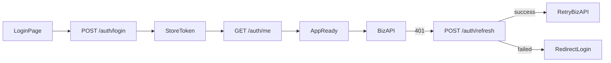
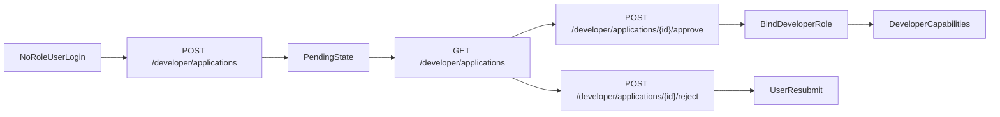
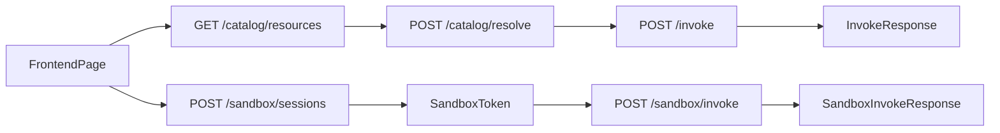
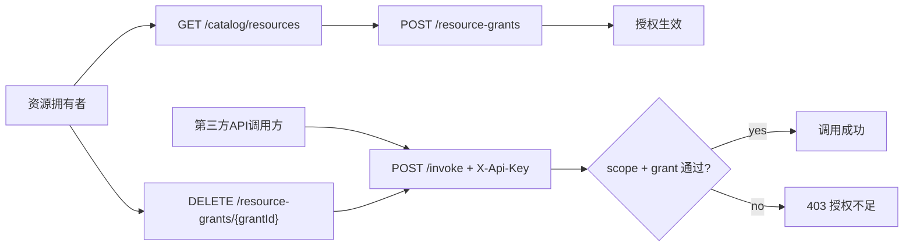

# 前端对接后端标准说明书（后端全量执行版）

> 更新时间：2026-03-24  
> 适用范围：前端控制台与用户端全部页面改造。  
> 权威顺序：后端代码（Controller/Filter/DTO/AOP）> 本文档 > `docs/frontend-full-spec.md`。  
> 结论标记：`保留` / `迁移` / `下线`。

---

## 1. 使用规则

- 本文档是前端执行手册，不是“前端现状描述”。
- 所有前端页面对应接口都必须给出去留结论。
- 即使与现状一致也必须标注 `保留`，避免误删。
- 后端接口以当前代码为真值：`src/main/java/com/lantu/connect/**/controller/*.java`。
- 资源注册闭环的前端落地步骤见：`docs/frontend-resource-registration-runbook.md`。

---

## 2. 全局技术契约（后端真值）

## 2.1 基础路径与网关

- 服务上下文前缀：`/api`。
- 后端路由是相对 `/api` 的业务路径，如 `POST /auth/login` 实际访问为 `/api/auth/login`。

## 2.2 认证/鉴权链路

- Spring Security 配置为 `permitAll`，但实际由自定义 Filter + AOP 执行校验。
- 过滤链顺序：
  1) `TraceIdFilter`（生成/回传 `X-Request-Id`）  
  2) `JwtAuthenticationFilter`（Bearer 校验 + `X-User-Id` 注入）  
  3) `UnassignedUserAccessFilter`（无角色用户仅允许入驻相关接口）
- 默认规则：除白名单外，接口均要求有效认证上下文（`Authorization: Bearer ...`，生产默认不再信任裸 `X-User-Id` 回退）。
- 即使某些 Controller 方法签名未显式声明 `@RequestHeader`，也不代表可匿名调用。
- 方法级鉴权：
  - `@RequireRole`：角色校验（`platform_admin` / `dept_admin` / `developer`）
  - `@RequirePermission`：权限点校验（如 `user:manage`、`monitor:view`）

## 2.3 匿名白名单（`SecurityProperties.permitPatterns`）

- `/auth/login`
- `/auth/register`
- `/auth/refresh`
- `/auth/logout`
- `/auth/send-sms`
- `/captcha/**`
- `/error`
- `/swagger-ui/**`
- `/swagger-ui.html`
- `/v3/api-docs/**`
- `/actuator/health`
- `/actuator/info`
- `/actuator/prometheus`

## 2.4 无角色用户白名单（`UnassignedUserAccessFilter`）

- `/auth/me`
- `/auth/logout`
- `/auth/refresh`
- `/auth/profile`
- `/auth/change-password`
- `/auth/bind-phone`
- `/auth/login-history`
- `/developer/applications`
- `/developer/applications/**`
- `/error`
- `/swagger-ui/**`
- `/swagger-ui.html`
- `/v3/api-docs/**`
- `/actuator/**`

## 2.5 Header 契约

| Header | 来源 | 说明 | 必填性 |
|---|---|---|---|
| `Authorization` | 客户端 | `Bearer <access_token>`，JWT 入口 | 业务接口推荐 |
| `X-User-Id` | JWT Filter 注入或前端直传 | 用户标识，很多 Controller 显式读取 | 多数业务必填 |
| `X-Api-Key` | 客户端 | 网关/SDK/沙箱 app 级调用凭证 | 指定接口必填 |
| `X-Trace-Id` | 客户端 | 统一调用链追踪 ID（invoke 透传下游） | invoke 可选 |
| `X-Sandbox-Token` | 客户端 | 沙箱会话令牌 | 沙箱调用必填 |
| `X-Request-Id` | 客户端或服务端生成 | 平台请求 ID；过滤器统一回写响应头 | 可选 |
| `X-Username` | 客户端 | `POST /reviews` 可选展示名 | 可选 |

补充规则：
- 网关调用优先使用 `X-Trace-Id` 作为业务追踪 ID。
- 若未传 `X-Trace-Id`，后端会回退到 `X-Request-Id`；两者都没有时由后端生成。
- 响应会同时回写 `X-Trace-Id` 与 `X-Request-Id`，值保持一致。
- 当前 CORS `exposedHeaders` 默认仅暴露 `X-Request-Id`、`X-Total-Count`；浏览器跨域场景若需读取 `X-Trace-Id`，需后端额外暴露该响应头。

## 2.6 响应与分页契约

- 统一响应：
```json
{
  "code": 0,
  "message": "ok",
  "data": {}
}
```
- 统一包装类型：`R<T>`，业务码见 `ResultCode`。
- 分页主体：统一使用 `PageResult`（`list,total,page,pageSize`），`/notifications` 已收敛到该格式。
- 分页响应头：若 `data` 为 `PageResult`，会额外返回 `X-Total-Count`。

## 2.7 错误映射（前端必须统一处理）

| 场景 | HTTP/业务码 | 前端动作 |
|---|---|---|
| 未认证 | `401` 或 `1002` | 刷新失败后跳登录 |
| 权限不足 | `403` 或 `1003` | 直接提示无权限 |
| 参数校验失败 | `400` 或 `1001` | 显示后端 message |
| 资源不存在 | `404` 或 `1004` | 提示资源不存在/已下线 |
| 旧写接口已下线 | `410` + `1004` | 统一提示“接口已下线，请迁移到统一网关接口” |
| 限流 | `429` 或 `3001` | 频率限制提示，不重试 |
| 熔断/配额 | `3004/3005/3002/3003` | 提示并建议稍后重试 |
| 服务异常 | `500` 或 `5001` | 通用异常提示 |

## 2.8 角色模型与前端视图映射（关键澄清）

> 重要：`admin/user` 只是前端路由视图域，不是后端真实角色名。

### 2.8.1 后端真实角色

- `platform_admin`：平台级管理角色。
- `dept_admin`：部门管理角色。
- `developer`：开发者角色。
- 未绑定角色用户：只能走“开发者入驻申请”主流程（受 `UnassignedUserAccessFilter` 限制）。

### 2.8.2 前端视图域与角色关系

| 前端视图域 | 含义 | 对应后端角色（可进入） | 备注 |
|---|---|---|---|
| `admin` 视图域 | 管理后台导航壳层 | 通常 `platform_admin`、部分 `dept_admin` | 实际功能仍受权限点控制 |
| `user` 视图域 | 用户侧导航壳层 | `developer`、普通登录用户 | 未赋权用户会被限制到入驻相关接口 |

### 2.8.3 判权优先级

1. 认证过滤器（JWT / `X-User-Id` 回退）
2. 未赋权用户过滤器（仅放行入驻相关）
3. `@RequireRole`
4. `@RequirePermission`
5. 前端菜单可见性（仅 UI 层，不等于后端授权）

## 2.9 登录权限 vs 调用权限（新增双层模型）

- 登录权限（RBAC）：决定用户是否可进入某页面与调用管理接口（`@RequireRole` / `@RequirePermission`）。
- 调用权限（Scope + Grant）：决定某个 `X-Api-Key` 是否可访问某资源。
  - Scope：`catalog:* / resolve:* / invoke:*` 或 type/id 级 scope。
  - Grant：资源拥有者把某个资源授予第三方 `ApiKey`（`t_resource_invoke_grant`）。
- 网关调用已升级为三层同时生效：
  1) 用户 RBAC（有 `X-User-Id` 时）
  2) API Key scope
  3) 资源 grant（资源拥有者或平台管理员授予）
- 新增授权管理接口（供前端授权页接入）：
  - `POST /resource-grants`：授予/更新授权
  - `GET /resource-grants?resourceType=&resourceId=`：查询授权列表
  - `DELETE /resource-grants/{grantId}`：撤销授权

---

## 3. 逐页面后端对齐（按 `frontend-full-spec`）

| 页面/能力域 | 前端现状 | 后端结论 | 目标接口 |
|---|---|---|---|
| 登录页 | `/auth/*` + `/captcha/*` | 保留 | `/captcha/generate`、`/auth/login`、`/auth/refresh` |
| 顶栏消息/退出 | `/notifications/*`、`/auth/logout` | 保留 | `/notifications`、`/notifications/unread-count`、`/auth/logout` |
| 个人资料/设置 | `/auth/profile`、`/auth/change-password`、`/auth/bind-phone`、`/auth/login-history` | 保留 | 同现状 |
| Agent 管理、Agent 市场 | 旧 `/agents/**` | 下线 | 迁到 `/catalog/resources*` + `/catalog/resolve` + `/invoke` |
| Agent 版本管理 | 旧 `/agents/{id}/versions`、`/versions/*` | 下线 | 迁到统一资源能力（网关/资源模型） |
| Skill 管理、Skill 市场 | 旧 `/v1/skills/**` | 下线 | 迁到 `/catalog/resources*` + `/invoke` |
| MCP 管理页 | 旧 `/v1/mcp-servers/**` | 下线 | 迁到统一资源目录和解析调用 |
| App 管理/市场 | 旧 `/v1/apps/**` | 下线 | 迁到统一资源目录和调用 |
| Dataset 管理/市场 | 旧 `/v1/datasets/**` | 下线 | 迁到统一资源目录和调用 |
| Provider/Category | 旧 `/v1/providers/**`、`/v1/categories/**` | 下线 | 对应系统配置/标签或资源域 |
| 用户活动页（收藏、最近使用、统计） | `/user/*` | 保留 | 同现状 |
| 用户管理、角色、组织、API Key | `/user-mgmt/*` | 保留 | 同现状 |
| 监控与告警 | `/monitoring/*` | 保留 | 同现状 |
| 健康检查与熔断 | `/health/*` | 保留 | 同现状 |
| 系统配置 | `/system-config/*`、`/system-config/rate-limits`（`/system-config/model-configs*` **已移除**） | 保留 | 同现状 |
| 配额与运营限流 | `/quotas`、`/rate-limits` | 保留 | 同现状 |
| 看板 | `/dashboard/*` | 保留 | 同现状 |
| 评论评价 | `/reviews/*` | 保留 | 同现状 |
| 审核工作台 | `/audit/*` | 保留（过渡） | 可继续使用，建议后续与统一资源审核收敛 |
| 无角色用户入驻 | `/developer/applications*` | 保留（核心） | 同现状 |
| 沙箱测试 | `/sandbox/*` | 保留（核心） | 同现状 |
| SDK 调用 | `/sdk/v1/*` | 保留（核心） | 同现状 |
| 文件上传 | `/files/upload` | 保留（按需接入） | 同现状 |
| 敏感词管理 | `/sensitive-words*` | 保留（按需接入） | 同现状 |

## 3.1 admin 页面逐条映射（slug 级）

| page slug | 后端结论 | 对齐接口 |
|---|---|---|
| `dashboard` | 保留 | `/dashboard/admin-overview` |
| `health-check` | 保留 | `/dashboard/health-summary`,`/health/configs` |
| `usage-statistics` | 保留 | `/dashboard/usage-stats` |
| `data-reports` | 保留 | `/dashboard/data-reports` |
| `agent-list` | 下线 | 迁移到 `/catalog/resources`（`resourceType=agent`） |
| `agent-create` | 下线 | 迁移到统一资源注册链路（目录+解析） |
| `agent-audit` | 迁移 | 过渡可用 `/audit/agents`，目标是统一资源审核 |
| `agent-versions` | 下线 | 旧版本接口已删 |
| `agent-monitoring` | 迁移 | 用 `/monitoring/*` + `/invoke` 调用日志替代 |
| `agent-trace` | 迁移 | `/monitoring/traces` |
| `agent-detail` | 下线 | 迁移到 `/catalog/resources/{type}/{id}` |
| `skill-list` | 下线 | 迁移到 `/catalog/resources`（`resourceType=skill`） |
| `skill-create` | 下线 | 迁移到统一资源注册链路 |
| `skill-audit` | 迁移 | 过渡可用 `/audit/skills` |
| `mcp-server-list` | 下线 | 迁移到 `/catalog/resources`（`resourceType=mcp`） |
| `app-list` | 下线 | 迁移到 `/catalog/resources`（`resourceType=app`） |
| `app-create` | 下线 | 迁移到统一资源注册链路 |
| `dataset-list` | 下线 | 迁移到 `/catalog/resources`（`resourceType=dataset`） |
| `dataset-create` | 下线 | 迁移到统一资源注册链路 |
| `provider-list` | 下线 | 旧 `/v1/providers/**` 已删除 |
| `provider-create` | 下线 | 旧 `/v1/providers/**` 已删除 |
| `user-list` | 保留 | `/user-mgmt/users*` |
| `role-management` | 保留 | `/user-mgmt/roles*` |
| `organization` | 保留 | `/user-mgmt/org-tree`,`/user-mgmt/orgs*` |
| `api-key-management` | 保留 | `/user-mgmt/api-keys*` |
| `resource-grant-management` | 保留（新增） | `/resource-grants*`（资源授权他人调用） |
| `monitoring-overview` | 保留 | `/monitoring/kpis` |
| `call-logs` | 保留 | `/monitoring/call-logs` |
| `performance-analysis` | 保留 | `/monitoring/performance` |
| `alert-management` | 保留 | `/monitoring/alerts` |
| `alert-rules` | 保留 | `/monitoring/alert-rules*` |
| `health-config` | 保留 | `/health/configs*` |
| `circuit-breaker` | 保留 | `/health/circuit-breakers*` |
| `category-management` | 下线 | 旧 `/v1/categories/**` 已删除 |
| `tag-management` | 保留 | `/tags*` |
| `model-config` | **已移除** | 产品不提供大模型配置；后端 API/表已删 |
| `security-settings` | 保留 | `/system-config/security` |
| `quota-management` | 保留 | `/quotas*`,`/rate-limits*` |
| `rate-limit-policy` | 保留 | `/system-config/rate-limits*` |
| `access-control` | 保留 | `/system-config/acl/publish` + `/resource-grants*` |
| `audit-log` | 保留 | `/system-config/audit-logs` |
| `api-docs` | 保留 | 文档页，不直接绑定单一接口 |
| `sdk-download` | 保留 | `/sdk/v1/*`（示例链路） |
| `api-playground` | 迁移 | 默认示例路径应改成 `/catalog/*`,`/invoke` |

## 3.2 user 页面逐条映射（slug 级）

| page slug | 后端结论 | 对齐接口 |
|---|---|---|
| `hub` | 保留 | 聚合页，按子能力调用 |
| `workspace` | 保留 | `/dashboard/user-workspace` |
| `my-agents` | 保留（过渡） | `/user/my-agents` |
| `authorized-skills` | 保留 | `/user/authorized-skills` |
| `my-favorites` | 保留 | `/user/favorites*` |
| `quick-access` | 下线（兼容） | 前端 `normalizeDeprecatedPage` → `workspace` |
| `recent-use` | 兼容重定向 | 前端 `normalizeDeprecatedPage` → `usage-records`；接口 `/user/recent-use` 仍可为最近列表 |
| `agent-market` | 下线（旧调用） | 从 `/agents/**` 迁移到 `/catalog/resources` + `/invoke` |
| `skill-market` | 下线（旧调用） | 从 `/v1/skills/**` 迁移到 `/catalog/resources` + `/invoke` |
| `app-market` | 下线（旧调用） | 从 `/v1/apps/**` 迁移到 `/catalog/resources` + `/invoke` |
| `dataset-market` | 下线（旧调用） | 从 `/v1/datasets/**` 迁移到 `/catalog/resources` + `/invoke` |
| `my-agents-pub` | 迁移 | 当前占位页，迁移到统一资源“我的发布” |
| `my-skills` | 保留（过渡） | `/user/my-skills` |
| `submit-agent` | 下线 | 旧 Agent 提交流程已删除 |
| `submit-skill` | 下线 | 旧 Skill 提交流程已删除 |
| `usage-records` | 保留 | `/user/usage-records` |
| `usage-stats` | 保留 | `/user/usage-stats` |
| `profile` | 保留 | `/auth/profile`,`/auth/change-password`,`/auth/bind-phone` |
| `preferences` | 保留 | `/user-settings/workspace`（建议接入） |

## 3.3 接口用途说明（前端调用目的）

| 接口域 | 典型接口 | 前端调用目的 | 触发页面/场景 |
|---|---|---|---|
| 认证域 | `/auth/login`,`/auth/refresh`,`/auth/me`,`/auth/logout` | 建立登录态、续签 token、恢复用户态、退出 | 登录页、应用启动、顶部退出 |
| 验证码 | `/captcha/generate`,`/captcha/verify` | 防刷与登录前置校验 | 登录页 |
| 统一资源目录 | `/catalog/resources`,`/catalog/resources/{type}/{id}` | 拉取资源列表与详情（统一资源模型） | 市场页、管理页、详情页 |
| 统一资源解析 | `/catalog/resolve` | 把资源标识解析成可调用目标（endpoint/spec） | 调用前预处理 |
| 统一调用 | `/invoke` | 发起标准化调用并记录调用轨迹 | 使用弹窗、测试按钮、调试页 |
| SDK 对外调用 | `/sdk/v1/*` | 给外部 SDK 稳定调用协议 | SDK 示例、对外联调 |
| 沙箱 | `/sandbox/sessions`,`/sandbox/invoke` | 隔离环境测试调用、限次限时 | Playground、联调测试 |
| 入驻审批 | `/developer/applications*` | 无角色用户申请成为 developer，管理员审批 | 入驻页、审批页 |
| 用户管理 | `/user-mgmt/*` | 管理用户/角色/组织/API Key | 管理后台用户中心 |
| 用户活动 | `/user/favorites`,`/user/recent-use`,`/user/usage-*` | 收藏、最近使用、统计与记录 | 用户工作台 |
| 监控治理 | `/monitoring/*`,`/health/*` | 监控指标、日志、告警、健康检查、熔断治理 | 监控页、健康页 |
| 系统配置 | `/system-config/*`,`/quotas`,`/rate-limits` | 参数、安全、审计、网络 ACL、配额与限流 | 系统配置页 |
| 看板 | `/dashboard/*` | 管理总览、用户工作台摘要、报表统计 | 首页看板 |
| 通知评价 | `/notifications/*`,`/reviews/*` | 站内消息、评分评论、互动 helpful | 顶部消息、市场详情 |
| 标签与内容治理 | `/tags*`,`/sensitive-words*`,`/files/upload` | 标签管理、敏感词治理、文件上传 | 系统配置扩展、运营工具 |

---

## 4. 后端全量接口清单（全部 Controller）

> 读取规则：本章“鉴权/权限/关键约束”列只写额外约束；除白名单外，所有接口都默认需要有效认证上下文。

## 4.1 Auth + Captcha

| 方法 | 路径 | 请求要点 | 鉴权/权限 | 结论 |
|---|---|---|---|---|
| GET | `/captcha/generate` | 无 | 匿名可用 | 保留 |
| POST | `/captcha/verify` | query:`captchaId`,`code` | 匿名可用 | 保留 |
| POST | `/auth/login` | body:`LoginRequest` | 匿名可用 | 保留 |
| POST | `/auth/register` | body:`RegisterRequest` | 匿名可用 | 保留 |
| POST | `/auth/logout` | header:`Authorization` | 白名单接口，但业务仍要求 Bearer Token（缺失会返回未认证） | 保留 |
| GET | `/auth/me` | header:`X-User-Id` | 已登录 | 保留 |
| POST | `/auth/refresh` | body:`RefreshTokenRequest` | 匿名可用 | 保留 |
| POST | `/auth/change-password` | header:`X-User-Id` + body | 已登录 | 保留 |
| PUT | `/auth/profile` | header:`X-User-Id` + body | 已登录 | 保留 |
| POST | `/auth/send-sms` | body:`Map<String,String>` | 匿名可用 | 保留 |
| POST | `/auth/bind-phone` | header:`X-User-Id` + body | 已登录 | 保留 |
| GET | `/auth/login-history` | header:`X-User-Id`, query:`page,pageSize` | 已登录 | 保留 |

## 4.2 统一资源目录与调用（核心主链路）

| 方法 | 路径 | 请求要点 | 鉴权/权限 | 结论 |
|---|---|---|---|---|
| GET | `/catalog/resources` | query:`ResourceCatalogQueryRequest` | `X-User-Id?`,`X-Api-Key?` | 保留 |
| GET | `/catalog/resources/{type}/{id}` | path:`type,id` | `X-User-Id?`,`X-Api-Key?` | 保留 |
| POST | `/catalog/resolve` | body:`ResourceResolveRequest` | **`X-Api-Key` 必填**（强统一执行向）；可与 Bearer / `X-User-Id` 同传 | 保留 |
| POST | `/invoke` | body:`InvokeRequest` | **`X-Api-Key` 必填**；`X-User-Id?`,`X-Trace-Id?` | 保留 |
| POST | `/invoke-stream` | body: 同 invoke | **`X-Api-Key` 必填**；权限同 invoke | 保留 |

## 4.2.1 资源调用授权管理（新增）

| 方法 | 路径 | 请求要点 | 鉴权/权限 | 结论 |
|---|---|---|---|---|
| POST | `/resource-grants` | body:`ResourceGrantCreateRequest` | `X-User-Id`；资源拥有者或平台管理员 | 保留（新增） |
| GET | `/resource-grants` | query:`resourceType,resourceId` | `X-User-Id`；资源拥有者或平台管理员 | 保留（新增） |
| DELETE | `/resource-grants/{grantId}` | path:`grantId` | `X-User-Id`；资源拥有者或平台管理员 | 保留（新增） |

## 4.2.2 统一资源注册中心（新增）

| 方法 | 路径 | 请求要点 | 鉴权/权限 | 结论 |
|---|---|---|---|---|
| POST | `/resource-center/resources` | body:`ResourceUpsertRequest` | `X-User-Id`（资源创建者） | 保留（新增） |
| PUT | `/resource-center/resources/{id}` | path:`id` + body:`ResourceUpsertRequest` | `X-User-Id`；资源拥有者或平台管理员 | 保留（新增） |
| DELETE | `/resource-center/resources/{id}` | path:`id` | `X-User-Id`；资源拥有者或平台管理员（`published`/审核中不可删） | 保留（新增） |
| POST | `/resource-center/resources/{id}/submit` | path:`id` | `X-User-Id`；资源拥有者或平台管理员 | 保留（新增） |
| POST | `/resource-center/resources/{id}/deprecate` | path:`id` | `X-User-Id`；资源拥有者或平台管理员 | 保留（新增） |
| GET | `/resource-center/resources/mine` | query:`resourceType?,page,pageSize` | `X-User-Id`（管理员可查看全量） | 保留（新增） |
| POST | `/resource-center/resources/{id}/versions` | path:`id` + body:`ResourceVersionCreateRequest` | `X-User-Id`；资源拥有者或平台管理员 | 保留（新增） |
| POST | `/resource-center/resources/{id}/versions/{version}/switch` | path:`id,version` | `X-User-Id`；资源拥有者或平台管理员 | 保留（新增） |
| GET | `/resource-center/resources/{id}/versions` | path:`id` | `X-User-Id`；资源拥有者或平台管理员 | 保留（新增） |

## 4.3 SDK v1（核心主链路）

| 方法 | 路径 | 请求要点 | 鉴权/权限 | 结论 |
|---|---|---|---|---|
| GET | `/sdk/v1/resources` | query:`ResourceCatalogQueryRequest` | `X-Api-Key` 必填 | 保留 |
| GET | `/sdk/v1/resources/{type}/{id}` | path:`type,id` | `X-Api-Key` 必填 | 保留 |
| POST | `/sdk/v1/resolve` | body:`ResourceResolveRequest` | `X-Api-Key` 必填 | 保留 |
| POST | `/sdk/v1/invoke` | body:`InvokeRequest` | `X-Api-Key` 必填，`X-Trace-Id?` | 保留 |

## 4.4 沙箱（核心主链路）

| 方法 | 路径 | 请求要点 | 鉴权/权限 | 结论 |
|---|---|---|---|---|
| POST | `/sandbox/sessions` | body:`SandboxSessionCreateRequest?` | `@RequireRole(platform_admin/dept_admin/developer)` + `X-User-Id`,`X-Api-Key` | 保留 |
| GET | `/sandbox/sessions/mine` | 无 | `@RequireRole(platform_admin/dept_admin/developer)` + `X-User-Id` | 保留 |
| POST | `/sandbox/invoke` | body:`InvokeRequest` | `X-Sandbox-Token` 必填，`X-Trace-Id?` | 保留 |

## 4.5 开发者入驻（核心主链路）

| 方法 | 路径 | 请求要点 | 鉴权/权限 | 结论 |
|---|---|---|---|---|
| POST | `/developer/applications` | body:`DeveloperApplicationCreateRequest` | `X-User-Id` | 保留 |
| GET | `/developer/applications/me` | 无 | `X-User-Id` | 保留 |
| GET | `/developer/applications` | query:`DeveloperApplicationQueryRequest` | `@RequirePermission(user:manage)` | 保留 |
| POST | `/developer/applications/{id}/approve` | body:`DeveloperApplicationReviewRequest?` | `@RequirePermission(user:manage)` + `X-User-Id` | 保留 |
| POST | `/developer/applications/{id}/reject` | body:`DeveloperApplicationReviewRequest` | `@RequirePermission(user:manage)` + `X-User-Id` | 保留 |

## 4.6 用户设置

| 方法 | 路径 | 请求要点 | 鉴权/权限 | 结论 |
|---|---|---|---|---|
| GET | `/user-settings/workspace` | 无 | `X-User-Id` | 保留 |
| PUT | `/user-settings/workspace` | body:`WorkspaceUpdateRequest` | `X-User-Id` | 保留 |
| GET | `/user-settings/api-keys` | 无 | `X-User-Id` | 保留 |
| POST | `/user-settings/api-keys` | body:`ApiKeyCreateRequest` | `X-User-Id` | 保留 |
| DELETE | `/user-settings/api-keys/{id}` | path:`id` | `X-User-Id` | 保留 |
| GET | `/user-settings/stats` | 无 | `X-User-Id` | 保留 |

## 4.7 用户活动

| 方法 | 路径 | 请求要点 | 鉴权/权限 | 结论 |
|---|---|---|---|---|
| GET | `/user/usage-records` | query:`page,pageSize,type?` | `X-User-Id` | 保留 |
| GET | `/user/favorites` | 无 | `X-User-Id` | 保留 |
| POST | `/user/favorites` | body:`FavoriteCreateRequest` | `X-User-Id` | 保留 |
| DELETE | `/user/favorites/{id}` | path:`id` | `X-User-Id` | 保留 |
| GET | `/user/usage-stats` | 无 | `X-User-Id` | 保留 |
| GET | `/user/my-agents` | 无 | `X-User-Id` | 保留 |
| GET | `/user/my-skills` | 无 | `X-User-Id` | 保留 |
| GET | `/user/authorized-skills` | query:`page,pageSize` | `X-User-Id` | 保留 |
| GET | `/user/recent-use` | query:`limit,type?` | `X-User-Id` | 保留 |

## 4.8 用户管理（全量）

| 方法 | 路径 | 额外权限 | 结论 |
|---|---|---|---|
| GET | `/user-mgmt/users` | `@RequirePermission(user:read)` | 保留 |
| POST | `/user-mgmt/users` | `@RequirePermission(user:create)` | 保留 |
| PUT | `/user-mgmt/users/{id}` | `@RequirePermission(user:update)` | 保留 |
| GET | `/user-mgmt/users/{id}` | `@RequirePermission(user:read)` | 保留 |
| DELETE | `/user-mgmt/users/{id}` | `@RequirePermission(user:delete)` + `@RequireRole(platform_admin)` | 保留 |
| GET | `/user-mgmt/roles` | `@RequirePermission(role:read)` | 保留 |
| POST | `/user-mgmt/roles` | `@RequirePermission(role:create)` + `@RequireRole(platform_admin)` | 保留 |
| PUT | `/user-mgmt/roles/{id}` | `@RequirePermission(role:update)` + `@RequireRole(platform_admin)` | 保留 |
| DELETE | `/user-mgmt/roles/{id}` | `@RequirePermission(role:delete)` + `@RequireRole(platform_admin)` | 保留 |
| GET | `/user-mgmt/api-keys` | `@RequirePermission(apikey:read)` | 保留 |
| POST | `/user-mgmt/api-keys` | `@RequirePermission(apikey:create)` | 保留 |
| PATCH | `/user-mgmt/api-keys/{id}/revoke` | `@RequirePermission(apikey:delete)` | 保留 |
| GET | `/user-mgmt/org-tree` | `@RequirePermission(org:read)` | 保留 |
| GET | `/user-mgmt/orgs/{id}` | `@RequirePermission(org:read)` | 保留 |
| POST | `/user-mgmt/orgs` | `@RequirePermission(org:create)` + `@RequireRole(platform_admin)` | 保留 |
| PUT | `/user-mgmt/orgs/{id}` | `@RequirePermission(org:update)` + `@RequireRole(platform_admin)` | 保留 |
| DELETE | `/user-mgmt/orgs/{id}` | `@RequirePermission(org:delete)` + `@RequireRole(platform_admin)` | 保留 |
| GET | `/user-mgmt/users/{id}/org` | `@RequirePermission(user:read)` | 保留 |
| PUT | `/user-mgmt/users/{id}/org` | `@RequirePermission(user:update)` | 保留 |
| DELETE | `/user-mgmt/users/{id}/org` | `@RequirePermission(user:update)` | 保留 |
| GET | `/user-mgmt/users/{id}/roles` | `@RequirePermission(user:read)` | 保留 |
| POST | `/user-mgmt/users/{id}/roles` | `@RequirePermission(user:update)` | 保留 |
| PUT | `/user-mgmt/users/{id}/roles` | `@RequirePermission(user:update)` | 保留 |
| DELETE | `/user-mgmt/users/{id}/roles/{roleId}` | `@RequirePermission(user:update)` | 保留 |

> 说明：`/user-mgmt/**` 控制器类级别还要求 `@RequireRole(platform_admin/dept_admin)`。

## 4.9 系统配置 + 配额限流

| 方法 | 路径 | 关键约束 | 结论 |
|---|---|---|---|
| GET | `/system-config/params` | `@RequireRole(platform_admin)` | 保留 |
| PUT | `/system-config/params` | `@RequireRole(platform_admin)` + body:`SystemParamUpsertRequest` | 保留 |
| GET | `/system-config/security` | `@RequireRole(platform_admin)` | 保留 |
| PUT | `/system-config/security` | `@RequireRole(platform_admin)` + body:`SecuritySettingUpsertRequest` | 保留 |
| GET | `/system-config/audit-logs` | `@RequireRole(platform_admin)` + query:`AuditLogQueryRequest` | 保留 |
| POST | `/system-config/network/apply` | `@RequireRole(platform_admin)` | 保留 |
| POST | `/system-config/acl/publish` | `@RequireRole(platform_admin)` | 保留 |
| POST | `/system-config/rate-limits` | `@RequireRole(platform_admin)` + body:`RateLimitRuleCreateRequest` | 保留 |
| PUT | `/system-config/rate-limits/{id}` | `@RequireRole(platform_admin)` + body:`RateLimitRuleUpdateRequest` | 保留 |
| DELETE | `/system-config/rate-limits/{id}` | `@RequireRole(platform_admin)` + path:`id` | 保留 |
| GET | `/system-config/rate-limits/{id}` | `@RequireRole(platform_admin)` + path:`id` | 保留 |
| GET | `/system-config/rate-limits` | `@RequireRole(platform_admin)` + query:`page,pageSize,name?` | 保留 |
| POST | `/quotas` | `@RequireRole(platform_admin)` + body:`QuotaCreateRequest` | 保留 |
| PUT | `/quotas` | `@RequireRole(platform_admin)` + body:`QuotaUpdateRequest` | 保留 |
| DELETE | `/quotas/{id}` | `@RequireRole(platform_admin)` + path:`id` | 保留 |
| GET | `/quotas/{id}` | `@RequireRole(platform_admin)` + path:`id` | 保留 |
| GET | `/quotas` | `@RequireRole(platform_admin)` + query:`page,pageSize,subjectType?` | 保留 |
| POST | `/rate-limits` | `@RequireRole(platform_admin)` + body:`QuotaRateLimitCreateRequest` | 保留 |
| DELETE | `/rate-limits/{id}` | `@RequireRole(platform_admin)` + path:`id` | 保留 |
| GET | `/rate-limits/{id}` | `@RequireRole(platform_admin)` + path:`id` | 保留 |
| GET | `/rate-limits` | `@RequireRole(platform_admin)` + query:`page,pageSize,quotaId?` | 保留 |
| PATCH | `/rate-limits/{id}` | `@RequireRole(platform_admin)` + body:`QuotaRateLimitToggleRequest` | 保留 |

## 4.10 监控、健康、看板

| 方法 | 路径 | 关键约束 | 结论 |
|---|---|---|---|
| GET | `/monitoring/kpis` | `@RequirePermission(monitor:view)` | 保留 |
| GET | `/monitoring/performance` | `@RequirePermission(monitor:view)` | 保留 |
| GET | `/monitoring/call-logs` | `@RequirePermission(monitor:view)` + query:`PageQuery` | 保留 |
| GET | `/monitoring/alerts` | `@RequirePermission(monitor:view)` + query:`PageQuery` | 保留 |
| GET | `/monitoring/traces` | `@RequirePermission(monitor:view)` + query:`PageQuery` | 保留 |
| POST | `/monitoring/alert-rules` | `@RequireRole(platform_admin)` + body:`AlertRuleCreateRequest` | 保留 |
| PUT | `/monitoring/alert-rules/{id}` | `@RequireRole(platform_admin)` + body:`AlertRuleUpdateRequest` | 保留 |
| DELETE | `/monitoring/alert-rules/{id}` | `@RequireRole(platform_admin)` | 保留 |
| GET | `/monitoring/alert-rules/{id}` | `@RequirePermission(monitor:view)` + path:`id` | 保留 |
| GET | `/monitoring/alert-rules` | `@RequirePermission(monitor:view)` + query:`page,pageSize,name?` | 保留 |
| POST | `/monitoring/alert-rules/{id}/dry-run` | `@RequireRole(platform_admin)` + body:`AlertRuleDryRunRequest` | 保留 |
| GET | `/health/configs` | `@RequirePermission(monitor:view)` | 保留 |
| POST | `/health/configs` | `@RequireRole(platform_admin)` + body:`HealthConfigUpsertRequest` | 保留 |
| PUT | `/health/configs/{id}` | `@RequireRole(platform_admin)` + body:`HealthConfigUpsertRequest` | 保留 |
| DELETE | `/health/configs/{id}` | `@RequireRole(platform_admin)` | 保留 |
| GET | `/health/circuit-breakers` | `@RequirePermission(monitor:view)` | 保留 |
| PUT | `/health/circuit-breakers/{id}` | `@RequireRole(platform_admin)` + body:`CircuitBreakerUpdateRequest` | 保留 |
| POST | `/health/circuit-breakers/{id}/break` | `@RequireRole(platform_admin)` + body:`CircuitBreakerManualRequest?` | 保留 |
| POST | `/health/circuit-breakers/{id}/recover` | `@RequireRole(platform_admin)` | 保留 |
| GET | `/health/security-config` | `@RequireRole(platform_admin)` | 保留 |
| GET | `/dashboard/admin-overview` | `@RequirePermission(monitor:view)` | 保留 |
| GET | `/dashboard/user-workspace` | header:`X-User-Id` | 保留 |
| GET | `/dashboard/health-summary` | `@RequirePermission(monitor:view)` | 保留 |
| GET | `/dashboard/usage-stats` | `@RequirePermission(monitor:view)` + query:`range?` | 保留 |
| GET | `/dashboard/data-reports` | `@RequirePermission(monitor:view)` + query:`range?` | 保留 |

## 4.11 通知、评价、审核、标签、文件、敏感词

| 方法 | 路径 | 关键约束 | 结论 |
|---|---|---|---|
| GET | `/notifications` | header:`X-User-Id`, query:`page,pageSize` | 保留 |
| GET | `/notifications/unread-count` | header:`X-User-Id` | 保留 |
| POST | `/notifications/{id}/read` | header:`X-User-Id` | 保留 |
| POST | `/notifications/read-all` | header:`X-User-Id` | 保留 |
| GET | `/reviews` | query:`targetType,targetId` | 保留 |
| GET | `/reviews/summary` | query:`targetType,targetId` | 保留 |
| POST | `/reviews` | header:`X-User-Id`,`X-Username?`, body:`ReviewCreateRequest` | 保留 |
| POST | `/reviews/{id}/helpful` | header:`X-User-Id` | 保留 |
| GET | `/audit/agents` | query:`page,pageSize` | 保留（过渡） |
| GET | `/audit/skills` | query:`page,pageSize` | 保留（过渡） |
| POST | `/audit/agents/{id}/approve` | `@RequireRole(platform_admin/dept_admin)` | 保留（过渡） |
| POST | `/audit/skills/{id}/approve` | `@RequireRole(platform_admin/dept_admin)` | 保留（过渡） |
| POST | `/audit/agents/{id}/reject` | `@RequireRole(platform_admin/dept_admin)` + body:`RejectBody` | 保留（过渡） |
| POST | `/audit/skills/{id}/reject` | `@RequireRole(platform_admin/dept_admin)` + body:`RejectBody` | 保留（过渡） |
| POST | `/audit/agents/{id}/publish` | `@RequireRole(platform_admin/dept_admin)` | 新增：审核通过后发布到可调用状态 |
| POST | `/audit/skills/{id}/publish` | `@RequireRole(platform_admin/dept_admin)` | 新增：审核通过后发布到可调用状态 |
| GET | `/audit/resources` | query:`resourceType?,page,pageSize` | 保留（新增，统一资源审核列表） |
| POST | `/audit/resources/{id}/approve` | `@RequireRole(platform_admin/dept_admin)` | 保留（新增，统一资源审核） |
| POST | `/audit/resources/{id}/reject` | `@RequireRole(platform_admin/dept_admin)` + body:`ResourceRejectRequest` | 保留（新增，统一资源审核） |
| POST | `/audit/resources/{id}/publish` | `@RequireRole(platform_admin/dept_admin)` | 保留（新增，统一资源发布） |
| GET | `/tags` | 默认需认证上下文 | 保留 |
| POST | `/tags` | `@RequireRole(platform_admin)` + body:`TagCreateRequest` | 保留 |
| POST | `/tags/batch` | `@RequireRole(platform_admin)` + body:`List<TagCreateRequest>` | 保留 |
| DELETE | `/tags/{id}` | `@RequireRole(platform_admin)` + path:`id` | 保留 |
| POST | `/files/upload` | multipart:`file`,query:`category?` | 保留 |
| GET | `/sensitive-words` | `@RequireRole(platform_admin)` + query:`page,pageSize,category?,enabled?` | 保留 |
| GET | `/sensitive-words/categories` | `@RequireRole(platform_admin)` | 保留 |
| GET | `/sensitive-words/count` | `@RequireRole(platform_admin)` | 保留 |
| POST | `/sensitive-words` | `@RequireRole(platform_admin)` + header:`X-User-Id`, body:`AddRequest` | 保留 |
| POST | `/sensitive-words/batch` | `@RequireRole(platform_admin)` + header:`X-User-Id`, body:`BatchAddRequest` | 保留 |
| PUT | `/sensitive-words/{id}` | `@RequireRole(platform_admin)` + body:`UpdateRequest` | 保留 |
| DELETE | `/sensitive-words/{id}` | `@RequireRole(platform_admin)` + path:`id` | 保留 |
| POST | `/sensitive-words/check` | body:`CheckRequest` | 保留 |

---

## 5. 核心接口字段级契约（混合粒度中的“全字段”）

## 5.1 资源目录查询 `GET /catalog/resources`（SDK 同结构）

请求参数（`ResourceCatalogQueryRequest`）：

| 字段 | 类型 | 必填 | 默认值 | 说明 |
|---|---|---|---|---|
| `page` | Integer | 否 | `1` | 页码 |
| `pageSize` | Integer | 否 | `20` | 每页条数 |
| `resourceType` | String | 否 | - | `agent/skill/mcp/app/dataset` |
| `status` | String | 否 | - | 资源状态 |
| `keyword` | String | 否 | - | 关键字 |

响应项（`PageResult<ResourceCatalogItemVO>`）：

| 字段 | 类型 | 说明 |
|---|---|---|
| `list[].resourceType` | String | 资源类型 |
| `list[].resourceId` | String | 资源 ID |
| `list[].resourceCode` | String | 资源编码 |
| `list[].displayName` | String | 展示名 |
| `list[].description` | String | 描述 |
| `list[].status` | String | 状态 |
| `list[].sourceType` | String | 来源类型 |
| `list[].updateTime` | LocalDateTime | 更新时间 |
| `total/page/pageSize` | Number | 分页元信息 |

## 5.2 资源解析 `POST /catalog/resolve`（SDK 同结构）

请求体（`ResourceResolveRequest`）：

| 字段 | 类型 | 必填 | 说明 |
|---|---|---|---|
| `resourceType` | String | 是 | 资源类型 |
| `resourceId` | String | 是 | 资源 ID |
| `version` | String | 否 | 版本号 |

响应体（`ResourceResolveVO`）：

| 字段 | 类型 | 说明 |
|---|---|---|
| `resourceType` | String | 资源类型 |
| `resourceId` | String | 资源 ID |
| `version` | String | 生效版本（未指定时返回当前版本，默认 `v1`） |
| `resourceCode` | String | 资源编码 |
| `displayName` | String | 展示名 |
| `status` | String | 资源状态 |
| `invokeType` | String | 调用类型（http/sse/mcp...） |
| `endpoint` | String | 调用入口 |
| `spec` | Map | 协议参数 |

## 5.3 统一调用 `POST /invoke`（SDK 同结构）

请求头：
- `X-User-Id?`
- `X-Api-Key`（必填；SDK 路径同样必填）
- `X-Trace-Id?`（缺失时后端生成 UUID）

请求体（`InvokeRequest`）：

| 字段 | 类型 | 必填 | 默认值 | 说明 |
|---|---|---|---|---|
| `resourceType` | String | 是 | - | 资源类型 |
| `resourceId` | String | 是 | - | 资源 ID |
| `version` | String | 否 | - | 指定版本 |
| `timeoutSec` | Integer | 否 | `30` | 超时时间 |
| `payload` | Map | 否 | - | 业务输入 |

调用门禁约束：
- 仅 `published` 状态资源允许 `invoke`。
- 若传入 `version`，后端按 `resource_id + version` 精确解析；找不到返回资源不存在。

响应体（`InvokeResponse`）：

| 字段 | 类型 | 说明 |
|---|---|---|
| `requestId` | String | 请求 ID |
| `traceId` | String | 链路追踪 ID |
| `resourceType` | String | 资源类型 |
| `resourceId` | String | 资源 ID |
| `statusCode` | Integer | 下游状态码 |
| `status` | String | 调用状态 |
| `latencyMs` | Long | 耗时 |
| `body` | String | 下游返回文本 |

## 5.3.1 资源注册中心（新增）

创建/更新请求体（`ResourceUpsertRequest`，按 `resourceType` 选填）：

| 字段 | 类型 | 必填 | 说明 |
|---|---|---|---|
| `resourceType` | String | 是 | `agent/skill/mcp/app/dataset` |
| `resourceCode` | String | 是 | 同类型唯一编码 |
| `displayName` | String | 是 | 展示名 |
| `description` | String | 否 | 描述 |
| `sourceType/providerId/categoryId` | String/Long | 否 | 来源与归属 |
| `agentType/spec` | String/Object | agent 必填 | Agent 扩展 |
| `skillType/spec` | String/Object | skill 必填 | Skill 扩展 |
| `endpoint/protocol/authType/authConfig` | String/Object | mcp: endpoint 必填 | MCP 扩展；`protocol` 必须后端可调用 |
| `appUrl/embedType` | String | app 必填 | App 扩展 |
| `dataType/format` | String | dataset 必填 | Dataset 扩展 |

版本请求体（`ResourceVersionCreateRequest`）：

| 字段 | 类型 | 必填 | 说明 |
|---|---|---|---|
| `version` | String | 是 | 版本号（同资源唯一） |
| `makeCurrent` | Boolean | 否 | 是否立即切为当前版本 |
| `snapshot` | Object | 否 | 不传则后端按当前资源自动生成 |

生命周期接口与状态机：

| 接口 | 语义 | 状态流转 |
|---|---|---|
| `POST /resource-center/resources/{id}/submit` | 提审 | `draft/rejected/deprecated -> pending_review` |
| `POST /audit/resources/{id}/approve` | 审核通过 | `pending_review -> testing` |
| `POST /audit/resources/{id}/reject` | 审核驳回 | `pending_review/testing -> rejected` |
| `POST /audit/resources/{id}/publish` | 发布 | `testing -> published` |
| `POST /resource-center/resources/{id}/deprecate` | 下线 | `published/testing -> deprecated` |

表结构说明：

- 本次注册闭环接口使用已有表：`t_resource`、`t_resource_agent_ext`、`t_resource_skill_ext`、`t_resource_mcp_ext`、`t_resource_app_ext`、`t_resource_dataset_ext`、`t_resource_version`、`t_audit_item`。
- 本次未新增/变更表结构；若后续需改表，必须按 `sql/migrations/README.md` 追加增量脚本并同步本文件。

## 5.4 沙箱会话 `POST /sandbox/sessions`

请求头：
- `X-User-Id`（必填）
- `X-Api-Key`（必填）

请求体（`SandboxSessionCreateRequest`，可空）：

| 字段 | 类型 | 必填 | 说明 |
|---|---|---|---|
| `ttlMinutes` | Integer | 否 | 会话有效期（分钟） |
| `maxCalls` | Integer | 否 | 最大调用次数 |
| `maxTimeoutSec` | Integer | 否 | 单次最大超时 |
| `allowedResourceTypes` | List<String> | 否 | 允许调用的资源类型集合 |

响应体（`SandboxSessionVO`）：

| 字段 | 类型 | 说明 |
|---|---|---|
| `sessionToken` | String | 沙箱 token |
| `apiKeyPrefix` | String | 绑定 API Key 前缀 |
| `maxCalls/usedCalls` | Integer | 调用配额 |
| `maxTimeoutSec` | Integer | 超时上限 |
| `allowedResourceTypes` | List<String> | 允许资源类型 |
| `expiresAt` | LocalDateTime | 过期时间 |
| `lastInvokeAt` | LocalDateTime | 最近调用时间 |
| `status` | String | 会话状态 |

## 5.5 开发者入驻

### `POST /developer/applications`

请求体（`DeveloperApplicationCreateRequest`）：

| 字段 | 类型 | 必填 | 说明 |
|---|---|---|---|
| `contactEmail` | String | 是 | 联系邮箱 |
| `contactPhone` | String | 否 | 联系电话 |
| `companyName` | String | 否 | 单位名 |
| `applyReason` | String | 是 | 申请原因 |

### `GET /developer/applications`

查询参数（`DeveloperApplicationQueryRequest`）：

| 字段 | 类型 | 必填 | 默认值 | 说明 |
|---|---|---|---|---|
| `page` | Integer | 否 | `1` | 页码 |
| `pageSize` | Integer | 否 | `20` | 每页 |
| `status` | String | 否 | - | 状态筛选 |
| `keyword` | String | 否 | - | 关键词 |

### 审批 `POST /developer/applications/{id}/approve|reject`

请求体（`DeveloperApplicationReviewRequest`）：

| 字段 | 类型 | 必填 | 说明 |
|---|---|---|---|
| `reviewComment` | String | 驳回必填 | 审批意见 |

## 5.6 复杂流程（前端必须按流程实现）

### 5.6.1 登录与刷新流程



### 5.6.2 未赋权用户入驻流程



### 5.6.3 统一调用与沙箱流程



### 5.6.4 MCP/Skill 授权他人调用流程（新增）



---

## 6. 次要接口关键字段 + DTO 引用（混合粒度中的“关键字段”）

| 模块 | 接口 | DTO/VO 引用 |
|---|---|---|
| Auth | `/auth/login` | `auth/dto/LoginRequest`,`auth/dto/LoginResponse` |
| Auth | `/auth/register` | `auth/dto/RegisterRequest` |
| Auth | `/auth/refresh` | `auth/dto/RefreshTokenRequest`,`auth/dto/TokenResponse` |
| Auth | `/auth/me` | `auth/dto/UserInfoVO` |
| Auth | `/auth/change-password` | `auth/dto/ChangePasswordRequest` |
| Auth | `/auth/profile` | `auth/dto/ProfileUpdateRequest` |
| UserMgmt | `/user-mgmt/users*` | `usermgmt/dto/UserQueryRequest`,`CreateUserRequest`,`UpdateUserRequest`,`UserDetailVO` |
| UserMgmt | `/user-mgmt/roles*` | `usermgmt/dto/RoleCreateRequest`,`RoleUpdateRequest` |
| UserMgmt | `/user-mgmt/org*` | `usermgmt/dto/OrgCreateRequest`,`OrgUpdateRequest`,`OrgNodeVO` |
| UserMgmt | `/user-mgmt/users/{id}/org` | `usermgmt/dto/UserOrgBindRequest`,`UserOrgVO` |
| UserMgmt | `/user-mgmt/users/{id}/roles*` | `usermgmt/dto/UserRoleBindRequest`,`UserRoleReplaceRequest` |
| Monitoring | `/monitoring/call-logs`,`/alerts`,`/traces` | `monitoring/dto/PageQuery`,`monitoring/entity/CallLog`,`AlertRecord`,`TraceSpan` |
| Monitoring | `/monitoring/alert-rules*` | `monitoring/dto/AlertRuleCreateRequest`,`AlertRuleUpdateRequest`,`AlertRuleDryRunRequest` |
| Health | `/health/configs*` | `monitoring/dto/HealthConfigUpsertRequest`,`monitoring/entity/HealthConfig` |
| Health | `/health/circuit-breakers*` | `monitoring/dto/CircuitBreakerUpdateRequest`,`CircuitBreakerManualRequest`,`monitoring/entity/CircuitBreaker` |
| SystemConfig | `/system-config/params`,`/security` | `sysconfig/dto/SystemParamUpsertRequest`,`SecuritySettingUpsertRequest` |
| SystemConfig | `/system-config/audit-logs` | `sysconfig/dto/AuditLogQueryRequest`,`sysconfig/entity/AuditLog` |
| RateLimitRule | `/system-config/rate-limits*` | `sysconfig/dto/RateLimitRuleCreateRequest`,`RateLimitRuleUpdateRequest` |
| Quota | `/quotas*` | `sysconfig/dto/QuotaCreateRequest`,`QuotaUpdateRequest`,`sysconfig/entity/Quota` |
| QuotaRateLimit | `/rate-limits*` | `sysconfig/dto/QuotaRateLimitCreateRequest`,`QuotaRateLimitToggleRequest` |
| UserActivity | `/user/favorites` | `useractivity/dto/FavoriteCreateRequest`,`useractivity/entity/Favorite` |
| UserActivity | `/user/authorized-skills` | `useractivity/dto/AuthorizedSkillVO` |
| UserActivity | `/user/recent-use` | `useractivity/dto/RecentUseVO` |
| Review | `/reviews` | `review/dto/ReviewCreateRequest`,`review/dto/ReviewSummaryVO` |
| Notification | `/notifications` | `notification/entity/Notification` |
| Grant | `/resource-grants*` | `gateway/dto/ResourceGrantCreateRequest`,`ResourceGrantVO` |
| Tags | `/tags`,`/tags/batch` | `dataset/dto/TagCreateRequest`,`dataset/entity/Tag` |
| SensitiveWord | `/sensitive-words*` | `common/sensitive/SensitiveWordController` 内部请求对象 `AddRequest/BatchAddRequest/UpdateRequest/CheckRequest` |
| File | `/files/upload` | multipart 入参，无独立 DTO |

---

## 7. 旧接口下线附录（必须迁移）

下列旧控制器已物理删除，结论统一为 `下线`：

| 旧路径模式 | 现状 | 前端动作 |
|---|---|---|
| `/agents/**` | 控制器已删除 | 改用 `/catalog/resources*`、`/catalog/resolve`、`/invoke` |
| `/agents/{agentId}/versions` | 控制器已删除 | 不再直连，改走统一资源生命周期能力 |
| `/versions/{id}/publish`、`/versions/{id}/rollback` | 控制器已删除 | 下线 |
| `/v1/skills/**` | 控制器已删除 | 改走统一目录与调用 |
| `/v1/mcp-servers/**` | 控制器已删除 | 改走统一目录与调用 |
| `/v1/apps/**` | 控制器已删除 | 改走统一目录与调用 |
| `/v1/datasets/**` | 控制器已删除 | 改走统一目录与调用 |
| `/v1/providers/**` | 控制器已删除 | 改走系统配置/资源域 |
| `/v1/categories/**` | 控制器已删除 | 改走标签与配置域 |

参考：`docs/backend/deprecation/removed-code-audit.md`。

---

## 8. 前端改造优先级（执行清单）

- P0：所有旧路径（`/agents/**`,`/v1/**`旧资源）全部替换为统一资源网关链路。
- P0：Playground/SDK 示例统一为 `X-Api-Key` + `X-Trace-Id` 规范。
- P1：无角色用户流程必须只保留“提交入驻 + 查询我的申请”。
- P1：审核页若继续使用 `/audit/*`，需明确“过渡能力”标记，避免误解为统一资源最终方案。
- P2：接入 `/user-settings/*`、`/files/upload`、`/sensitive-words*` 等预留能力页。

---

## 9. 维护规则

- 新增、修改、删除任何后端接口时，必须同步更新本文件和 `docs/frontend-alignment-handbook.md`。
- 接口结论变化（保留/迁移/下线）必须当日落文档。
- 文档与代码冲突时，以代码为准，并在 24 小时内修正文档。
