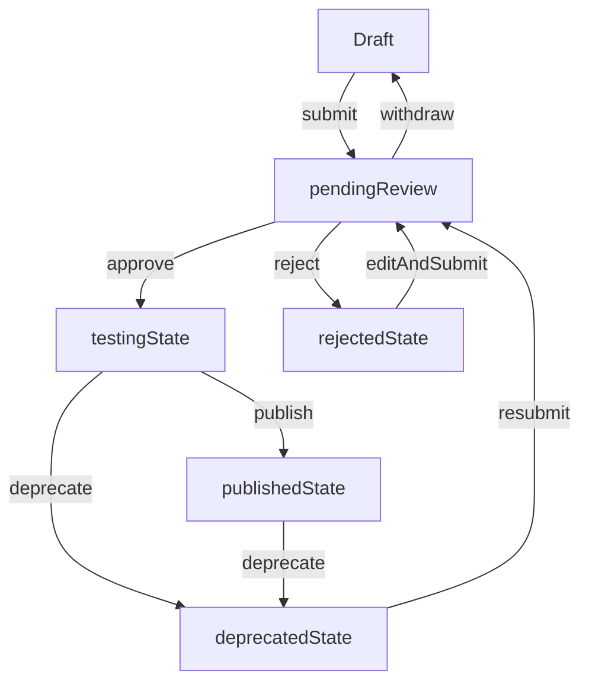
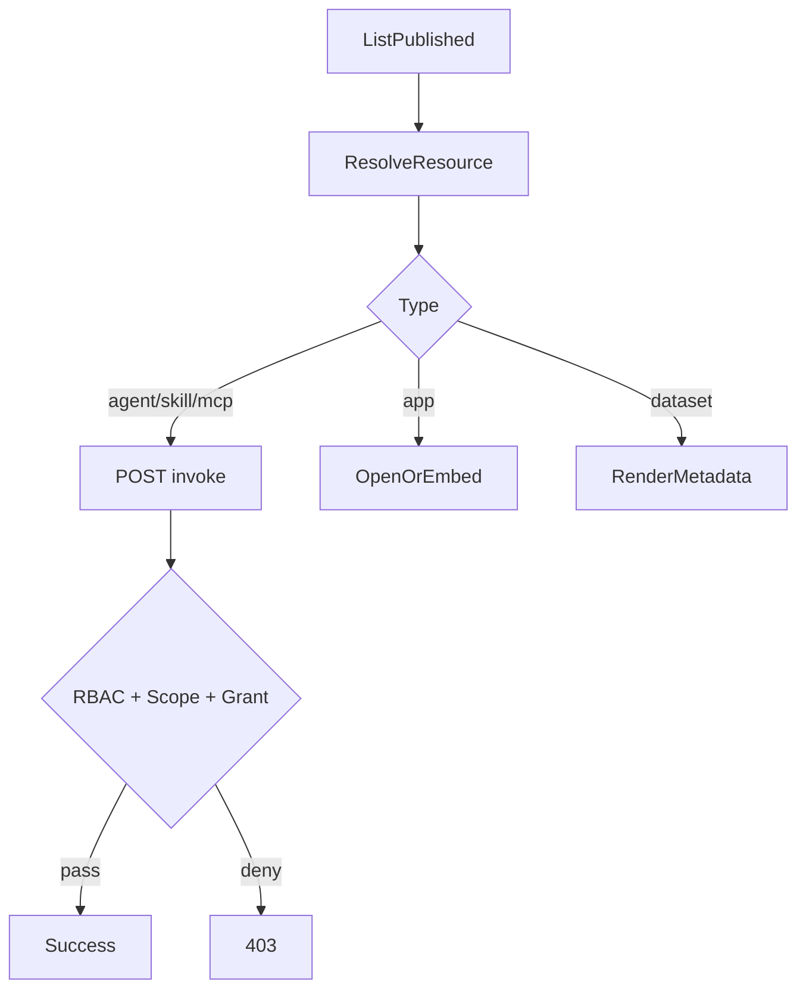

# 前端菜单与闭环功能分子级说明书（As-Is / To-Be / Gap）

> 文档目的：给前端、产品、测试一份可以“逐菜单、逐按钮、逐接口”核对的执行手册，避免继续出现功能理解偏差。  
> 适用范围：`platform_admin`、`dept_admin`、`developer`、`user` 四类角色。  
> 对齐基准：后端闭环真值文档 `docs/resource-registration-authorization-invocation-guide.md`。  
> 代码基线：`src/layouts/MainLayout.tsx`、`src/constants/navigation.ts`、`src/constants/consoleRoutes.ts`、`src/api/services/**`、`src/views/**`。

---

## 1. 核心结论（必须先统一）

1. 前端目前已经接入统一资源主链路（注册中心、审核中心、授权中心、目录/解析/调用）。
2. 菜单语义已按资源边界重构：`MCP` 已从 `Skill 管理` 拆出为独立一级菜单 `MCP 管理`。
3. `Provider` 目录已改为“关系说明”入口，不再与 `用户与权限 -> 资源授权管理` 形成同页双入口误导。
4. 应用端新增“授权申请适配层 + 申请记录页”，市场页可提交申请并查看状态、失败原因。
5. 你关注的问题（MCP 广场、Skill/MCP 边界、Provider 与 Grant 关系）已在本轮实现中落地修正。

---

## 2. 角色、路由、菜单总规则（平台级）

## 2.1 角色到控制台视图映射（代码真值）

- `platform_admin` / `dept_admin` -> 控制台 `admin`
- `developer` / `user` -> 控制台 `user`
- 路由统一形态：`/#/:role/:page/:id?`，`role` 仅支持 `admin|user`

## 2.2 路由校验与重定向规则

- 无效 `page`：跳转 `404`
- 无管理端权限访问 `admin/*`：跳转 `user` 默认页
- 用户端访问统一资源中心且无发布权限：跳转 `hub` 并提示
- 旧页面 slug 自动归一到新入口（如 `provider-list` -> `provider-authorization-guide`）

## 2.3 菜单权限裁剪规则

- 一级菜单按权限裁剪：`provider:manage`、`user:manage`、`monitor:view`、`system:config`
- 二级菜单按 `SUB_ITEM_PERM_MAP` 再裁剪（如 `skill-audit` 需 `skill:audit`）
- `my-publish` 是否可见取决于 `agent/skill/app/dataset` 任一 `create` 权限

---

## 3. platform_admin / dept_admin 菜单分子级说明

> 说明：`dept_admin` 基本菜单结构与 `platform_admin` 一致，但实际可见项可能因权限被裁剪。

## 3.1 一级菜单全表（管理端）

| 一级菜单 | 二级分组 | 二级菜单项 | 页面 page |
|---|---|---|---|
| 总览 | 总览 | 数据概览 / 健康状态 / 使用统计 / 数据报表 | `dashboard` / `health-check` / `usage-statistics` / `data-reports` |
| Agent 管理 | 资源目录 / 运行 | Agent 列表 / 审核队列 / 运行监控 / 调用追踪 | `agent-list` / `agent-audit` / `agent-monitoring` / `agent-trace` |
| Skill 管理 | 资源目录 | Skill 列表 / 审核队列 | `skill-list` / `skill-audit` |
| MCP 管理 | 资源目录 | MCP 列表 / 审核队列 | `mcp-server-list` / `mcp-audit` |
| 智能应用 | 资源目录 | 应用列表 | `app-list` |
| 数据集 | 资源目录 | 数据集列表 | `dataset-list` |
| 资源提供与授权 | Provider 语义 | Provider 与授权关系说明 | `provider-authorization-guide` |
| 用户与权限 | 用户 / 凭证 / 入驻 | 用户管理 / 角色管理 / 组织架构 / API Key 管理 / 资源授权管理 / 入驻审批 | `user-list` / `role-management` / `organization` / `api-key-management` / `resource-grant-management` / `developer-applications` |
| 监控中心 | 观测 / 告警 / 治理 | 监控概览 / 调用日志 / 性能分析 / 告警管理 / 告警规则 / 健康检查 / 熔断降级 | `monitoring-overview` 等 |
| 系统配置 | 基础 / 策略 / 审计 / 内容治理 | 标签 / 模型 / 安全 / 配额 / 限流 / 访问控制 / 审计日志 / 敏感词 / 平台公告 | `tag-management` 等 |
| 开发者中心 | 文档 / 统计 | API 文档 / SDK 下载 / API Playground / 开发者统计 | `api-docs` / `sdk-download` / `api-playground` / `developer-statistics` |

## 3.2 管理端资源管理链路（菜单 -> 功能 -> 接口）

### A. Agent/Skill/MCP/App/Dataset 列表页（统一资源中心壳）

- 入口：
  - Agent: `agent-list`
  - Skill: `skill-list`
  - MCP: `mcp-server-list`
  - App: `app-list`
  - Dataset: `dataset-list`
- 页面组件：`ResourceCenterManagementPage`
- 核心动作与状态约束：
  - `draft`: 编辑、版本、提审、删除
  - `pending_review`: 撤回提审
  - `testing`: 待发布提示、下线
  - `published`: 下线
  - `rejected`: 编辑、重新提审、删除
  - `deprecated`: 重新提审
- 接口：
  - 列表 `GET /resource-center/resources/mine`
  - 提审 `POST /resource-center/resources/{id}/submit`
  - 撤回 `POST /resource-center/resources/{id}/withdraw`
  - 下线 `POST /resource-center/resources/{id}/deprecate`
  - 删除 `DELETE /resource-center/resources/{id}`
  - 版本 `POST /resource-center/resources/{id}/versions`、`POST /resource-center/resources/{id}/versions/{version}/switch`

### B. 注册页（统一动态表单）

- 入口：
  - `agent-register` / `skill-register` / `mcp-register` / `app-register` / `dataset-register`
- 页面组件：`ResourceRegisterPage`
- 功能：
  - 中文字段说明 + 小白填写提示
  - 类型级必填校验（URL / JSON / 数值边界）
  - 保存、保存并提审
- 接口：
  - 创建 `POST /resource-center/resources`
  - 更新 `PUT /resource-center/resources/{id}`
  - 提审 `POST /resource-center/resources/{id}/submit`

### C. 审核页

- 入口：`agent-audit`、`skill-audit`、`mcp-audit`
- 页面组件：`ResourceAuditList`
- 状态动作规则：
  - `pending_review`: 通过、驳回（reason 必填）
  - `testing`: 发布、驳回
  - 其他状态：无可执行动作
- 接口：
  - 列表 `GET /audit/resources`
  - 通过 `POST /audit/resources/{id}/approve`
  - 驳回 `POST /audit/resources/{id}/reject`（`{ reason }`）
  - 发布 `POST /audit/resources/{id}/publish`

---

## 4. developer / user 菜单分子级说明

## 4.1 一级菜单全表（应用端）

| 一级菜单 | 二级菜单 | 页面 page | 备注 |
|---|---|---|---|
| 探索发现 | 无 | `hub` | 聚合发现页 |
| 我的工作台 | 我的智能体 / 已授权技能 / 我的收藏 / 最近使用 | `my-agents` / `authorized-skills` / `my-favorites` / `recent-use` | 总览页 `workspace` 为默认 |
| Agent 市场 | 无 | `agent-market` | 可调用资源市场 |
| 技能市场 | 无 | `skill-market` | 可调用资源市场 |
| MCP 市场 | 无 | `mcp-market` | MCP 资源市场 |
| 应用广场 | 无 | `app-market` | 跳转/嵌入型 |
| 数据集 | 无 | `dataset-market` | 元数据消费型 |
| 我的发布 | 发布总览 / 统一资源中心 | `my-agents-pub` / `resource-center` | 需要发布权限才可见 |
| 个人资产 | 使用记录 / 用量统计 / 授权申请记录 | `usage-records` / `usage-stats` / `authorization-requests` | 使用侧数据与授权闭环 |

## 4.2 应用端“发布”链路

- 菜单入口：`我的发布 -> 统一资源中心`
- 页面组件：`ResourceCenterManagementPage`（可切换资源类型）
- 与管理端共用注册/提审能力
- 权限约束：无创建权限时禁止进入并跳转 `hub`

## 4.3 应用端“市场与使用”链路

### A. 市场入口现状

- 有：`agent-market`、`skill-market`、`mcp-market`、`app-market`、`dataset-market`
- `mcp-market` 已接入导航与路由，探索页跳转链路可直接命中。

### B. 使用动作（按类型）

- `agent/skill/mcp`：
  1. `POST /catalog/resolve`
  2. 根据 `invokeType` 决定 `invoke/redirect/metadata`
  3. invoke 场景 `POST /invoke`
- `app`：
  - resolve 后跳转或嵌入，不建议走统一 invoke
- `dataset`：
  - 展示元数据与标签，走浏览/申请流程，不是通用执行入口

---

## 5. 五类资源闭环（分子级流程）

## 5.1 全局状态机（前后端共识）

## 5.2 MCP

- 注册必填：`resourceCode`、`displayName`、`endpoint`、`protocol`
- 创建后流程：
  - 创建 `draft` -> 提审 -> 审核通过 `testing` -> 发布 `published`
- 使用流程：
  - 市场发现（`mcp-market`）
  - resolve -> 按 `invokeType` 分流（`redirect`/`metadata`/`invoke`）

## 5.3 Agent

- 注册必填：`agentType`、`spec(url)`
- 使用流程：resolve -> invoke
- 管理动作与 MCP 一致（状态机一致）

## 5.4 Skill

- 注册必填：`skillType`、`spec(url)`，建议填 `parametersSchema`
- 使用流程：resolve -> invoke
- 注意：技能市场中“类型标签 MCP”是 `agentType` 维度，不等于资源类型 `mcp`

## 5.5 Dataset

- 注册必填：`dataType`、`format`
- 使用流程：resolve 后展示 metadata/spec，不应强制 invoke
- “申请使用”已接入授权申请适配层，并在授权申请记录页可追踪状态

## 5.6 App

- 注册必填：`appUrl`、`embedType`
- 使用流程：resolve 返回 `invokeType=redirect` 时进行跳转/嵌入

---

## 6. 授权与调用（API Key + Scope + Grant）

## 6.1 三层校验模型

1. RBAC（用户角色权限）
2. API Key scope（`catalog/resolve/invoke`）
3. Resource Grant（资源拥有者授予）

## 6.2 授权管理页流程（当前实现）

- 页面：`ResourceGrantManagementPage`
- 新增授权输入：
  - `resourceType`
  - `resourceId`
  - `granteeApiKeyId`
  - `actions[]`（`catalog/resolve/invoke/*`，非空）
  - `expiresAt`（可选）
- 接口：
  - 创建 `POST /resource-grants`
  - 查询 `GET /resource-grants?resourceType=&resourceId=`
  - 撤销 `DELETE /resource-grants/{grantId}`

## 6.3 调用时序（标准）

---

## 7. 你提出的争议问题逐条回答（强制阅读）

## 7.1 “platform_admin 下 skill 管理的 MCP 注册中心是干什么的？”

- 作用：管理 `resourceType=mcp` 的资源列表与注册入口（不是 Skill 本身）。
- 现状：在导航层归入 “Skill 管理” 分组，但在数据层是独立资源类型 `mcp`。
- 结论：信息架构混放，数据模型未混。建议后续从“Skill 管理”拆成“MCP 管理”一级菜单。

## 7.2 “应用端用户如何申请应用授权？”

- 已在 `agent-market`、`skill-market`、`mcp-market`、`app-market`、`dataset-market` 接入“申请授权”入口。
- 统一走 `authorizationRequestService` 适配层：
  - 后端有 `/authorization-requests` 时走真实接口；
  - 后端未开放时自动降级本地记录（不中断前端流程）。
- 申请记录在 `个人资产 -> 授权申请记录` 统一展示，可查看状态和失败原因。

## 7.3 “应用端有 Agent/Skill/App/Dataset，MCP 广场呢？”

- 已新增 `mcp-market` 页面、菜单和路由，并纳入探索页分类导航。
- `ExploreHub` 的 `mcp` 资源跳转不再断链。

## 7.4 “管理端是否把 Skill 与 MCP 混一起了？”

- 资源中心组件仍复用，但菜单和入口已拆分：
  - `Skill 管理` -> `skill-list/skill-audit`
  - `MCP 管理` -> `mcp-server-list/mcp-audit`
- 数据层仍保持 `resourceType=skill|mcp` 独立。

## 7.5 “Provider 目录和用户与权限里的资源授权管理为什么是一个页面？”

- 本轮已改造为“关系说明 + 明确跳转”：
  - `provider-management` 指向 `provider-authorization-guide`（解释 Provider 与 Grant 的关系）；
  - 实际授权操作仍统一在 `resource-grant-management`。
- 旧入口兼容跳转到关系说明页，减少同名异义困惑。

---

## 8. Gap 清单（本轮后）

## P0（已完成）

1. 应用端 `mcp-market` 页面、菜单、路由已接入。
2. 管理端 `MCP` 已从 `Skill 管理` 拆出为独立一级菜单。
3. 应用端授权申请已补齐入口、记录、状态反馈（含后端未开放时的适配降级）。
4. Provider 菜单已完成语义修正与关系说明页改造。

## P1（本迭代建议完成）

1. 在所有市场详情页统一展示“当前资源类型 + 当前 invokeType + 当前授权状态”。
2. 在资源中心增加“操作不可用原因”提示（状态/权限驱动）。
3. 在审核页增加显式状态提示文案：`testing != published`。

## P2（体验优化）

1. 统一各页术语（Skill/MCP/Provider/Grant）。
2. 在 API 文档页加入角色分层调用示例（owner、third-party、admin）。
3. 增加端到端联调脚本页面（一键模拟 resolve/invoke/grant）。

---

## 9. 验收清单（测试按此走）

## 9.1 菜单与路由

- `platform_admin` 可看到完整管理菜单树。
- `dept_admin` 仅看到其权限允许菜单。
- `developer` 能看到 `my-publish`，普通 `user` 默认看不到。
- 每个菜单点击后页面与文档映射一致，无“空路由/占位误跳”。

## 9.2 五类资源闭环

- 五类资源都能走：注册 -> 提审 -> 审核 -> 发布 -> 市场可见。
- `approve` 后状态是 `testing`，只有 `publish` 后才是 `published`。
- `dataset/app` 使用链路不误用 invoke。

## 9.3 授权与调用

- 无 API Key 调用 invoke 被拒绝并有明确提示。
- 有 scope 但无 Grant 调用被 403。
- 创建 Grant 后调用成功；撤销 Grant 后再次 403。

---

## 10. 附录：关键代码落点

- 路由与页面归一：`src/layouts/MainLayout.tsx`
- 菜单树：`src/constants/navigation.ts`
- 路由映射：`src/constants/consoleRoutes.ts`
- MCP 市场：`src/views/mcp/McpMarket.tsx`
- 授权申请适配层：`src/api/services/authorization-request.service.ts`
- 授权申请记录页：`src/views/user/AuthorizationRequestPage.tsx`
- Provider 关系说明页：`src/views/provider/ProviderAuthorizationGuidePage.tsx`
- 资源中心服务：`src/api/services/resource-center.service.ts`
- 审核服务：`src/api/services/resource-audit.service.ts`
- 授权服务：`src/api/services/resource-grant.service.ts`
- 目录与解析：`src/api/services/resource-catalog.service.ts`
- 调用：`src/api/services/invoke.service.ts`
- 授权页面：`src/views/userMgmt/ResourceGrantManagementPage.tsx`
- 探索页（含 mcp 跳转）：`src/views/dashboard/ExploreHub.tsx`
- 市场授权申请入口：`src/views/agent/AgentMarket.tsx`、`src/views/skill/SkillMarket.tsx`、`src/views/mcp/McpMarket.tsx`、`src/views/apps/AppMarket.tsx`、`src/views/dataset/DatasetMarket.tsx`
- Provider 兼容层：`src/api/services/provider.service.ts`、`src/views/provider/ProviderList.tsx`

