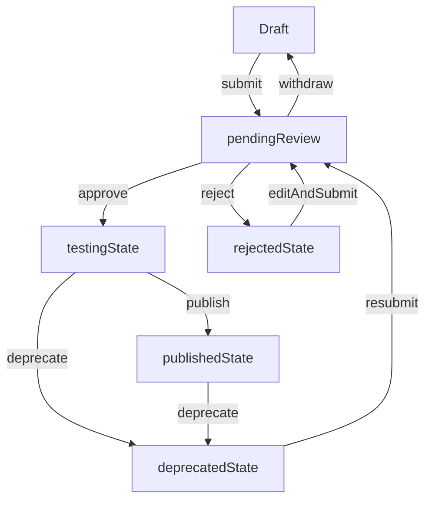
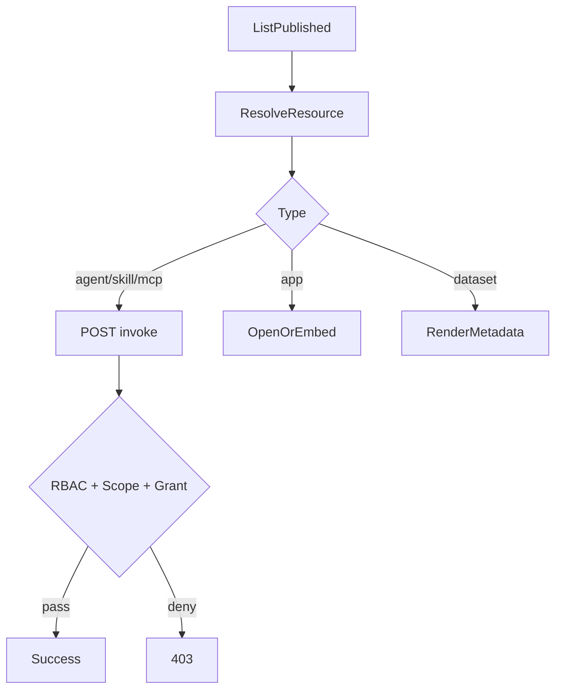

# 前端菜单与闭环功能分子级说明书（As-Is / To-Be / Gap）

> 文档目的：给前端、产品、测试一份可以“逐菜单、逐按钮、逐接口”核对的执行手册，避免继续出现功能理解偏差。  
> 适用范围：`platform_admin`、`dept_admin`、`developer`、`user` 四类角色。  
> **路由与侧栏真值**：[docs/frontend/routes-and-navigation.md](frontend/routes-and-navigation.md)（与本文冲突时以该文与源码为准）。  
> 业务闭环说明：`docs/resource-registration-authorization-invocation-guide.md`。  
> 代码基线：`src/layouts/MainLayout.tsx`、`src/constants/navigation.ts`、`src/constants/consoleRoutes.ts`、`src/api/services/**`、`src/views/**`。

---

## 1. 核心结论（必须先统一）

1. 前端目前已经接入统一资源主链路（注册中心、审核中心、授权中心、目录/解析/调用）。
2. **管理端**资源与审核在侧栏上归并为 **`resource-management`（统一资源中心 + 注册/运维）** 与 **`audit-center`（资源审核）**；不再使用多套并列的「Agent 管理 / Skill 管理 / MCP 管理」一级菜单（旧 slug 如 `agent-list` 仍可作 URL，会重定向到 `resource-catalog?type=`）。
3. **`Provider`** 在 **`provider-management`** 下以 **`ProviderManagementPage`（列表/新建）** 呈现，并可跳转「资源授权管理」；**不是** `provider-authorization-guide` 页面（代码中无该 slug）。
4. 应用端含授权申请与用户侧「我的授权申请」等能力；市场侧流程以后端能力为准。
5. **用户端**五类市场入口归属同一侧栏分组 **`marketplace`**；**开发者中心**仅挂在 **`user`** 路由下，从 `#/admin/...` 访问开发者页会被重定向到 `#/user/...`。

---

## 2. 角色、路由、菜单总规则（平台级）

## 2.1 角色到控制台视图映射（代码真值）

- `platform_admin` / `dept_admin` -> 控制台 `admin`
- `developer` / `user` -> 控制台 `user`
- 路由统一形态：`/#/:role/:page/:id?`，`role` 仅支持 `admin|user`

## 2.2 路由校验与重定向规则

- 无效 `page`（无法映射到已知侧栏）：`replace` 到当前 `role` 的默认页（`#/admin/dashboard` 或 `#/user/hub`）；非 `/:role/:page` 路径可走 `#/404`
- 无管理端权限访问 `admin/*`：跳转 `user` 默认页
- 用户端访问统一资源相关页且无发布权限：跳转 `hub` 并提示
- `normalizeDeprecatedPage`：`agent-create`→`agent-register`、`category-management`→`tag-management`、`submit-*` / `my-agents` / `my-skills`→`my-agents-pub` 等（**不含** `provider-list`）
- 管理端：`agent-list` 等 → `resource-catalog?type=`；`agent-audit` 等 → `resource-audit?type=`
- 用户端：五类 `*-list` → `resource-center?type=`
- `#/admin/api-docs` 等开发者页 → `#/user/api-docs` 等同路径

## 2.3 菜单权限裁剪规则

- 一级菜单按权限裁剪：`provider:manage`、`user:manage`、`monitor:view`、`system:config`
- 二级菜单按 `MainLayout` 中 `SUB_ITEM_PERM_MAP` 再裁剪（如 `provider-list`、`resource-grant-management`、`alert-rules` 等）
- 审核类子项另有按资源类型的权限位（见侧栏装配逻辑）
- `my-publish` 是否可见取决于发布相关权限（与 `canPublishResources` 等一致）

---

## 3. platform_admin / dept_admin 菜单分子级说明

> 说明：`dept_admin` 基本菜单结构与 `platform_admin` 一致，但实际可见项可能因权限被裁剪。

## 3.1 一级菜单全表（管理端）

与 `navigation.ADMIN_SIDEBAR_ITEMS` + `getNavSubGroups` 一致；**「列表/审核」类旧 slug 仅作兼容 URL**，canonical 为 `resource-catalog` / `resource-audit`。

| 一级菜单（sidebarId） | 二级分组（示意） | 二级菜单项 / page |
|---|---|---|
| 总览 `overview` | 总览 | `dashboard`、`health-check`、`usage-statistics`、`data-reports` |
| 资源管理 `resource-management` | 资源目录 / Agent 运维 | **`resource-catalog`**（统一资源中心）；`agent-monitoring`、`agent-trace`；另 `agent-register`…`dataset-register`、`agent-detail` |
| 审核中心 `audit-center` | 待审核资源 | **`resource-audit`**（兼容 `agent-audit` 等 URL） |
| Provider 管理 `provider-management` | Provider | `provider-list`、`provider-create` |
| 用户与权限 `user-management` | 用户 / 凭证 / 入驻 | `user-list`、`role-management`、`organization`、`api-key-management`、`resource-grant-management`、`grant-applications`、`developer-applications` |
| 监控中心 `monitoring` | 观测 / 告警 / 治理 | `monitoring-overview`、`call-logs`、`performance-analysis`、`alert-management`、`alert-rules`、`health-config`、`circuit-breaker` |
| 系统配置 `system-config` | 基础 / 策略 / 审计 / 内容治理 | `tag-management`、`security-settings`、`quota-management`、`rate-limit-policy`、`access-control`、`audit-log`、`sensitive-words`、`announcements` |

**开发者中心**不挂在管理端 URL；页面仅在 `#/user/developer-portal/...` 下提供。

## 3.2 管理端资源管理链路（菜单 -> 功能 -> 接口）

### A. Agent/Skill/MCP/App/Dataset 列表页（统一资源中心壳）

- 入口：
  - Agent: `agent-list`
  - Skill: `skill-list`
  - MCP: `mcp-server-list`
  - App: `app-list`
  - Dataset: `dataset-list`
- 页面组件：`ResourceCenterManagementPage`
- 核心动作与状态约束：
  - `draft`: 编辑、版本、提审、删除
  - `pending_review`: 撤回提审
  - `testing`: 待发布提示、下线
  - `published`: 下线
  - `rejected`: 编辑、重新提审、删除
  - `deprecated`: 重新提审
- 接口：
  - 列表 `GET /resource-center/resources/mine`
  - 提审 `POST /resource-center/resources/{id}/submit`
  - 撤回 `POST /resource-center/resources/{id}/withdraw`
  - 下线 `POST /resource-center/resources/{id}/deprecate`
  - 删除 `DELETE /resource-center/resources/{id}`
  - 版本 `POST /resource-center/resources/{id}/versions`、`POST /resource-center/resources/{id}/versions/{version}/switch`

### B. 注册页（统一动态表单）

- 入口：
  - `agent-register` / `skill-register` / `mcp-register` / `app-register` / `dataset-register`
- 页面组件：`ResourceRegisterPage`
- 功能：
  - 中文字段说明 + 小白填写提示
  - 类型级必填校验（URL / JSON / 数值边界）
  - 保存、保存并提审
- 接口：
  - 创建 `POST /resource-center/resources`
  - 更新 `PUT /resource-center/resources/{id}`
  - 提审 `POST /resource-center/resources/{id}/submit`

### C. 审核页

- 入口：`agent-audit`、`skill-audit`、`mcp-audit`
- 页面组件：`ResourceAuditList`
- 状态动作规则：
  - `pending_review`: 通过、驳回（reason 必填）
  - `testing`: 发布、驳回
  - 其他状态：无可执行动作
- 接口：
  - 列表 `GET /audit/resources`
  - 通过 `POST /audit/resources/{id}/approve`
  - 驳回 `POST /audit/resources/{id}/reject`（`{ reason }`）
  - 发布 `POST /audit/resources/{id}/publish`

---

## 4. developer / user 菜单分子级说明

## 4.1 一级菜单全表（应用端）

| 一级菜单 | 二级菜单 | 页面 page | 备注 |
|---|---|---|---|
| 探索发现 | 无 | `hub` | 聚合发现页 |
| 个人工作台 | 工作台总览 / 使用记录 / 用量统计 / 我的收藏 / 发布总览 / 资源中心 / 开发者入驻 / 入驻审批 | `workspace` / `usage-records` / `usage-stats` / `my-favorites` / `my-agents-pub` / `resource-center` / `developer-onboarding` / `developer-applications` | 子项真值见 `navigation.ts` → `USER_MY_CONSOLE_GROUPS`；侧栏仅「使用记录」一项，`usage-records` 页内 tab 含最近使用（默认 tab）；旧 `recent-use` 仅 URL 归一 |
| Agent 市场 | 无 | `agent-market` | 可调用资源市场 |
| 技能市场 | 无 | `skill-market` | 可调用资源市场 |
| MCP 市场 | 无 | `mcp-market` | MCP 资源市场 |
| 应用广场 | 无 | `app-market` | 跳转/嵌入型 |
| 数据集 | 无 | `dataset-market` | 元数据消费型 |
| 我的发布 | 发布总览 / 统一资源中心 | `my-agents-pub` / `resource-center` | 需要发布权限才可见；列表 UI 见下文「统一资源中心」 |
| 个人资产（路由/深链） | 授权申请等 | `my-grant-applications` 等 | 若未出现在侧栏分组，以 `MainLayout` / `consoleRoutes` 白名单为准；勿与已废止 slug `authorization-requests` 混淆 |

## 4.2 应用端“发布”链路

- 菜单入口：`我的发布 -> 统一资源中心`
- 页面组件：`ResourceCenterManagementPage`（可切换资源类型）
- **布局（2026-04）**：`allowTypeSwitch` 为 true 时，「刷新 / 注册*」与资源类型标签（Agent/Skill/…）同一行；固定单类型列表时按钮仍在 `MgmtPageShell` 顶栏工具区
- 与管理端共用注册/提审能力
- 权限约束：无创建权限时禁止进入并跳转 `hub`

## 4.3 应用端“市场与使用”链路

### A. 市场入口现状

- 有：`agent-market`、`skill-market`、`mcp-market`、`app-market`、`dataset-market`
- `mcp-market` 已接入导航与路由，探索页跳转链路可直接命中。

### B. 使用动作（按类型）

- `agent/skill/mcp`：
  1. `POST /catalog/resolve`
  2. 根据 `invokeType` 决定 `invoke/redirect/metadata`
  3. invoke 场景 `POST /invoke`
- `app`：
  - resolve 后跳转或嵌入，不建议走统一 invoke
- `dataset`：
  - 展示元数据与标签，走浏览/申请流程，不是通用执行入口

---

## 5. 五类资源闭环（分子级流程）

## 5.1 全局状态机（前后端共识）

## 5.2 MCP

- 注册必填：`resourceCode`、`displayName`、`endpoint`、`protocol`
- 创建后流程：
  - 创建 `draft` -> 提审 -> 审核通过 `testing` -> 发布 `published`
- 使用流程：
  - 市场发现（`mcp-market`）
  - resolve -> 按 `invokeType` 分流（`redirect`/`metadata`/`invoke`）

## 5.3 Agent

- 注册必填：`agentType`、`spec(url)`
- 使用流程：resolve -> invoke
- 管理动作与 MCP 一致（状态机一致）

## 5.4 Skill

- 注册必填：`skillType`、`spec(url)`，建议填 `parametersSchema`
- 使用流程：resolve -> invoke
- 注意：技能市场中“类型标签 MCP”是 `agentType` 维度，不等于资源类型 `mcp`

## 5.5 Dataset

- 注册必填：`dataType`、`format`
- 使用流程：resolve 后展示 metadata/spec，不应强制 invoke
- “申请使用”已接入授权申请适配层，并在授权申请记录页可追踪状态

## 5.6 App

- 注册必填：`appUrl`、`embedType`
- 使用流程：resolve 返回 `invokeType=redirect` 时进行跳转/嵌入

---

## 6. 授权与调用（API Key + Scope + Grant）

## 6.1 三层校验模型

1. RBAC（用户角色权限）
2. API Key scope（`catalog/resolve/invoke`）
3. Resource Grant（资源拥有者授予）

## 6.2 授权管理页流程（当前实现）

- 页面：`ResourceGrantManagementPage`
- 新增授权输入：
  - `resourceType`
  - `resourceId`
  - `granteeApiKeyId`
  - `actions[]`（`catalog/resolve/invoke/*`，非空）
  - `expiresAt`（可选）
- 接口：
  - 创建 `POST /resource-grants`
  - 查询 `GET /resource-grants?resourceType=&resourceId=`
  - 撤销 `DELETE /resource-grants/{grantId}`

## 6.3 调用时序（标准）

---

## 7. 你提出的争议问题逐条回答（强制阅读）

## 7.1 “platform_admin 下 skill 管理与 MCP 是什么关系？”

- 数据层：`skill` 与 `mcp` 均为独立 `resourceType`。
- 导航层：二者同属 **`resource-management`**，经 **统一资源中心** `resource-catalog?type=skill|mcp` 切换；旧 URL `mcp-server-list` / `skill-list` 仍会重定向到对应 `type`。

## 7.2 “应用端用户如何申请应用授权？”

- 已在 `agent-market`、`skill-market`、`mcp-market`、`app-market`、`dataset-market` 接入“申请授权”入口。
- 统一走 `authorizationRequestService` 适配层：
  - 后端有 `/authorization-requests` 时走真实接口；
  - 后端未开放时自动降级本地记录（不中断前端流程）。
- 申请记录在 `个人资产 -> 授权申请记录` 统一展示，可查看状态和失败原因。

## 7.3 “应用端有 Agent/Skill/App/Dataset，MCP 广场呢？”

- 已新增 `mcp-market` 页面、菜单和路由，并纳入探索页分类导航。
- `ExploreHub` 的 `mcp` 资源跳转不再断链。

## 7.4 “管理端是否把 Skill 与 MCP 混一起了？”

- 列表与注册共用 **`ResourceCenterManagementPage` / `ResourceRegisterPage`**，按 `type` 区分；审核共用 **`resource-audit`**，按 `type` 区分。
- 不再使用并列的「Skill 管理 / MCP 管理」两个一级侧栏；侧栏上是一套 **资源管理 + 审核中心**。

## 7.5 “Provider 与资源授权管理是什么关系？”

- **`provider-management`**：`ProviderManagementPage`（Provider 列表/新建），可从该页打开 **`resource-grant-management`**（见 `onOpenGrantManagement`）。
- **`resource-grant-management`**：在 **`user-management`** 侧栏下，由 `UserManagementModule` 承载。
- 二者为不同 `page` slug，非同一页面。

---

## 8. Gap 清单（本轮后）

## P0（已完成 / 以当前代码为准）

1. 应用端 `mcp-market` 等市场路由已接入。
2. 管理端资源/审核已收敛为 **统一资源中心** + **资源审核** 侧栏结构（`resource-catalog` / `resource-audit`）。
3. 应用端授权申请与记录能力已接入（以后端接口可用性为准）。
4. Provider 与资源授权分为 **Provider 管理** 与 **资源授权管理** 两个入口。

## P1（本迭代建议完成）

1. 在所有市场详情页统一展示“当前资源类型 + 当前 invokeType + 当前授权状态”。
2. 在资源中心增加“操作不可用原因”提示（状态/权限驱动）。
3. 在审核页增加显式状态提示文案：`testing != published`。

## P2（体验优化）

1. 统一各页术语（Skill/MCP/Provider/Grant）。
2. 在 API 文档页加入角色分层调用示例（owner、third-party、admin）。
3. 增加端到端联调脚本页面（一键模拟 resolve/invoke/grant）。

---

## 9. 验收清单（测试按此走）

## 9.1 菜单与路由

- `platform_admin` 可看到完整管理菜单树。
- `dept_admin` 仅看到其权限允许菜单。
- `developer` 能看到 `my-publish`，普通 `user` 默认看不到。
- 每个菜单点击后页面与文档映射一致，无“空路由/占位误跳”。

## 9.2 五类资源闭环

- 五类资源都能走：注册 -> 提审 -> 审核 -> 发布 -> 市场可见。
- `approve` 后状态是 `testing`，只有 `publish` 后才是 `published`。
- `dataset/app` 使用链路不误用 invoke。

## 9.3 授权与调用

- 无 API Key 调用 invoke 被拒绝并有明确提示。
- 有 scope 但无 Grant 调用被 403。
- 创建 Grant 后调用成功；撤销 Grant 后再次 403。

---

## 10. 附录：关键代码落点

- 路由与页面归一：`src/layouts/MainLayout.tsx`
- 菜单树：`src/constants/navigation.ts`
- 路由映射：`src/constants/consoleRoutes.ts`
- MCP 市场：`src/views/mcp/McpMarket.tsx`
- 授权申请适配层：`src/api/services/authorization-request.service.ts`
- 授权申请记录页：`src/views/user/AuthorizationRequestPage.tsx`
- Provider 关系说明页：`src/views/provider/ProviderAuthorizationGuidePage.tsx`
- 资源中心服务：`src/api/services/resource-center.service.ts`
- 审核服务：`src/api/services/resource-audit.service.ts`
- 授权服务：`src/api/services/resource-grant.service.ts`
- 目录与解析：`src/api/services/resource-catalog.service.ts`
- 调用：`src/api/services/invoke.service.ts`
- 授权页面：`src/views/userMgmt/ResourceGrantManagementPage.tsx`
- 探索页（含 mcp 跳转）：`src/views/dashboard/ExploreHub.tsx`
- 市场授权申请入口：`src/views/agent/AgentMarket.tsx`、`src/views/skill/SkillMarket.tsx`、`src/views/mcp/McpMarket.tsx`、`src/views/apps/AppMarket.tsx`、`src/views/dataset/DatasetMarket.tsx`
- Provider 兼容层：`src/api/services/provider.service.ts`、`src/views/provider/ProviderList.tsx`

