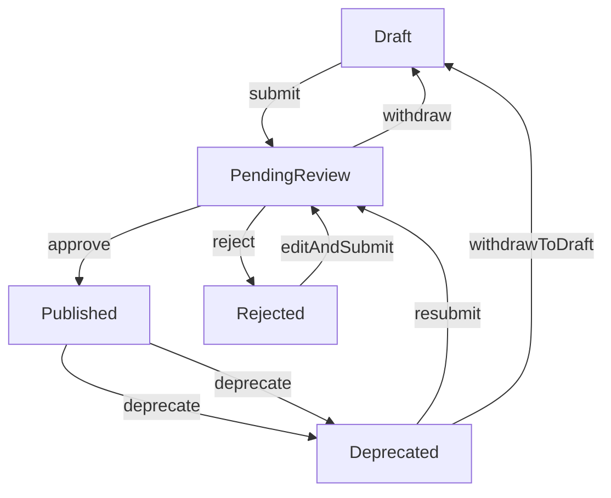
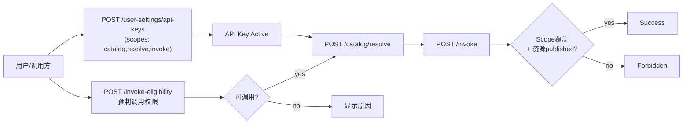
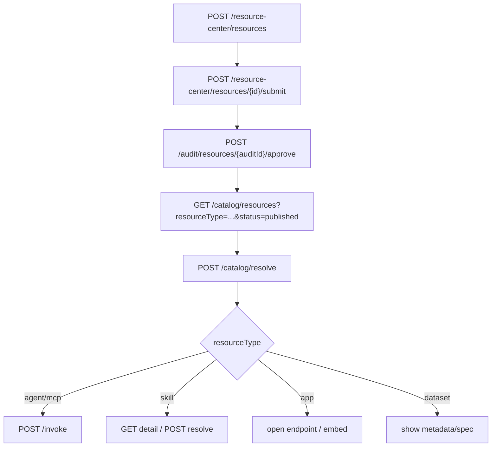

# 五类资源注册-审核-授权-调用超详细实施文档（后端真值版）

> 版本：v1.1  
> 更新日期：2026-04-11  
> 适用对象：前端开发、产品、测试、联调负责人  
> 目标：避免前端流程继续"想当然"，按后端真实能力完整落地 `mcp/agent/skill/dataset/app` 五类资源闭环  
> 后端上下文路径：`/regis`（与 `VITE_API_BASE_URL` 一致）

---

## 1. 一句话结论（先统一认知）

- 后端已经打通五类资源的主链路：**注册 -> 提审 -> 审核 -> 发布 -> 目录可见 -> 使用/调用**。
- 上架不是一步：**`approve` 不等于上架**，必须再执行 `publish` 才到 `published`。
- 授权不是"授权链接"：当前是 **`API Key + Scope + published 状态` 两层校验模型**（Grant 已于 2026-04-09 下线）。
- **强统一（浏览 / 执行）**：`GET /catalog/resources*` 可仅靠登录态（JWT）或 API Key **逛市场**；**`POST /catalog/resolve`、`POST /invoke`、`POST /invoke-stream` 必须带本人有效 `X-Api-Key`**（不能只依赖"仅登录"）。
- 五类资源都能注册，但"使用方式"不同：
  - `agent/mcp`：可走 `POST /catalog/resolve` 与统一调用 `POST /invoke`（或流式 `invoke-stream`）。
  - `skill`：可走 `POST /catalog/resolve`；**网关不接受** `resourceType=skill` 的 `POST /invoke`（与 Key 策略无关的协议限制）。
  - `app`：主要是解析后拿 URL 跳转/嵌入（`invokeType=redirect`）。
  - `dataset`：主要是元数据消费（`invokeType=metadata`），不是 HTTP 远程执行型。

---

## 2. 角色与职责（前端必须按角色设计页面）

## 2.1 角色定义

- 开发者（developer）
  - 创建/更新自己的资源
  - 提审自己的资源
  - 下线自己的资源
  - ~~管理自己资源的授权（Grant）~~ **已废弃（2026-04-09）**
- 部门管理员（dept_admin）
  - 审核资源（approve/reject）
  - 可操作资源（由后端 owner/admin 判断）
- 平台管理员（platform_admin）
  - 同部门管理员，且具备更高全局权限

## 2.2 前端页面建议映射

- 开发者侧
  - 我的资源列表（按类型分 tab）
  - 创建/编辑页面（五类动态表单）
  - 提审/下线/版本页面
  - ~~授权管理页面（Grant 管理）~~ **已废弃（2026-04-09）**
- 管理员侧
  - 审核列表（pending_review）
  - 审核详情（approve/reject）
- 用户/调用侧
  - 资源市场（目录）
  - 资源详情（resolve）
  - 调用页（invoke，仅对可调用类型）

---

## 3. 全局接口总览（闭环主链）

## 3.1 注册中心（资源拥有者）

- `POST /resource-center/resources` 创建资源（初始 `draft`）
- `PUT /resource-center/resources/{id}` 更新资源
- `DELETE /resource-center/resources/{id}` 删除（受状态机限制）
- `POST /resource-center/resources/{id}/submit` 提审（进入 `pending_review`）
- `POST /resource-center/resources/{id}/withdraw` 撤回提审（回 `draft`）
- `POST /resource-center/resources/{id}/deprecate` 下线（通常从 `published` 到 `deprecated`）
- `GET /resource-center/resources/mine` 我的资源分页
- `GET /resource-center/resources/{id}` 资源详情（owner 或 admin）

## 3.2 审核中心（管理员）

- `GET /audit/resources` 待审核列表（`pending_review`）
- `POST /audit/resources/{auditId}/approve` 审核通过并直接发布
- `POST /audit/resources/{auditId}/reject` 审核驳回（到 `rejected`）
- `POST /audit/resources/{auditId}/approve` 审核通过并直接上线（到 `published`）

## 3.3 市场/解析/调用

- `GET /catalog/resources` 目录列表
- `GET /catalog/resources/{type}/{id}` 按类型详情解析
- `POST /catalog/resolve` 统一解析（**必须 `X-Api-Key`**，强统一）
- `POST /invoke` / `POST /invoke-stream` 统一调用（**必须 `X-Api-Key`**）

## 3.4 授权（Grant）

> ⚠️ **已废弃（2026-04-09 下线）**
>
> 资源级 Grant 接口已下线，以下接口不再可用：
> - ~~`POST /resource-grants`~~ 授权给某个 API Key
> - ~~`GET /resource-grants?resourceType=&resourceId=`~~ 查看某资源授权列表
> - ~~`DELETE /resource-grants/{grantId}`~~ 撤销授权
>
> **新权限模型**：`API Key + Scope + published 状态`
> - 资源必须处于 `published` 状态才能被调用
> - API Key 的 `scopes` 字段控制可访问的资源类型和操作
> - 使用 `POST /user-settings/api-keys/{id}/invoke-eligibility` 预判调用权限
>
> **相关接口**：
> - `GET /user-settings/api-keys` 查看我的 API Key 列表
> - `POST /user-settings/api-keys` 创建 API Key（含 scopes）
> - `POST /user-settings/api-keys/{id}/invoke-eligibility` 预判调用权限

---

## 4. 生命周期状态机（前端按钮可见性的唯一依据）

## 4.1 状态定义

- `draft`：草稿，未提审
- `pending_review`：待审核
- `published`：审核通过直接上线
- `published`：已发布（可视为上架）
- `rejected`：驳回
- `deprecated`：下线

## 4.2 状态流转图



## 4.3 按状态的前端动作矩阵

- `draft`
  - 可见按钮：编辑、删除、提审、创建版本、切换版本
  - 不应显示：发布
- `pending_review`
  - 开发者可见：撤回提审
  - 管理员可见：通过、驳回
  - 不应允许编辑/删除
- `published`
  - 管理员可见：发布、驳回（按产品策略可保留）
  - 开发者可见：下线（若业务允许）
- `published`
  - 可见：下线、查看、使用（按类型）
  - 不应允许直接编辑（需先走状态操作后再改）
- `rejected`
  - 可见：编辑、重新提审、删除
- `deprecated`
  - 可见：重新提审（或回草稿再改）

---

## 5. 五类资源字段规范（创建/更新）

## 5.1 公共字段（五类都带）

请求体：`ResourceUpsertRequest`

- `resourceType`（必填）：`mcp|agent|skill|dataset|app`
- `resourceCode`（必填）：同类型唯一编码，建议 `a-z0-9-` 风格
- `displayName`（必填）：展示名
- `description`（选填）：描述
- `sourceType`（选填）：来源，如 `internal/cloud/department/...`
- `categoryId`（选填）：目录归属信息

## 5.2 MCP 必填字段

- `endpoint`（必填）
- `protocol`（建议填，默认按后端逻辑可落到 `mcp`）
- `authType`（选填，默认 `none`）
- `authConfig`（选填 JSON）

示例：

```json
{
  "resourceType": "mcp",
  "resourceCode": "campus-kb-mcp",
  "displayName": "校园知识库MCP",
  "description": "MCP知识检索服务",
  "sourceType": "internal",
  "endpoint": "http://localhost:9000/mcp",
  "protocol": "mcp",
  "authType": "none",
  "authConfig": {
    "method": "tools/call"
  }
}
```

## 5.3 Agent 必填字段

- `agentType`（必填）
- `spec`（必填，通常包含 `url`）
- 可选：`mode/maxConcurrency/maxSteps/temperature/systemPrompt/isPublic/hidden`

## 5.4 Skill 必填字段

- `skillType`（必填）
- `spec`（必填，通常包含 `url`）
- 可选：`mode/parametersSchema/parentResourceId/displayTemplate/isPublic/maxConcurrency`

## 5.5 Dataset 必填字段

- `dataType`（必填）
- `format`（必填）
- 可选：`recordCount/fileSize/tags/isPublic`

## 5.6 App 必填字段

- `appUrl`（必填）
- `embedType`（必填，如 `iframe` / `micro_frontend`）
- 可选：`icon/screenshots/isPublic`

---

## 6. 审核与上架（关键误区纠正）

## 6.1 为什么"通过后还没上架"

后端是分段状态：

1. `approve`：`pending_review -> published`
2. `publish`：`审核通过即 published`

只有 `published` 才应在前端标记为"已上架可用"。

## 6.2 审核接口调用顺序（管理员）

1) 审核列表拉取 `GET /audit/resources?resourceType=mcp&page=1&pageSize=20`  
2) 通过：`POST /audit/resources/{auditId}/approve`  
3) 审核通过：`POST /audit/resources/{auditId}/approve`
驳回路径：`POST /audit/resources/{auditId}/reject`（body 要有 `reason`）

---

## 7. 授权模型（不是授权链接）

> ⚠️ **重要变更（2026-04-09）**
>
> 资源级 Grant 已下线，当前权限模型简化为：**`API Key + Scope + published 状态`**

## 7.1 两层校验结构

调用是否成功，需通过两层校验：

1. 用户角色权限（RBAC，若带 `X-User-Id`）
2. API Key scope（`catalog/resolve/invoke` 的范围）+ 资源状态（必须 `published`）

~~3. Grant（资源拥有者是否把该资源授权给该 API Key）~~ **已废弃**

## 7.2 权限流程图



## 7.3 API Key 管理接口

`POST /user-settings/api-keys` 创建 API Key

```json
{
  "name": "my-api-key",
  "scopes": ["catalog", "resolve", "invoke"],
  "expiresAt": "2026-12-31T23:59:59"
}
```

字段说明：

- `scopes` 支持：`catalog`、`resolve`、`invoke` 或组合
- `expiresAt` 可选，过期后 Key 自动失效

**预判调用权限**：

`POST /user-settings/api-keys/{id}/invoke-eligibility`

```json
{
  "resourceType": "mcp",
  "resourceIds": ["29", "30"]
}
```

返回：

```json
{
  "byResourceId": {
    "29": true,
    "30": false
  }
}
```

## 7.4 常见授权误区

- 误区1：给了 scope 就能调
  - 错：资源还必须处于 `published` 状态。
- 误区2：需要 Grant 授权
  - 错：资源级 Grant 已下线，只需 API Key + Scope + published 状态。
- 误区3：授权链接可替代 API Key
  - 错：后端无"授权链接"协议，只有 API Key + Scope。

---

## 8. 目录、解析、调用的前端时序（可直接做页面流程）

## 8.1 统一时序图



## 8.2 接口头部规范（前端必须统一）

- 管理类接口（资源注册、审核、API Key 管理）：
  - `Authorization: Bearer <token>`
  - `X-User-Id`（由认证链路注入或透传）
- 目录（`GET /catalog/resources*`）：
  - 至少一项：`X-User-Id`（登录态）或 `X-Api-Key`（用于逛市场）
- 解析（`POST /catalog/resolve`）与调用（`POST /invoke`、`POST /invoke-stream`）：
  - **`X-Api-Key` 必填**（完整 secretPlain）；可与 `Authorization` / `X-User-Id` 同传
  - `X-Trace-Id` 推荐

## 8.3 `/invoke` 请求示例（仅可调用类型）

```json
{
  "resourceType": "mcp",
  "resourceId": "29",
  "version": "v1",
  "timeoutSec": 30,
  "payload": {
    "method": "tools/call",
    "params": {
      "name": "search",
      "arguments": {
        "query": "招生政策"
      }
    }
  }
}
```

---

## 9. 五类资源"使用方式差异"细化（前端必读）

## 9.1 MCP

- 目标：工具协议调用（通常 `mcp/jsonrpc`）
- 推荐前端动作：
  1) 目录筛选 `resourceType=mcp`
  2) resolve 得 endpoint/spec
  3) invoke 走 API Key
- UI 标记：可调用资源

## 9.2 Agent

- 目标：子智能体/HTTP Agent 服务
- 走法与 MCP 类似，主要差异在 `spec` 结构与 `agentType`

## 9.3 Skill

- 目标：工具型能力（HTTP/MCP 子能力）
- 仅可 resolve 获取 `contextPrompt / parametersSchema / 绑定 MCP`
- 不走统一 `POST /invoke`；如需执行工具能力，应 invoke Skill 绑定的 MCP

## 9.4 Dataset

- 目标：数据资产元信息消费，不是通用远程执行入口
- resolve 后主要用 `spec`（格式、规模、标签）
- 前端应提供：浏览、申请、绑定等业务动作（而非强制 invoke）

## 9.5 App

- 目标：应用跳转/嵌入
- resolve 返回 `invokeType=redirect` + `endpoint`
- 前端动作：打开 URL 或按 `embedType` 嵌入
- 不建议走统一 invoke 当作 HTTP 工具调用

---

## 10. 版本管理（避免"更新覆盖线上"）

## 10.1 创建版本

`POST /resource-center/resources/{id}/versions`

```json
{
  "version": "v2",
  "makeCurrent": true
}
```

- `version` 必填，长度 <= 32（后端校验）
- `makeCurrent=true` 会切当前版本

## 10.2 切换版本

- `POST /resource-center/resources/{id}/versions/{version}/switch`
- 仅 active 版本可切

## 10.3 查询版本

- `GET /resource-center/resources/{id}/versions`
- 前端建议展示：当前版本标识、创建时间、状态

---

## 11. 前端"分子级"落地清单（逐页面）

## 11.1 创建页（五类动态表单）

- 表单第一步选择 `resourceType`
- 按类型渲染必填字段（本文件第5章）
- 提交前本地校验：
  - 字段必填
  - URL 基础格式（mcp endpoint、appUrl、spec.url）
  - 数值边界（timeout、并发等）
- 成功后进入资源详情页，状态应显示 `draft`

## 11.2 我的资源页

- 统一读 `GET /resource-center/resources/mine`
- 按状态渲染按钮（第4.3）
- 关键按钮行为：
  - 提审 -> `/submit`
  - 撤回 -> `/withdraw`
  - 下线 -> `/deprecate`
  - 删除 -> `DELETE`

## 11.3 审核页（管理员）

- 列表：`GET /audit/resources`
- 行操作：
  - 通过 -> `approve`
  - 驳回 -> `reject`（必须填写 reason）
  - 发布 -> `publish`
- 强提醒：
  - 通过后卡片状态应显示 `published`
  - 发布成功后才显示"已上架/可使用"

## 11.4 市场页

- 为避免草稿泄露，建议默认查询：`status=published`
- 按类型分市场 tab：
  - MCP 市场：`resourceType=mcp`
  - Agent 市场：`resourceType=agent`
  - Skill 市场：`resourceType=skill`
  - Dataset 市场：`resourceType=dataset`
  - App 市场：`resourceType=app`

## 11.5 使用页

- 统一先 resolve
- 再按类型分流：
  - `mcp/agent` -> invoke
  - `skill` -> 拉取 context / schema / 绑定 MCP，供门户或 Agent 编排使用
  - `app` -> URL 打开/嵌入
  - `dataset` -> 展示 metadata/spec

## 11.6 API Key 管理页

> ⚠️ **已废弃（2026-04-09）**：资源级 Grant 管理已下线

- 用户进入后：
  - 查看我的 API Key 列表
  - 创建 API Key（设置 scopes、过期时间）
  - 撤销/轮换 API Key
  - 预判调用权限（invoke-eligibility）
- 第三方接入文案：需要创建 API Key 并设置正确的 scopes

---

## 12. 常见错误码与排查动作（联调必备）

- 401 未认证
  - 检查 `Authorization` 或 `X-Api-Key` 是否缺失/过期
- 403 无权限
  - 检查 RBAC 是否有类型访问权限
  - 检查 API Key scope 是否覆盖动作
  - 检查资源是否处于 `published` 状态
- 404 不存在
  - 资源 ID、类型、版本号是否匹配
- 400 参数错误
  - 字段必填、JSON 结构、类型值是否合法
- 500 服务异常
  - 优先看后端日志 SQL/序列化/连接错误栈

---

## 13. 联调验收清单（测试用）

## 13.1 MCP 完整验收

1. 开发者创建 MCP 成功（状态 `draft`）
2. 提审成功（状态 `pending_review`）
3. 管理员 approve 后状态 `published`
4. 市场 `resourceType=mcp&status=published` 可见
6. resolve 返回 endpoint/spec 正确
7. invoke 可成功（需有效 API Key + scope 覆盖）
8. 无 API Key 或 scope 不覆盖时返回 403
9. 资源未 published 时无法调用

## 13.2 其余四类验收最小集

- Agent：同 MCP 全链路（包含 invoke）
- Skill：发布后可 resolve 获取上下文规范与绑定 MCP，不走统一 invoke
- App：发布后可 resolve，前端可按 endpoint 正常跳转/嵌入
- Dataset：发布后可 resolve，前端展示元数据字段完整

---

## 14. 最后两条硬规则（防再跑偏）

- 规则1：**任何"上架成功"文案必须以 `published` 为准**，不能以 `approve` 为准。
- 规则2：**任何"授权"文案必须按 API Key + Scope + published 状态模型描述**，不要再写"授权链接"或"Grant"。

---

## 15. 关键后端代码参考（联调时建议并读）

- `src/main/java/com/lantu/connect/gateway/controller/ResourceRegistryController.java`
- `src/main/java/com/lantu/connect/gateway/service/impl/ResourceRegistryServiceImpl.java`
- `src/main/java/com/lantu/connect/gateway/service/support/ResourceLifecycleStateMachine.java`
- `src/main/java/com/lantu/connect/audit/controller/AuditController.java`
- `src/main/java/com/lantu/connect/audit/service/impl/AuditServiceImpl.java`
- `src/main/java/com/lantu/connect/gateway/controller/ResourceCatalogController.java`
- `src/main/java/com/lantu/connect/gateway/service/impl/UnifiedGatewayServiceImpl.java`
- ~~`src/main/java/com/lantu/connect/gateway/controller/ResourceGrantController.java`~~ **已废弃**
- `src/main/java/com/lantu/connect/gateway/security/ApiKeyScopeService.java`
